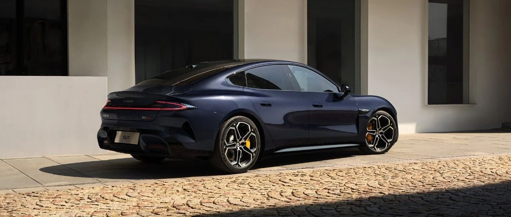

#  小米SU7答网友问（第四十集）

[ 小米汽车 ](<javascript:void\(0\);>)

______

  

**01**  

**有传闻说，小米汽车工厂五一期间曾一度停工，这是真的吗？**

确有其事，这是为了提拉本年产能，我们的工程师利用五一假期，进行了一轮设备维护改造，为接下来继续快速提升交付能力做好了准备。近期，我们会有一些好消息跟大家陆续汇报。  

**02**  

**有人说，现在下定就得明年提车，这是真的吗？**

目前小米SU7的火爆程度，的确超越了我们之前的预期。另一方面，我们的产能持续努力提升，进展也很顺利。

如上一个问题的回答，我们五一期间为提拉产能也进行了短时「假期技改」。至少我们可以保障，现在依然可以放心下单。具体的预计交付周期以小米汽车APP显示为准。我们仍在全力推进产能提升，让您早日提到爱车。

**03**  

**OTA升级后代客泊车的车速提高了，怎么做到的？**

在车辆系统升级到最新版本后，小米SU7 Pro和Max升级为更先进的端到端代客泊车。泊车效率大幅提升，最高车速达到23km/h，同时可以模拟真实用户的倒车避让，当行进过程中空间受限时，可自主倒车腾挪。  

端到端大模型取代了此前用于感知、决策、规划的多个模块，让智能驾驶直接从一端输入图像，一端输出行驶轨迹，端到端大模型是迄今类人思考程度最深的智驾算法。因为去掉了中间模块计算和信号传输的时间，所以系统响应更快。也因为端到端，相比传统级联方案不再以局部性能为评估点，而是以最终智驾表现为基准，所以无论从技术或是体验角度都是全局最优的技术方案，可以实现更灵活的决策和更拟人的车辆控制。

总之，端到端技术是更先进、更安全、更拟人的智驾方案，应用于代客泊车功能将会让体验明显改善，欢迎大家体验。同时，我们再次提示大家，**智能辅助驾驶功能并不能完全代替驾驶员控制车辆** ，驾驶员在驾驶车辆过程中请务必全程保持注意力集中，时刻关注车辆周围路况，并做好随时接管车辆的准备。

**04**  

**小米SU7的保费是什么水平？**  

小米SU7 保费由合作保险公司进行定价，按照新能源车险专属条款进行承保，条款主要围绕“三电”系统提供保障，全面涵盖新能源汽车行驶、停放、充电及作业的使用场景。 

小米SU7售价区间为21.59万元~29.99万元，同一车型和承保方案在不同省市地区的保费定价不同，以北京地区为例，选择基础版保险方案小米SU7保费约5200元，小米SU7 Max保费约6600元，符合目前售价区间为20万元~30万元的市场主销新能源电动轿车的整体保费定价水平。  

  

小米SU7答网友问

持续进行中…

[小米SU7答网友问总集（上）：整车产品篇](<http://mp.weixin.qq.com/s?__biz=MzkyNzU3MDI3Nw==&mid=2247489972&idx=1&sn=b8c58d29e1da2eb08549f48262d2fcce&chksm=c22759bef550d0a88c50e70ab4bc59b26ab31ee5e634a52694ee0cc28f08979a4662fe598032&scene=21#wechat_redirect>)

[小米SU7答网友问总集（中）：智能体验篇](<http://mp.weixin.qq.com/s?__biz=MzkyNzU3MDI3Nw==&mid=2247490580&idx=1&sn=c0e685b4d60f817a799fd4594ab294ad&chksm=c2275c1ef550d508549e791b5b0d076288f55ee40a8145ea3642e6f9166aedba8b267cb11051&scene=21#wechat_redirect>)

[小米SU7答网友问总集（下）：交付服务篇](<http://mp.weixin.qq.com/s?__biz=MzkyNzU3MDI3Nw==&mid=2247490603&idx=1&sn=88ef8375987c8a7be5c1bc6b8a42e9f6&chksm=c2275c21f550d537cbed33f14c6062f066a768b19efdaa1fd3b67dc17c1abe494d5cffa15124&scene=21#wechat_redirect>)

  

  

  

预览时标签不可点

微信扫一扫  
关注该公众号

继续滑动看下一个

轻触阅读原文

小米汽车 

向上滑动看下一个

[知道了](<javascript:;>)

微信扫一扫  
使用小程序

****

[取消](<javascript:void\(0\);>) [允许](<javascript:void\(0\);>)

****

[取消](<javascript:void\(0\);>) [允许](<javascript:void\(0\);>)

****

[取消](<javascript:void\(0\);>) [允许](<javascript:void\(0\);>)

× 分析

__

微信扫一扫可打开此内容，  
使用完整服务

： ， ， ， ， ， ， ， ， ， ， ， ， 。 视频 小程序 赞 ，轻点两下取消赞 在看 ，轻点两下取消在看 分享 留言 收藏 听过