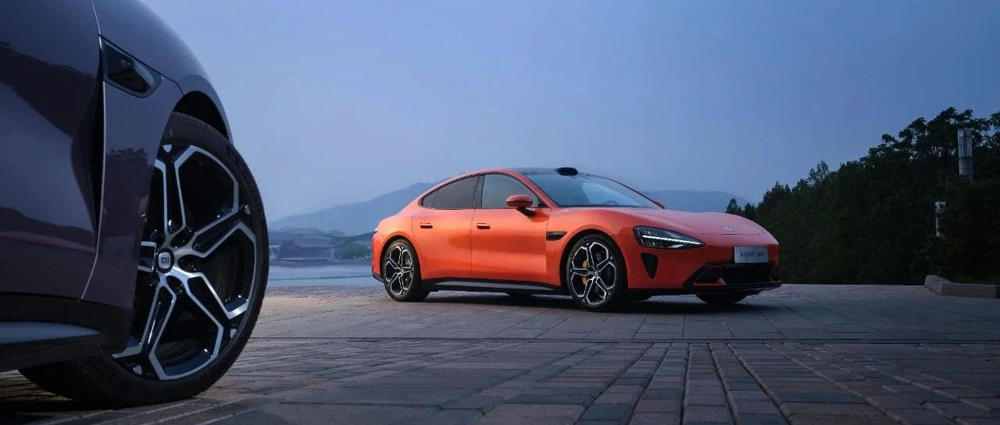
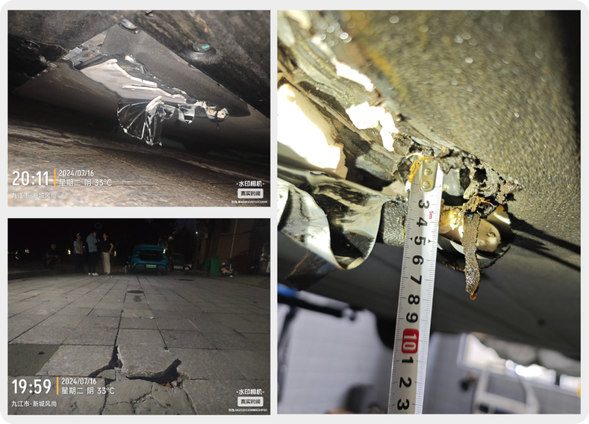

#  小米SU7答网友问（第四十五集）

[ 小米汽车 ](<javascript:void\(0\);>)

______

  

  

****

****

****

****

  

  

小米SU7答网友问，今天起将阶段性重启。

将继续针对大家近期关注的问题，每天解答。

感谢大家一直以来的关注。

  

**01**  

**7月19日雷军年度演讲，小米汽车戏份有多重？会有新车型亮相吗？**

今年是连续第5次举办雷军年度演讲，主题为《勇气》，主要讲述小米造车三年背后的故事。所以，小米汽车的戏份当然很重。

关于大家关心的新车型问题，首先要说明，网传的“小米SU8”并不属实，小米汽车没有这样的车系、型号规划，当然也就不会在此次发布会有任何信息。

**02**  

**产能提升、交付加速的进展怎么样了？现在下单还是要等很久很久吗？**  

目前进展顺利。7月小米汽车工厂虽然的确经历了一次产线维护调优，不过不会影响完成既定的月交付1万台以上的目标。  

关于产能相关话题，7月19日的演讲上，将有从未公开的信息披露。

**03**  

**网上有传闻称小米SU7有磕碰后车底冒烟的案例，这是真的吗？具体情况是什么？**  

这起案例，我们只能认为是在极端偶然的情况下，因极端外力引起的极小概率的极端工况。

前日，我们接到车辆驾驶员进线，反馈车辆在碰撞后有短时局部冒烟现象。小米汽车门店服务人员第一时间赶往现场，经与用户沟通以及现场检查后，确认情况如下：

  * 车辆底盘有明显外力导致的严重破损，不过电池包仅出现短暂的泄压排气，无热蔓延、无起火。同时事故车辆事发时后台数据联网功能处于车端主动关闭状态。

  * 事故车辆电池底部疑似发生极端的外力碰撞。根据现场情况分析，推测极端工况最终触发原因（目前尚无法确认底盘此前是否曾遭受磕碰），系松动的大理石混泥地砖（300*300*20mm），在轮胎碾压后单侧翘起，以尖锐的侵入角度，猛烈顶击电池包底部，并导致其撕裂（最大开口超过350mm）。最终，电池包底部严重凹陷（最大深度超过30mm），内部电芯受损裸露，变形量约14.3mm左右。  

  * 小米CTB电池包开发按照最高安全标准设计，针对电池底部碰撞安全开展了全面且严苛的测试，例如使用直径150mm的实心半球置于地面，然后以30km/h车速进行刮底测试，电芯变形量仅1mm。而即便应对目前行业最严苛的底部冲击测试，电池变形量也仅为5.4mm。而本次事故中，电芯变形量超过14mm，超过了最严苛测试的2.6倍，已属于极端工况。不过由于小米SU7电池包的一系列保护措施，没有导致更多电芯因热蔓延起火，仅出现短暂泄压排气。  

部分报道在没有了解真实情况的前提下，用“自燃”、“起火”等描述，已经完全失实。恳请大家不信谣，不传谣。目前，我们也正协助用户妥善处理后续事宜。

**04**  

**有赛道体验的用户称，制动性能变化并不会体现在刹车踏板脚感上，为何有这样设计？**  

再次诚挚恳切地提醒大家，小米SU7是一辆民用车型，并非为赛道设计。人员未经专业训练，车辆未经改装，请千万不要尝试赛道驾驶。  

小米SU7采用全球首发的博世DPB+ESP10全解耦制动系统，制动踏板与制动的液压系统之间没有机械连接，制动踏板仅为一个行程和回馈力固定的操作装置。但如果制动系统性能受限，车辆会在中控屏幕中弹出提示、提醒驾驶员注意行车安全。  

事实上，全解耦制动系统并非小米“首创”，此前已广泛应用在各类车型上，甚至包括一些顶级燃油高性能车。而作为全球首发的博世DPB+ESP10系统，其优势主要有以下4点：  

  * 相比传统机械真空制动系统，DPB全解耦制动系统可实现更快的建压速度，可有效缩短制动距离，助力小米SU7 Max版100km/h-0制动33.3m的优异性能。  

  * DPB和ESP双建压模块的设计可互为冗余，结合动能回收可实现四重制动冗余功能，最大限度消除刹车失灵风险，可满足L4级别自动驾驶的安全冗余，给未来辅助驾驶系统的升级打下基础；  

  * DPB全解耦制动系统在极限工况（如紧急制动）下，制动踏板不会传来因ABS工作或制动主缸压力波动导致的踏板反馈力度波动，可以给驾驶者提供更强的制动信心，保证安全性；  

  * DPB全解耦制动系统可更有效地结合电机动能回收和机械液压制动，在日常驾驶中即便关闭动能回收，驾驶员踩下制动踏板时，车辆仍优先使用动能回收进行减速，可有效提高车辆的续航里程。  

我们将进一步改善，把制动系统性能受限时的安全提醒，做得更加醒目，提示更明确。

**05**  

**三层镀银玻璃是否真的会影响手机信号？**  

三层镀银玻璃不会影响手机信号。

前风挡玻璃三层镀银是小米汽车采用的防晒技术。我们的生产合作伙伴、上市公司福耀玻璃，近日也在其投资者互动平台上回复解释了这一问题：为镀膜后的小米SU7玻璃进行区域性的激光除膜处理，预留ETC、GPS等各种信号的接收窗口，支持电子信号的无障碍识别，不会影响信号的传输。

小米SU7在开发过程中，做了充分的手机信号测试验证，不会对手机网络信号造成干扰。这个测试覆盖了主流的6个品牌15款手机，3大运营商，在全国多地的居民小区、商务写字楼区域、大型商超、地下车库、市区、郊区、山区、城市高架、隧道、高速、服务区、国道、省道场景，对不同车辆位置、开关窗的状态都做了全面的测试验证。结论是：**所有测试手机均通过测试，导航信号、上网信号、通信信号、多媒体流畅度体验均无影响。**

不具备原厂前挡风三层镀银玻璃的车型，选购第三方包含贵金属材料的隔热膜，由于没有严格的测试验证，确实有可能影响手机信号。

**06**

**小米SU7表显续航里程为0，还能继续行驶么？**

小米SU7续航里程显示为0，视路况等不同环境因素，还能跑3~15km不等的里程。

设计这个富余电量的初衷，是为了用户在极限状态下仍能够顺利找到充电桩。在日常使用中，建议及时充电避免耽误行程。同时，车辆预估续航里程低于50km时，中控屏会弹出相关设置项弹窗及说明，此时您可选择是否开启超级省电模式以获得更长的续航。

**07**

**目前申请车主账号变更，需要什么流程和资料呢？**  

若车辆发生过户、变更或实际用车人与当前车控帐号不符，您可通过400-182-6888联系我们发起帐号变更申请，我们会给您发送相关指引及注意事项。

根据不同的场景，我们会需要您提供相应的材料进行审核，收到材料并审核通过后，工作人员会对您的车控进行变更操作，完成后您会收到电话或者短信的通知。

同时，我们也在开发APP自助变更车控的功能，预计会在今年第三季度完成。

**08**

**如果将小米SU7过户后，是否影响质保以及赠送的智能驾驶权益呢？**  

小米汽车用户可享受车辆的整车和关键零件的质保权益，现在下单可享受智能驾驶高阶功能免费赠送的限时权益。同时，质保权益和智驾权益“跟车不跟人”，不受车辆交易的影响。

**09**

**为什么空调送风关闭了，感觉空调口仍旧在吹风？**  

仪表台两侧的空调吹面出风口，在产品逻辑定义中预设了很小比例风量的常吹风，行业大多也都有这样的设计逻辑。其主要目的是防止主驾及副驾侧窗起雾，保障开车时左右后视镜都有清晰安全的视野。

  

  

  

小米SU7答网友问

持续进行中…

[小米SU7答网友问总集（上）：整车产品篇](<http://mp.weixin.qq.com/s?__biz=MzkyNzU3MDI3Nw==&mid=2247489972&idx=1&sn=b8c58d29e1da2eb08549f48262d2fcce&chksm=c22759bef550d0a88c50e70ab4bc59b26ab31ee5e634a52694ee0cc28f08979a4662fe598032&scene=21#wechat_redirect>)

[小米SU7答网友问总集（中）：智能体验篇](<http://mp.weixin.qq.com/s?__biz=MzkyNzU3MDI3Nw==&mid=2247490580&idx=1&sn=c0e685b4d60f817a799fd4594ab294ad&chksm=c2275c1ef550d508549e791b5b0d076288f55ee40a8145ea3642e6f9166aedba8b267cb11051&scene=21#wechat_redirect>)

[小米SU7答网友问总集（下）：交付服务篇](<http://mp.weixin.qq.com/s?__biz=MzkyNzU3MDI3Nw==&mid=2247490603&idx=1&sn=88ef8375987c8a7be5c1bc6b8a42e9f6&chksm=c2275c21f550d537cbed33f14c6062f066a768b19efdaa1fd3b67dc17c1abe494d5cffa15124&scene=21#wechat_redirect>)

[小米SU7答网友问（第四十集）](<http://mp.weixin.qq.com/s?__biz=MzkyNzU3MDI3Nw==&mid=2247490643&idx=1&sn=213f175676280f7958bace8d6d467568&chksm=c2275c59f550d54f201060f9c4c7dd8be6c6bd2737d38aa16cc3ccb85f8b7fd9598e0def18f8&scene=21#wechat_redirect>)

[小米SU7答网友问（第四十一集）](<http://mp.weixin.qq.com/s?__biz=MzkyNzU3MDI3Nw==&mid=2247490710&idx=1&sn=56d9b707c60ba5be5457d884f1013f88&chksm=c2275c9cf550d58a249cdd7bf8ea554d1b19869171a8addb307c4ab9daf17ae6f1a8ec8a190d&scene=21#wechat_redirect>)  

[小米SU7答网友问（第四十二集）](<http://mp.weixin.qq.com/s?__biz=MzkyNzU3MDI3Nw==&mid=2247490735&idx=1&sn=70a61bb524c263198c3db73cd0f4db6c&chksm=c2275ca5f550d5b3eacbf734b503cfdde5466232420a627886309ae897b7ae6cecdea1acc52a&scene=21#wechat_redirect>)

[小米SU7答网友问（第四十三集）](<http://mp.weixin.qq.com/s?__biz=MzkyNzU3MDI3Nw==&mid=2247490743&idx=1&sn=bffffaf2e910fc0e666a7648ed694fe5&chksm=c2275cbdf550d5ab1bf4c1d6b82c5a1f3b5206ee1a1d05198ae7a8f1af4d59f839dc34fd6ad2&scene=21#wechat_redirect>)

[小米SU7答网友问（第四十四集）](<http://mp.weixin.qq.com/s?__biz=MzkyNzU3MDI3Nw==&mid=2247490748&idx=1&sn=6160b9038c5209a9e64153ebcb2d3807&chksm=c2275cb6f550d5a0e14bab2b01483fad1bcee53889419e318e91d5768d3952c1c7b30ad0e185&scene=21#wechat_redirect>)

  

  

  

预览时标签不可点

微信扫一扫  
关注该公众号

继续滑动看下一个

轻触阅读原文

小米汽车 

向上滑动看下一个

[知道了](<javascript:;>)

微信扫一扫  
使用小程序

****

[取消](<javascript:void\(0\);>) [允许](<javascript:void\(0\);>)

****

[取消](<javascript:void\(0\);>) [允许](<javascript:void\(0\);>)

****

[取消](<javascript:void\(0\);>) [允许](<javascript:void\(0\);>)

× 分析

__

微信扫一扫可打开此内容，  
使用完整服务

： ， ， ， ， ， ， ， ， ， ， ， ， 。 视频 小程序 赞 ，轻点两下取消赞 在看 ，轻点两下取消在看 分享 留言 收藏 听过