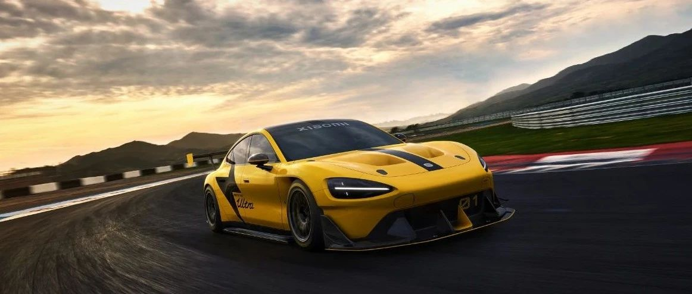

#  小米SU7答网友问（第四十六集）

[ 小米汽车 ](<javascript:void\(0\);>)

______

  

  

****

****

****

**01**

******小米V8s什么时候会正式上车？**

今天我们第一次亮相了小米SU7 Ultra原型车，也是小米自研V8s超级电机的首次应用。这款巅峰性能纯电车，采用了V8s+V8s+V6s的三电机设计，拥有1548PS的超强马力，零百加速仅有1.97秒（包含起步时间），最高时速超过350km/h。

我们之所以打造一款征战纽北的Ultra原型车，就是希望在世界最严苛的赛道工况下，做好充分的技术验证，不断打磨以尽快在量产车型上应用，敬请期待。

**02**

******10月****正式跑纽北，会直播吗？**

我们目前正在紧锣密鼓地备战，还没有想到是否直播的问题。届时我们肯定第一时间向大家汇报战绩。

**03**

******小米SU7 Ultra原型车涂装为什么是黄的？雷总演讲海报上的黄色字体是为了呼应做的特别设计吗？**

选择黄色涂装是因为工程师们觉得它帅。而雷总演讲海报上的黄色字体，这个纯粹是巧合。

**04**

******今天雷总披露，全年10万台交付目标会提前完成，那我的订单交付会不会提前？**

我们今天披露了最新的交付进度——10万台的交付目标将从今年年底达成提前至在今年11月内完成。

正是此前工厂双班生产并与供应链整合提产，才让这一激进目标成为现实。我们已于7月1日向所有用户刷新了交付周期，目前可在小米汽车APP上查询。

当然，今年接下来的时间，我们还会持续不断地尝试提产，后续的任何进展我们都将在第一时间告知大家，感谢你们的支持与等待。

**05**

******网传车外能语音唤醒小爱同学解锁车窗，现在还有这个问题吗？**

目前我们已经在Xiaomi HyperOS 1.2.2版本上线了严苛的语音控制权限策略，即当车辆处于P挡且车门中控锁上锁时，将禁止通过语音控制开启车窗、前后备箱等。对应到真实用车场景，当您停车在车内休息并且四门上锁时，来自车外的恶意语音控制将没有开启车窗等的可能。

为了进一步优化该体验，我们还将基于小米自研声音大模型能力，上线“车外唤醒防御”功能，可直接屏蔽来自车外的语音唤醒。届时，对于车外恶意语音操控车窗、前后备箱等攻击，抑制率将高达99%。

温馨提示：“车外唤醒防御”功能将在车辆处于P挡、四门及车窗处于完全关闭状态后自动生效，不需要额外设置。该功能预计将于8月通过OTA升级实现，具体以实际推送时间为准。

**06**

******购买了无忧服务包之后，免费取车/送车服务，是否有距离限制？**

小米汽车无忧服务包提供了免费维保取车或送车服务，仅在设有小米汽车已开业的官方服务中心（含授权）的城市提供，单个订单的服务仅限同城范围，不限距离公里数。使用该服务时，建议留存合理电量，司机会按照最优路线行驶。服务途中可能产生过路过桥费用，需要客户自行承担。

  
**07**

**无忧包里的免费喷漆，工时费也是免费的吗？**

免费漆面修复服务累计涵盖2个标准漆面。门把手等散件/小件，可多项累加享受免费喷漆服务，单次至少使用兑付1个面。权益有效期内，最大可累计享受2个标准漆面的免费喷漆权益。

免费喷漆权益已包含喷漆产生的工时费用，但不包含钣金和拆装工时，多信息可咨询小米官方客服了解。

  
**08**

**新增城市服务网络从哪里能查询到，年内会覆盖多少城市？**

2024年底，小米汽车服务网络将完成135家的官方服务中心拓展并开业，覆盖80个以上城市范围。服务网络可以通过官网查询：https://www.xiaomiev.com/store

  

  

小米SU7答网友问

持续进行中…

[小米SU7答网友问总集（上）：整车产品篇](<http://mp.weixin.qq.com/s?__biz=MzkyNzU3MDI3Nw==&mid=2247489972&idx=1&sn=b8c58d29e1da2eb08549f48262d2fcce&chksm=c22759bef550d0a88c50e70ab4bc59b26ab31ee5e634a52694ee0cc28f08979a4662fe598032&scene=21#wechat_redirect>)

[小米SU7答网友问总集（中）：智能体验篇](<http://mp.weixin.qq.com/s?__biz=MzkyNzU3MDI3Nw==&mid=2247490580&idx=1&sn=c0e685b4d60f817a799fd4594ab294ad&chksm=c2275c1ef550d508549e791b5b0d076288f55ee40a8145ea3642e6f9166aedba8b267cb11051&scene=21#wechat_redirect>)

[小米SU7答网友问总集（下）：交付服务篇](<http://mp.weixin.qq.com/s?__biz=MzkyNzU3MDI3Nw==&mid=2247490603&idx=1&sn=88ef8375987c8a7be5c1bc6b8a42e9f6&chksm=c2275c21f550d537cbed33f14c6062f066a768b19efdaa1fd3b67dc17c1abe494d5cffa15124&scene=21#wechat_redirect>)

[小米SU7答网友问（第四十集）](<http://mp.weixin.qq.com/s?__biz=MzkyNzU3MDI3Nw==&mid=2247490643&idx=1&sn=213f175676280f7958bace8d6d467568&chksm=c2275c59f550d54f201060f9c4c7dd8be6c6bd2737d38aa16cc3ccb85f8b7fd9598e0def18f8&scene=21#wechat_redirect>)

[小米SU7答网友问（第四十一集）](<http://mp.weixin.qq.com/s?__biz=MzkyNzU3MDI3Nw==&mid=2247490710&idx=1&sn=56d9b707c60ba5be5457d884f1013f88&chksm=c2275c9cf550d58a249cdd7bf8ea554d1b19869171a8addb307c4ab9daf17ae6f1a8ec8a190d&scene=21#wechat_redirect>)  

[小米SU7答网友问（第四十二集）](<http://mp.weixin.qq.com/s?__biz=MzkyNzU3MDI3Nw==&mid=2247490735&idx=1&sn=70a61bb524c263198c3db73cd0f4db6c&chksm=c2275ca5f550d5b3eacbf734b503cfdde5466232420a627886309ae897b7ae6cecdea1acc52a&scene=21#wechat_redirect>)

[小米SU7答网友问（第四十三集）](<http://mp.weixin.qq.com/s?__biz=MzkyNzU3MDI3Nw==&mid=2247490743&idx=1&sn=bffffaf2e910fc0e666a7648ed694fe5&chksm=c2275cbdf550d5ab1bf4c1d6b82c5a1f3b5206ee1a1d05198ae7a8f1af4d59f839dc34fd6ad2&scene=21#wechat_redirect>)

[小米SU7答网友问（第四十四集）](<http://mp.weixin.qq.com/s?__biz=MzkyNzU3MDI3Nw==&mid=2247490748&idx=1&sn=6160b9038c5209a9e64153ebcb2d3807&chksm=c2275cb6f550d5a0e14bab2b01483fad1bcee53889419e318e91d5768d3952c1c7b30ad0e185&scene=21#wechat_redirect>)

[小米SU7答网友问（第四十五集）](<http://mp.weixin.qq.com/s?__biz=MzkyNzU3MDI3Nw==&mid=2247494797&idx=1&sn=a97b403a4ff07ba213987e171f50119b&chksm=c224ac87f5532591b05a0ee18ef74c9372a10feb14481925ce4f496e9e11ef2f8d4b59336092&scene=21#wechat_redirect>)

  

  

  

预览时标签不可点

微信扫一扫  
关注该公众号

继续滑动看下一个

轻触阅读原文

小米汽车 

向上滑动看下一个

[知道了](<javascript:;>)

微信扫一扫  
使用小程序

****

[取消](<javascript:void\(0\);>) [允许](<javascript:void\(0\);>)

****

[取消](<javascript:void\(0\);>) [允许](<javascript:void\(0\);>)

****

[取消](<javascript:void\(0\);>) [允许](<javascript:void\(0\);>)

× 分析

__

微信扫一扫可打开此内容，  
使用完整服务

： ， ， ， ， ， ， ， ， ， ， ， ， 。 视频 小程序 赞 ，轻点两下取消赞 在看 ，轻点两下取消在看 分享 留言 收藏 听过