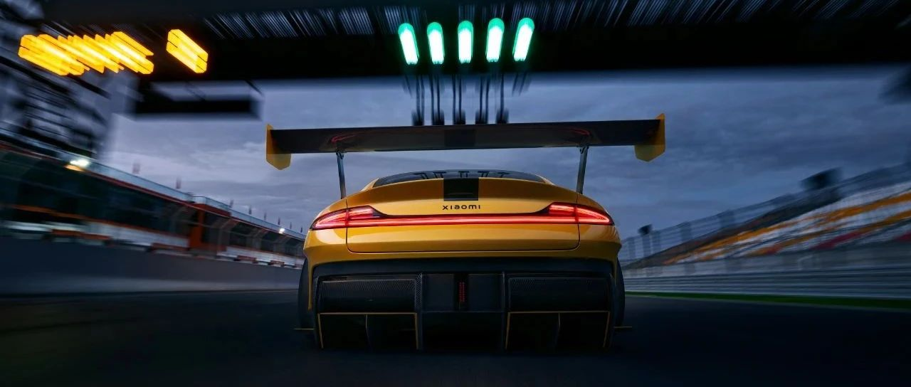

#  小米SU7答网友问（第四十九集）

[ 小米汽车 ](<javascript:void\(0\);>)

______

  

****01****

**有传闻说，小米SU7在金港赛道又上墙了，这是真的吗？**

的确出了赛道，但实情跟传闻的不一样。

7月21日下午，一辆小米SU7内部培训车辆在一次例行升级验证时，冲出赛道进入缓冲区。这次测试，本意正是为了摸寻赛道相关零部件的极限性能，所以进行了长时间激烈驾驶，以记录全周期下的全局数据。整个过程是在封闭包场环境下测试，现场无人员受伤，目前车辆已经运回测试中心进行内部调整。

有些网友利用了舆论的情绪惯性，在不了解这是一次官方测试的前提下，断然声称“小米又撞了”，造成大量用户对于此次事故的错误理解。

最后，我们也再次强调一下：小米SU7定位城市高性能轿车。上市后，我们一直强烈建议用户在进行赛道驾驶和测试时，首先要充分了解产品性能边界及掌握必要的专业驾驶知识，并对车辆制动系统、轮胎等进行必要的升级后，再尝试挑战赛道驾驶。请用户切勿在车辆原厂状态下，冒然挑战极端的赛道工况，确保人车安全。

  

**02**

******小米SU7 Max锁车后激光雷达似乎还在工作，为什么呢？**

整车锁车后，车辆将在一段时间后进入休眠状态。而当车辆正式进入休眠状态后， 激光雷达才将不再运行。在此之前，车辆控制器仍在工作，因此激光雷达也在工作。这一现象属于正常情况, 请各位用户不必担心。

  

**03**

******后排车门打开后，车身上有个小黑洞是干什么用的？**

小米SU7后门门槛部分确实有一个圆形洞，对应车门边有一个帽型柱状杆。这是为应对侧面碰撞而做的安全设计，防止侧碰时车门过多侵入乘员舱，以降低乘客受到伤害的风险。目前很多车型都会采用类似设计，只不过形状可能有所不同。

  

**04**

**为什么我朋友和我一起订车，他的预计交付周期更长，但是已经提车了？**

感谢大家的耐心等待和反馈，我们完全理解大家想要尽快提车的心情。

关于交付进度，目前小米汽车是按照同配客户的锁单时间顺序安排生产，但受到不同配置的车辆在不同城市的订单分布有差异、工厂发运至各城市物流时效的不同等因素影响，提车节奏也会有所不同。

我们的交付人员会在车辆信息发生变化时第一时间跟您同步，在预计交付周期内尽快通知您提车。

  

**05**

**网上都在说南方比北方快，是真的吗？多久能交付，能不能插队？**

我们是按全国用户锁单顺序进行车辆供应，小米将严格按照此原则进行车辆生产及交付安排，官方不会存在插队及城市/地域区别对待的现象。

针对大家关注的同配车辆交付进度的问题，在此也为大家科普一下同配置的概念：同配置是指车型、车漆、内饰及选装配置（轮毂、冰箱、储物空间、真皮座椅等）完全一样的订单。因此由于我们的车辆功能很多，选配丰富，并不是说车型及车漆颜色一样就是同配了。同配订单按锁单时间生产下线，同时在交付时效上会因为您所选提车城市运输距离有一定差异。

原则上同城同配置按锁单顺序供应不变，但同城不同配置订单由于生产和物料供应情况的限制，交付的周期会有所差异。

同时，针对车辆到店后原用户放弃订单的情况，在征得同城下个同配客户的同意后，我们会将车辆按锁单时间顺延安排交付，这并不是大家认为的插队。

为方便各位用户提前了解并安排提车事宜，请参考您APP订单详情页面展示的预计交付周期。

让您早日提到心爱的车辆是我们的目标，目前我们也正在全力提升产能，加速交付，感谢您的理解。

  

**06**

**提车是去交付中心吗？车辆发运后是否可以更改交付地点？**

是的，提车是在交付中心办理。

您在订单锁定的时候，有选择交付地点的确认环节。如在当时没有确认好，车辆下线前我们的交付顾问可以协助您修改一次，但之后就无法再次更换交付地点。我们的官网上有全国交付中心的清单，欢迎登陆官网查询，您也可以咨询您的交付顾问进行确认。

  

小米SU7答网友问

持续进行中…

[小米SU7答网友问总集（上）：整车产品篇](<http://mp.weixin.qq.com/s?__biz=MzkyNzU3MDI3Nw==&mid=2247489972&idx=1&sn=b8c58d29e1da2eb08549f48262d2fcce&chksm=c22759bef550d0a88c50e70ab4bc59b26ab31ee5e634a52694ee0cc28f08979a4662fe598032&scene=21#wechat_redirect>)

[小米SU7答网友问总集（中）：智能体验篇](<http://mp.weixin.qq.com/s?__biz=MzkyNzU3MDI3Nw==&mid=2247490580&idx=1&sn=c0e685b4d60f817a799fd4594ab294ad&chksm=c2275c1ef550d508549e791b5b0d076288f55ee40a8145ea3642e6f9166aedba8b267cb11051&scene=21#wechat_redirect>)

[小米SU7答网友问总集（下）：交付服务篇](<http://mp.weixin.qq.com/s?__biz=MzkyNzU3MDI3Nw==&mid=2247490603&idx=1&sn=88ef8375987c8a7be5c1bc6b8a42e9f6&chksm=c2275c21f550d537cbed33f14c6062f066a768b19efdaa1fd3b67dc17c1abe494d5cffa15124&scene=21#wechat_redirect>)

[小米SU7答网友问（第四十集）](<http://mp.weixin.qq.com/s?__biz=MzkyNzU3MDI3Nw==&mid=2247490643&idx=1&sn=213f175676280f7958bace8d6d467568&chksm=c2275c59f550d54f201060f9c4c7dd8be6c6bd2737d38aa16cc3ccb85f8b7fd9598e0def18f8&scene=21#wechat_redirect>)

[小米SU7答网友问（第四十一集）](<http://mp.weixin.qq.com/s?__biz=MzkyNzU3MDI3Nw==&mid=2247490710&idx=1&sn=56d9b707c60ba5be5457d884f1013f88&chksm=c2275c9cf550d58a249cdd7bf8ea554d1b19869171a8addb307c4ab9daf17ae6f1a8ec8a190d&scene=21#wechat_redirect>)  

[小米SU7答网友问（第四十二集）](<http://mp.weixin.qq.com/s?__biz=MzkyNzU3MDI3Nw==&mid=2247490735&idx=1&sn=70a61bb524c263198c3db73cd0f4db6c&chksm=c2275ca5f550d5b3eacbf734b503cfdde5466232420a627886309ae897b7ae6cecdea1acc52a&scene=21#wechat_redirect>)

[小米SU7答网友问（第四十三集）](<http://mp.weixin.qq.com/s?__biz=MzkyNzU3MDI3Nw==&mid=2247490743&idx=1&sn=bffffaf2e910fc0e666a7648ed694fe5&chksm=c2275cbdf550d5ab1bf4c1d6b82c5a1f3b5206ee1a1d05198ae7a8f1af4d59f839dc34fd6ad2&scene=21#wechat_redirect>)

[小米SU7答网友问（第四十四集）](<http://mp.weixin.qq.com/s?__biz=MzkyNzU3MDI3Nw==&mid=2247490748&idx=1&sn=6160b9038c5209a9e64153ebcb2d3807&chksm=c2275cb6f550d5a0e14bab2b01483fad1bcee53889419e318e91d5768d3952c1c7b30ad0e185&scene=21#wechat_redirect>)

[小米SU7答网友问（第四十五集）](<http://mp.weixin.qq.com/s?__biz=MzkyNzU3MDI3Nw==&mid=2247494797&idx=1&sn=a97b403a4ff07ba213987e171f50119b&chksm=c224ac87f5532591b05a0ee18ef74c9372a10feb14481925ce4f496e9e11ef2f8d4b59336092&scene=21#wechat_redirect>)

[小米SU7答网友问（第四十六集）](<http://mp.weixin.qq.com/s?__biz=MzkyNzU3MDI3Nw==&mid=2247496002&idx=1&sn=581d0d1142d93ce150fea3965895558c&chksm=c224b148f553385e5f55cf9d7371f2db2fb70c3b8abb72b00774d4ffd446d16babcf1186ac00&scene=21#wechat_redirect>)

[小米SU7答网友问（第四十七集）](<http://mp.weixin.qq.com/s?__biz=MzkyNzU3MDI3Nw==&mid=2247496007&idx=1&sn=6a421c3b17cc1c65329d05cb32d9623c&chksm=c224b14df553385b03ed46354e48060b3936c02ef2eb6fc0525f42f293750ed873268571d202&scene=21#wechat_redirect>)

[小米SU7答网友问（第四十八集）](<http://mp.weixin.qq.com/s?__biz=MzkyNzU3MDI3Nw==&mid=2247496032&idx=1&sn=55195b432d452da064fcef7d5974a10f&chksm=c224b16af553387ccad87fac4f24947fa2d47458f9582f2346f5e289a8e7eb26a0347b2b811f&scene=21#wechat_redirect>)

  

  

  

预览时标签不可点

微信扫一扫  
关注该公众号

继续滑动看下一个

轻触阅读原文

小米汽车 

向上滑动看下一个

[知道了](<javascript:;>)

微信扫一扫  
使用小程序

****

[取消](<javascript:void\(0\);>) [允许](<javascript:void\(0\);>)

****

[取消](<javascript:void\(0\);>) [允许](<javascript:void\(0\);>)

****

[取消](<javascript:void\(0\);>) [允许](<javascript:void\(0\);>)

× 分析

__

微信扫一扫可打开此内容，  
使用完整服务

： ， ， ， ， ， ， ， ， ， ， ， ， 。 视频 小程序 赞 ，轻点两下取消赞 在看 ，轻点两下取消在看 分享 留言 收藏 听过