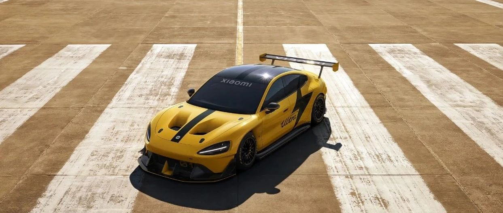
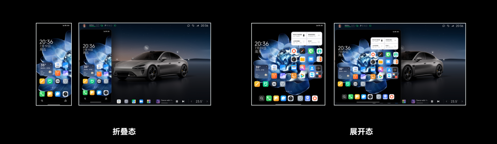
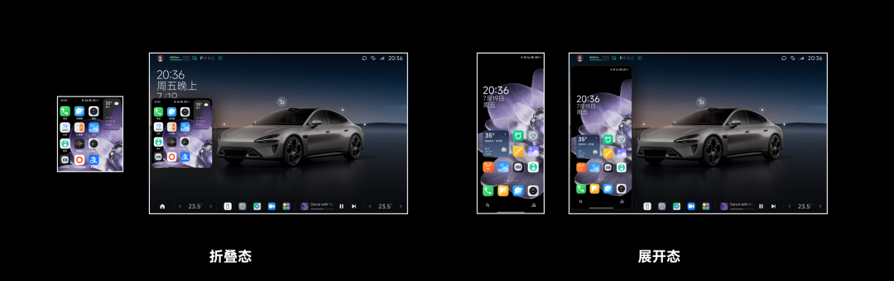

#  小米SU7答网友问（第五十集）

[ 小米汽车 ](<javascript:void\(0\);>)

______

  

****01****  

**为什么现在路上还能看到贴着伪装车衣的小米SU7，是新版本测试吗？** 7月19号的雷军年度演讲，给大家透露了小米SU7在上市前一共造了576辆样车，在超过300个城市进行了超过540万公里的道路测试。目前小米SU7上市后已经进行了2个大版本的OTA，为了持续保驾护航后续的功能OTA，确保大家能持续获得高质量的新功能和更稳定的软硬件协同，我们在发布后仍然坚持大规模的道路测试，这在行业内是十分少见的。所以大家在公开道路上仍然可以看到伪装车和相关测试车。  

**02**

**为什么我车还没到，连车都没有看到就要办理贷款？**

选择贷款购车的用户，银行侧有相关贷款办理流程需配合，如征信评估，面签，贷款额度审批，补齐尾款等流程，以上流程完成后才能最终放款。每一个环节都需要对应的办理时间，如果贷款放款未到账则无法完成提车。因此，提前完成贷款流程，有助于车辆到达交付中心后能第一时间为大家安排提车，缩短现场等待时间。

  

**03**

**为什么我已经锁单了，我的交付顾问还没有联系我？******

由于前期小米订单量比较多，交付顾问同时对接的用户数量较大，当前交付顾问在陆续服务中，感谢您的耐心等待。

我们的交付顾问会在您的订单临近交付周期时，联系销售同学邀请您进群并通过企业微信群与您联系。交付顾问将协助您开启车辆交付车主任务并与您对接完成前序流程，感谢您的耐心等待。

  

**04**

**小米新款的MIX Fold 4以及Flip，妙享桌面镜像到车机，内外屏会如何显示？**

我们正在为小米 SU7 推送 1.2.3 版本系统。升级后，小米 MIX Fold 4 和 MIX Flip 两款折叠新机，均支持将内外屏画面通过妙享桌面实时投送至车机。界面比例是和手机屏幕完全一致的，没有裁切、拉伸和黑边填充等问题。

小米 MIX Fold 4 妙享桌面投屏效果

小米 MIX Flip 妙享桌面投屏效果

特别推荐一下小米 MIX Flip——借助小米 SU7 车内预置的标准 1/4 螺口，再搭配手机支架，可以很轻松地架设在仪表台、顶部后视镜等机位。开启妙享桌面后，可以在车机上实时控制手机的视频录制、查看预览画面等，非常方便。

  

小米SU7答网友问

持续进行中…

[小米SU7答网友问总集（上）：整车产品篇](<http://mp.weixin.qq.com/s?__biz=MzkyNzU3MDI3Nw==&mid=2247489972&idx=1&sn=b8c58d29e1da2eb08549f48262d2fcce&chksm=c22759bef550d0a88c50e70ab4bc59b26ab31ee5e634a52694ee0cc28f08979a4662fe598032&scene=21#wechat_redirect>)

[小米SU7答网友问总集（中）：智能体验篇](<http://mp.weixin.qq.com/s?__biz=MzkyNzU3MDI3Nw==&mid=2247490580&idx=1&sn=c0e685b4d60f817a799fd4594ab294ad&chksm=c2275c1ef550d508549e791b5b0d076288f55ee40a8145ea3642e6f9166aedba8b267cb11051&scene=21#wechat_redirect>)

[小米SU7答网友问总集（下）：交付服务篇](<http://mp.weixin.qq.com/s?__biz=MzkyNzU3MDI3Nw==&mid=2247490603&idx=1&sn=88ef8375987c8a7be5c1bc6b8a42e9f6&chksm=c2275c21f550d537cbed33f14c6062f066a768b19efdaa1fd3b67dc17c1abe494d5cffa15124&scene=21#wechat_redirect>)

[小米SU7答网友问（第四十集）](<http://mp.weixin.qq.com/s?__biz=MzkyNzU3MDI3Nw==&mid=2247490643&idx=1&sn=213f175676280f7958bace8d6d467568&chksm=c2275c59f550d54f201060f9c4c7dd8be6c6bd2737d38aa16cc3ccb85f8b7fd9598e0def18f8&scene=21#wechat_redirect>)

[小米SU7答网友问（第四十一集）](<http://mp.weixin.qq.com/s?__biz=MzkyNzU3MDI3Nw==&mid=2247490710&idx=1&sn=56d9b707c60ba5be5457d884f1013f88&chksm=c2275c9cf550d58a249cdd7bf8ea554d1b19869171a8addb307c4ab9daf17ae6f1a8ec8a190d&scene=21#wechat_redirect>)  

[小米SU7答网友问（第四十二集）](<http://mp.weixin.qq.com/s?__biz=MzkyNzU3MDI3Nw==&mid=2247490735&idx=1&sn=70a61bb524c263198c3db73cd0f4db6c&chksm=c2275ca5f550d5b3eacbf734b503cfdde5466232420a627886309ae897b7ae6cecdea1acc52a&scene=21#wechat_redirect>)

[小米SU7答网友问（第四十三集）](<http://mp.weixin.qq.com/s?__biz=MzkyNzU3MDI3Nw==&mid=2247490743&idx=1&sn=bffffaf2e910fc0e666a7648ed694fe5&chksm=c2275cbdf550d5ab1bf4c1d6b82c5a1f3b5206ee1a1d05198ae7a8f1af4d59f839dc34fd6ad2&scene=21#wechat_redirect>)

[小米SU7答网友问（第四十四集）](<http://mp.weixin.qq.com/s?__biz=MzkyNzU3MDI3Nw==&mid=2247490748&idx=1&sn=6160b9038c5209a9e64153ebcb2d3807&chksm=c2275cb6f550d5a0e14bab2b01483fad1bcee53889419e318e91d5768d3952c1c7b30ad0e185&scene=21#wechat_redirect>)

[小米SU7答网友问（第四十五集）](<http://mp.weixin.qq.com/s?__biz=MzkyNzU3MDI3Nw==&mid=2247494797&idx=1&sn=a97b403a4ff07ba213987e171f50119b&chksm=c224ac87f5532591b05a0ee18ef74c9372a10feb14481925ce4f496e9e11ef2f8d4b59336092&scene=21#wechat_redirect>)

[小米SU7答网友问（第四十六集）](<http://mp.weixin.qq.com/s?__biz=MzkyNzU3MDI3Nw==&mid=2247496002&idx=1&sn=581d0d1142d93ce150fea3965895558c&chksm=c224b148f553385e5f55cf9d7371f2db2fb70c3b8abb72b00774d4ffd446d16babcf1186ac00&scene=21#wechat_redirect>)

[小米SU7答网友问（第四十七集）](<http://mp.weixin.qq.com/s?__biz=MzkyNzU3MDI3Nw==&mid=2247496007&idx=1&sn=6a421c3b17cc1c65329d05cb32d9623c&chksm=c224b14df553385b03ed46354e48060b3936c02ef2eb6fc0525f42f293750ed873268571d202&scene=21#wechat_redirect>)

[小米SU7答网友问（第四十八集）](<http://mp.weixin.qq.com/s?__biz=MzkyNzU3MDI3Nw==&mid=2247496032&idx=1&sn=55195b432d452da064fcef7d5974a10f&chksm=c224b16af553387ccad87fac4f24947fa2d47458f9582f2346f5e289a8e7eb26a0347b2b811f&scene=21#wechat_redirect>)

[小米SU7答网友问（第四十九集）](<http://mp.weixin.qq.com/s?__biz=MzkyNzU3MDI3Nw==&mid=2247496197&idx=2&sn=20d2997ddaa8b4acd48320f29c065d02&chksm=c224b20ff5533b1970b474d54e1c45dc70270641db75757bc54f82d4eb96112b4acb25ec8ed3&scene=21#wechat_redirect>)

  

  

  

预览时标签不可点

微信扫一扫  
关注该公众号

继续滑动看下一个

轻触阅读原文

小米汽车 

向上滑动看下一个

[知道了](<javascript:;>)

微信扫一扫  
使用小程序

****

[取消](<javascript:void\(0\);>) [允许](<javascript:void\(0\);>)

****

[取消](<javascript:void\(0\);>) [允许](<javascript:void\(0\);>)

****

[取消](<javascript:void\(0\);>) [允许](<javascript:void\(0\);>)

× 分析

__

微信扫一扫可打开此内容，  
使用完整服务

： ， ， ， ， ， ， ， ， ， ， ， ， 。 视频 小程序 赞 ，轻点两下取消赞 在看 ，轻点两下取消在看 分享 留言 收藏 听过