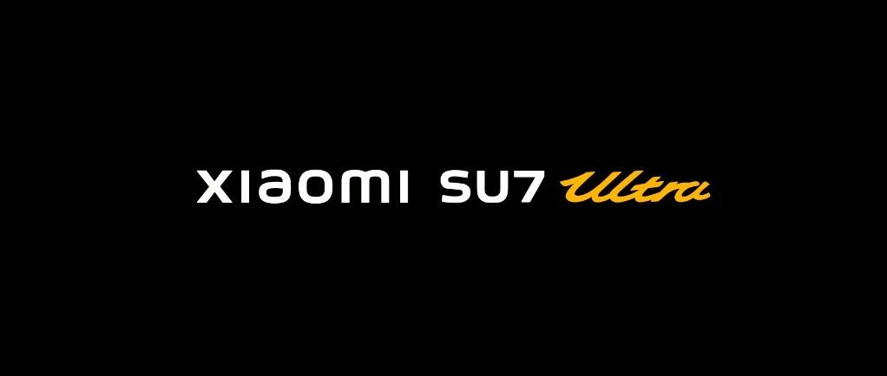
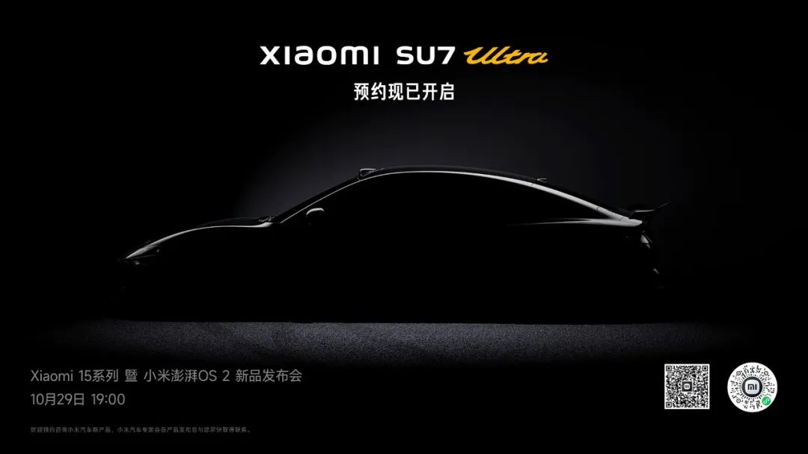

#  小米SU7答网友问（第七十集）

[ 小米汽车 ](<javascript:void\(0\);>)

______

****  
****

****01****

**29号要发布的小米SU7 Ultra量产版，跟之前发布过的小米SU7 Ultra Prototype，是什么关系？**

小米SU7 Ultra 量产版和小米SU7 Ultra Prototype（以下简称“PT版”），包括三电机系统、赛道版电池、热管理系统等核心技术能力完全相同，可以理解为“里子”一样。

不同之处在于，PT版是小米汽车纯电架构打造的赛道原型车，完全为赛道而生，无法实现合法上路。PT版的设计初衷就是追求赛道的极致表现，并验证三电系统及底盘等核心技术。

而量产版，除了巅峰极速赛道体验，还能合法上路。

简单总结，小米SU7 Ultra Prototype是验证技术的赛道原型车，小米SU7 Ultra是搭载赛道验证技术的量产车。更多信息，敬请期待10月29日晚7点的发布会。

  

**02**

**小米SU7 Ultra Prototype纽北跑了吗？现在有圈速了吗？**

非常感谢大家的期待与支持。由于纽北当地天气原因，目前我们仍未获得正式刷圈的机会。

我们的车手和工程团队仍然驻扎在纽北，等待新的窗口期，枕戈待旦做冲刺努力。

  

**03**

**小米SU7 Ultra量产版目前是盲定状态么，是否会涉及到后续购车权益？**

小米SU7 Ultra今天已经开启预约咨询通道，当您留下联系方式后，将会有产品专家与您取得联系。

当前的预约咨询阶段没有设置权益活动，更多的产品及销售权益信息，我们将会在发布会公布。

  

**04**

**除了小米SU7 Ultra 量产版，29号的其他新品怎么样？**

这次同场发布的还有全新旗舰手机小米15系列、全新的小米澎湃OS2，以及小米平板7系列 、小米手表S4等出色的新品，共同为小米「全生态 AI」的「新起点」加持助力。了解更多新品信息，敬请关注 10月29日 19点举行的发布会！

  

  

预览时标签不可点

微信扫一扫  
关注该公众号

继续滑动看下一个

轻触阅读原文

小米汽车 

向上滑动看下一个

[知道了](<javascript:;>)

微信扫一扫  
使用小程序

****

[取消](<javascript:void\(0\);>) [允许](<javascript:void\(0\);>)

****

[取消](<javascript:void\(0\);>) [允许](<javascript:void\(0\);>)

****

[取消](<javascript:void\(0\);>) [允许](<javascript:void\(0\);>)

× 分析

__

微信扫一扫可打开此内容，  
使用完整服务

： ， ， ， ， ， ， ， ， ， ， ， ， 。 视频 小程序 赞 ，轻点两下取消赞 在看 ，轻点两下取消在看 分享 留言 收藏 听过