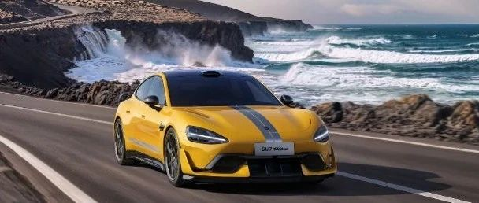

#  小米汽车答网友问（第七十五集）

[ 小米汽车 ](<javascript:void\(0\);>)

______

****  
****

****01****

**小米SU7 Ultra订金可退么？目前订车可以获得什么权益？**

小米SU7 Ultra今晚22点30分正式开始预订，意向金10000元，预计明年3月正式发布后，意向金即随时可退。

预订订单在权益兑现有效期内转为大定定单，可成功兑现优先交付权，权益规则以后续发布为准。

  

**02**

**我预订了小米SU7 Ultra，最快什么时候可以看到实车？**

小米SU7 Ultra当前仍处于预订阶段，目前全国门店尚未开放实车体验。我们计划在近期开启小米SU7 Ultra全国巡展，具体计划请关注小米汽车等相关官方渠道。

门店的展试驾车，我们预计在正式发布前就位，您的专属产品专家会持续与您保持联系，当您有机会鉴赏实车时，他会第一时间与您取得联系。

**03**

**小米SU7 Ultra有多少种颜色？**

此次发布会上，我们公布了小米SU7 Ultra「闪电黄」外饰颜色。但大家相信，在产品正式上市时，我们将公布更多令人惊喜的全新配色。

小米SU7 Ultra的「闪电黄」外观颜色，来源于极速闪电下的色彩，给人凌厉和速度感，进一步强化小米SU7 Ultra的巅峰性能。同时，我们用最真实、本真的工艺，表达了对闪电的敬畏：通过超音速旋杯，将油漆液滴分散到微米级，叠加层层质感还原闪电的色彩；此外，车漆覆盖的珠光粉实现特定排列，形成细腻闪烁的珠光折射，使车体在阳光中富有深邃的质感。

此次内饰设计上，小米SU7 Ultra也使用了黑黄撞色，这是很多超跑才会使用的大胆设计，细节处搭配的赛道刺绣条纹和专属刺绣均展示了小米SU7 Ultra的专属感。

  

**04**

**小米SU7 Ultra目前有哪些配置是标配？碳陶瓷制动盘是标配吗？**

作为一台拥有纯正赛道基因的四门跑车，小米SU7 Ultra原厂就能直接下赛道，因此标配了大量顶级高性能装备。

其中最关键的是碳陶瓷制动盘。我们深知制动系统在赛道极限工况驾驶时的关键作用，决心标配碳陶瓷制动盘和Akebono前六后四活塞的高性能制动卡钳。其中碳陶瓷制动盘的最大工作温度高达1300摄氏度，抗热衰性能极强，可以满足连续赛道驾驶的需求。在这套制动系统的加持下，小米SU7 Ultra的100-0km/h制动距离仅为30.8m，180-0km/h制动测试可连续进行10次不衰减，性能非常强大。

小米SU7 Ultra具备1548PS的超强马力，但想要将如此强大的动力输送至地面，作为介质的轮胎就显得极为关键。为了满足小米SU7 Ultra的性能需求，我们标配了倍耐力的顶级街胎P ZERO，且该款轮胎的花纹、配方和结构均为小米SU7 Ultra专门定制，能够带来极强的干湿地性能，足以匹配“可街可赛”的全面性能。

**05**

**小米SU7 Ultra性能这么强，电耗会不会非常高？**

小米SU7 Ultra搭载了两台小米超级电机V8s，配合小米自主设计的碳化硅电机控制器，不但功率密度极高，效率也达到了全新的高度--其中碳化硅电机控制器的最高效率可达99.85%，可有效降低驱动电耗。

拥有了高效的驱动系统，小米SU7 Ultra的CLTC工况续航里程可达630km，在释放超强性能的同时突破性的兼顾了长续航，日常在城市内通勤使用，也提供了令人安心的续航保障。

**06**

**纽北圈速有那么多榜单，为何小米只说了SU7 Ultra原型车是四门车第一？**

纽北全称纽博格林北环赛道，简称纽北。从2019年起，纽北开始记录官方圈速榜单，记录认证完成20.832km赛道圈速的车型。其中官方榜单车型分类包含燃油车与混动车型、纯电动车型两大类及11小类榜单。

截止目前在纽北官方榜单中，四门车一共20台，四门车的最快记录是**7′07″550。**

公开信息以往的所有纽北有效测试记录，包含四门原型车/量产车的最快记录是**6′57″578。**

小米汽车一开始的目标就是基于四门车去征战纽北，希望通过在赛道严苛环境下的不断历练后，未来将更多领先性技术应用于量产车中。并达成在十年内成为纽北最快四门电车的目标。

基于我们打造四门车的目标，小米SU7 Ultra原型车的纽北认证成绩是**6′46″874** ，无论从纽北官方榜单及公开信息记录来看，小米SU7 Ultra原型车都是纽北史上最快的四门车，不分量产车还是原型车。

**07**

**小米SU7 Ultra原型车纽北6分46秒874的成绩，符合预期么？**

今年7月19日，小米汽车首次宣布小米SU7 Ultra原型车将于10月正式挑战纽北。事实上，小米汽车在今年1月已经预定了纽北10月9日、10日全天包场测试，用于圈速挑战。

但在10月9日和10日，当地持续降雨，我们被迫放弃挑战。之后在10月17日，我们再次和纽北官方协调i-Pool时间，但再次因大雨未能测试成功。后续在10月21日和24日，同样希望争取测试场窗口，但均未成功。

直至10月28日当地时间上午11时，我们开始侦查赛道，之后进行了装载轮胎并进行调试，最终在当地时间11时50分正式发车，并最终以6分46秒874冲线完成，取得纽北最速四门车的圈速成绩。当日也完成了纽北官方确认。

在小米SU7 Ultra量产版正式亮相的前一天，我们完成了如同奇迹般的挑战，我们和所有关注小米汽车的朋友们都同样兴奋。此次挑战，我们在路面依然潮湿，且只有一圈的挑战机会下，完成了6分46秒874的成绩。后续我们还会继续发起挑战，希望可以取得更好的成绩。

**  
**

**08**

**据悉测试当天赛道路面还有20%是湿的，这对成绩有什么影响？**

湿滑路面会降低轮胎与路面之间的摩擦力，导致抓地力下降。这会影响小米SU7 Ultra原型车的加速、制动和过弯表现，从而影响圈速；极端情况下，积水还可能导致轮胎打滑，进一步降低整车操控性。

非常遗憾，测试当天赛道路面还有20%是湿的，会对我们的赛道成绩产生显著影响，我们也希望能够有机会再次刷新我们的圈速记录。

预览时标签不可点

修改于

微信扫一扫  
关注该公众号

继续滑动看下一个

轻触阅读原文

小米汽车 

向上滑动看下一个

[知道了](<javascript:;>)

微信扫一扫  
使用小程序

****

[取消](<javascript:void\(0\);>) [允许](<javascript:void\(0\);>)

****

[取消](<javascript:void\(0\);>) [允许](<javascript:void\(0\);>)

****

[取消](<javascript:void\(0\);>) [允许](<javascript:void\(0\);>)

× 分析

__

微信扫一扫可打开此内容，  
使用完整服务

： ， ， ， ， ， ， ， ， ， ， ， ， 。 视频 小程序 赞 ，轻点两下取消赞 在看 ，轻点两下取消在看 分享 留言 收藏 听过