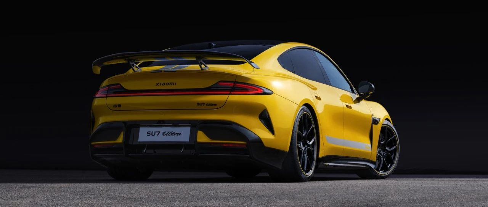

#  小米汽车答网友问（第九十二集）

[ 小米汽车 ](<javascript:void\(0\);>)

______

****  
****

****01****

**燃油车也可以原地掉头，小米智能底盘有什么区别？**

小米智能底盘预研技术展示的原地掉头，是基于超级四电机系统实现的。相比基于燃油四驱、电动四驱等方式实现的原地掉头，有很多优势。

  * **车内车外均可控制。** 用户可以在车内操作，也可以在车外通过手机APP遥控来操作，同时角度可调，比如下车后发现车辆停放位置不是很正，是可以通过手机APP修改角度，将车摆正。我们还引入了智驾感知信息，这对于车外遥控原地掉头功能是必要的。例如，在探测到路面条件不足或障碍物时，原地掉头功能会自动停止。

  * **能实现掉头速度可调，想快就快，想慢就慢。** 这需要整车控制模块协同调用四电机、制动、转向、悬架感知等系统，精准地控制四电机的扭矩、转速、方向，保证四个轮胎的滑移和转速一致；转向系统调整车轮方向，与电机协同实现旋转；悬架系统减少侧向力，保障稳定性与舒适性。

  * **能实现无间隔连续原地掉头。** 这十分考验电机的冷却能力，小米超级四电机系统的冷却系统非常强大，定子采用双循环立体油冷技术，对比行业通用的单向油路设计，有效散热面积增加100%；转子则采用了S型油路设计，实现了转轴和铁芯的同步冷却。这套散热系统搭载在SU7 Ultra的后驱系统上，就带来了纽北测试电机最高降温超30摄氏度的惊人成绩。

  * 小米超级四电机系统的前驱单个电机峰值扭矩380N·m，后驱单个电机峰值扭矩635N·m，大扭矩配合每秒500次的高频扭矩协同控制，使它在高附着路面上也能轻松掉头，**在极限情况下，能迅速反馈并自动校正车身姿态，保证安全驾驶。**

  * **转弯半径较小，能在更极限的路面脱困。** 四电机独立扭矩控制可以使左右两侧车轮反向运动，实现围绕车辆中的原地掉头。而基于燃油四驱，电动四驱等结构实现的原地掉头（又叫圆规掉头或者支点掉头），则是通过锁死某个车轮实现，转弯半径要大于基于四电机实现的原地掉头。如果用户需要，例如侧方位停车时，小米智能底盘也可以从默认的原地掉头方式切换到圆规掉头方式。

  

**02**

**小米预研的双活塞电子卡钳真的是首创吗？和行业已有的技术有什么区别？**

虽然同为线控制动及双活塞电子卡钳，但目前行业已有的产品方案与小米双活塞电子卡钳技术方案并不一致。

首先，小米采用的是48V系统方案，行业一些方案为12V系统；其次，小米预研的双活塞电子制动卡钳是单电机双活塞结构，目前行业已有的则是双电机双活塞、单电机单活塞、双电机单活塞结构，二者有所区别。相关技术创新，目前小米汽车也已经申请专利。

我们深知，线控化是未来智能汽车的发展趋势，小米汽车坚持量产一代，发布一代，预研一代的技术路线，持续深耕智能底盘领域，为大家带来更优的驾乘体验。

  

**03**

**端到端“车位到车位”的智驾功能可以在哪些城市使用？**

端到端“车位到车位”的智驾功能可覆盖全国、不限城市，我们将于12月底开启先锋版推送，请大家耐心等待。

  

**04**

**「小米汽车精英驾驶」是什么？所有用户都能参与么？**

小米汽车精英驾驶是小米汽车为用户打造的专业驾控技巧学习活动，内容包括赛道驾驶、漂移、驾控安全等项目，希望可以帮助喜爱驾驶的用户充分享受驾驶及赛道乐趣，并在提高驾驶技术和安全性的同时，感受小米汽车的驾控魅力。

其中面向小米SU7 Ultra小订用户的专属活动将在12月中旬开始招募。后续我们将为其余用户提供更多更具有趣味性的活动，敬请期待！

  

预览时标签不可点

微信扫一扫  
关注该公众号

继续滑动看下一个

轻触阅读原文

小米汽车 

向上滑动看下一个

[知道了](<javascript:;>)

微信扫一扫  
使用小程序

****

[取消](<javascript:void\(0\);>) [允许](<javascript:void\(0\);>)

****

[取消](<javascript:void\(0\);>) [允许](<javascript:void\(0\);>)

****

[取消](<javascript:void\(0\);>) [允许](<javascript:void\(0\);>)

× 分析

__

微信扫一扫可打开此内容，  
使用完整服务

： ， ， ， ， ， ， ， ， ， ， ， ， 。 视频 小程序 赞 ，轻点两下取消赞 在看 ，轻点两下取消在看 分享 留言 收藏 听过