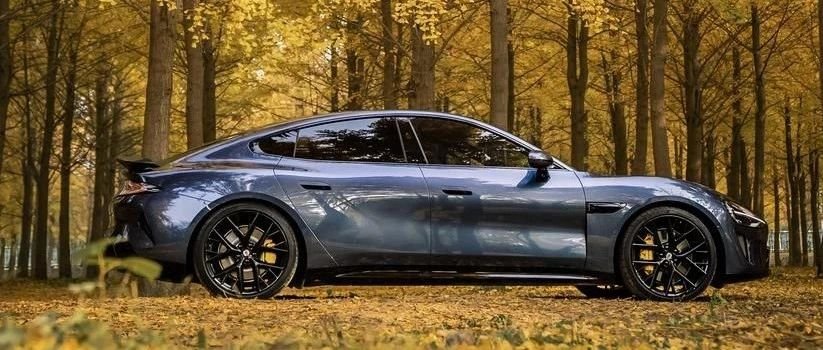
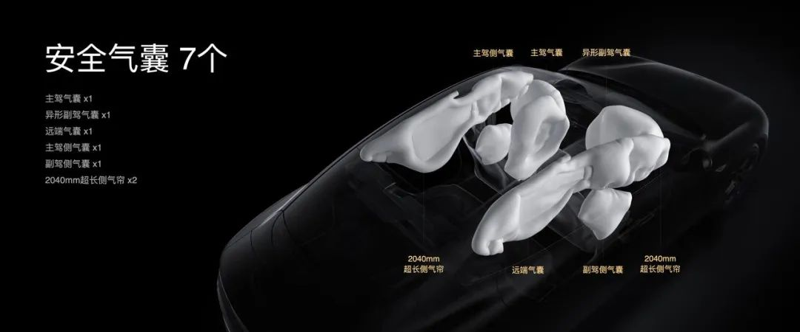
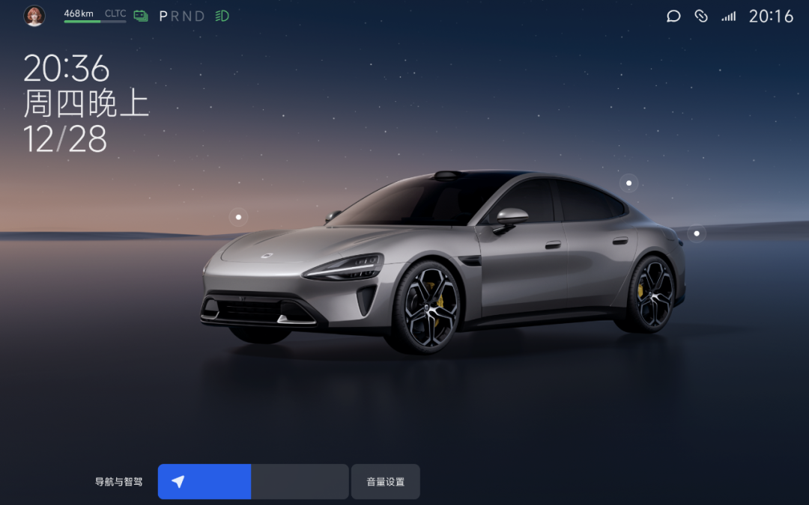

#  小米汽车答网友问（第九十七集）

[ 小米汽车 ](<javascript:void\(0\);>)

______

****  
****

****01****

**「车位到车位」智驾功能正式推送后，路线是如何生成的，需要手动设置么?**

小米汽车后续推送的「车位到车位」智驾功能，路线建立过程是完全在后台自动创建地图和路径，当一键开启智驾功能后，用户无需手动设置，全程均为无感的流畅体验。

比如通勤路线，只要上下班来回人驾各一次通过停车场，不需要额外任何的引导操作，即可在后台帮用户建好停车场地图。下次启动时系统会自动提醒用户，一键即可开启「车位到车位」智驾功能。

  

  

**02**

**车辆一旦发生碰撞，安全气囊都会弹开么？小米SU7有多少个安全气囊，分布在哪里？**

安全气囊是否展开需根据碰撞位置、速度等因素综合判断，并非任何碰撞都会展开安全气囊，否则可能为用户带来不必要的维修成本。安全气囊在部分情况可能不会展开，比如被追尾、与细长物体发生碰撞等未达到安全气囊传感器触发条件的情况，具体可见用户手册。

安全气囊的数量方面，小米SU7全系标配7个安全气囊，其中副驾安全气囊采用异形设计，其两侧护翼可有效避免乘员头部撞击到中控台、中控屏等硬物；长度达到2040mm的超长左右侧气帘还采用腔体下弯式设计，可有效避免乘员头部撞击到门板等硬物。气囊的具体位置如下：

  * 主驾安全气囊位于方向盘盖板内部

  * 副驾安全气囊位于副驾位置仪表板内部

  * 前排左侧气囊位于主驾座椅左侧

  * 前排右侧气囊位于副驾座椅右侧

  * 远端气囊位于主驾座椅右侧

  * 左侧气帘位于车辆左侧车顶边梁内部

  * 右侧气帘位于车辆右侧车顶边梁内部

  

此外，在中国保险汽车安全指数（以下简称中保研）全新测试规程的测试难度、评级规则全面升级的前提下，小米SU7仍获得3G+及A的优异成绩，即车内乘员安全指数G+（最高评级）、车外行人安全指数G+（最高评级）、车辆辅助安全指数G+（最高评级）、耐撞性与维修经济性指数A。同时小米SU7在驾驶员侧正面25%偏置碰撞、乘员侧正面25%偏置碰撞、正面50%偏置碰撞、侧面碰撞中，均获得乘员保护0缺陷的评价；小米SU7也是中保研新规首批测试车型中，唯一获得3G+及A的轿车；这足以说明小米SU7的安全性表现非常优秀，请大家放心。

**03**

**小米SU7的导航音量和音乐音量能分开调节么？**

小米SU7的导航和音乐音量是可以分开调节的。支持媒体、语音、导航与智驾、通话、来电铃声音量的独立调节，可在设置页面中独调节音量大小。另外，小米SU7多类的声音同时播放的情况提供了动态压音策略，以确保用户的听感体验。

还可以通过方向盘右侧滚轮调节音量大小，系统会自动调节当前活跃的声音音量，并且会在屏幕右下角展示正在调节的音量条，点击音量条右侧的「音量设置」可以拓展调节其它声音音量。

  

  

另外，也可以通过呼唤小爱同学，直接调节某一类声音的音量，例如：“小爱同学，导航音量大一些”或“小爱同学，音乐声音大一些”。

选装了物理按键的车主，也可以通过物理按键中间的旋钮调节媒体音量。

**04**

**不同的轮胎花纹、轮毂造型，对车辆的性能和续航有什么样的影响？**

不同轮胎花纹影响车辆的抓地力，不同重量的轮毂影响簧下质量，进而影响整车加速、制动及操控性能；不同的轮胎尺寸影响车辆的滚动阻力，不同轮毂的设计也会影响车辆的空气动力学性能，进而影响续航；

以小米SU7 Max版本为例，想要更静音舒适可以选20英寸轮毂，米其林Pilot Sport EV轮胎，内装隔音棉有效降低胎噪；想要更好操控体验可以选21英寸轮毂，倍耐力P ZERO 5轮胎，有效提高抓地力与运动性能。

小米SU7 Max版本零百加速2.78s，CLTC续航里程800公里，是国内唯一同时实现2秒级加速和800公里续航的纯电车型。在媒体实测中小米SU7 Pro版本续航里程实测达到804公里，续航达成率高达96.87%。

  

预览时标签不可点

微信扫一扫  
关注该公众号

继续滑动看下一个

轻触阅读原文

小米汽车 

向上滑动看下一个

[知道了](<javascript:;>)

微信扫一扫  
使用小程序

****

[取消](<javascript:void\(0\);>) [允许](<javascript:void\(0\);>)

****

[取消](<javascript:void\(0\);>) [允许](<javascript:void\(0\);>)

****

[取消](<javascript:void\(0\);>) [允许](<javascript:void\(0\);>)

× 分析

__

微信扫一扫可打开此内容，  
使用完整服务

： ， ， ， ， ， ， ， ， ， ， ， ， 。 视频 小程序 赞 ，轻点两下取消赞 在看 ，轻点两下取消在看 分享 留言 收藏 听过