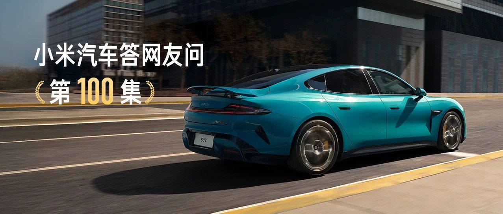

#  小米汽车答网友问（第100集）

[ 小米汽车 ](<javascript:void\(0\);>)

______

  

今天是「小米汽车答网友问」的第100集，在这个普通而有意义的日子，向所有关注、支持小米汽车和「小米汽车答网友问」的朋友们，致以最诚挚的感谢！

  

****01****

#### **小米SU7今年成绩超出了很多人想象，这是怎么做到的？**

的确，小米SU7的成功，远远超出年初我们自己最乐观的预期。这背后的原因，我们还在不断总结复盘。

目前我们认为最重要的原因有这么几条：

  

**一、“从核心技术做起，十倍投入，认真造一辆好车”**

在小米SU7这一款车上，我们花了3年多时间，投入超过130亿。

**二、始终坚持「小米方法论」，坚持小米“真诚、热爱”的价值观**

我们相信，小米汽车初战告捷，是小米方法论、小米价值观的成功。

**三、真诚面对用户，一切以用户为中心**

比如，100集「小米汽车答网友问」，数百个问题，**尽快响应用户关切的问题。**

从决定造车到现在，每一天我们都在总结经验、不断进步，真心感谢大家的关注和支持！

  

**  
**

**02**

#### **小米汽车「答网友问」是怎么坚持做到100集的？**

****

其实，如果算上2023年12月28日小米汽车技术发布会后的「小米汽车答网友100问」，我们的问答已经做了106集。

这个项目的初衷非常单纯，就是高度关注用户关切的问题，以最快的速度解答大家的疑问。在这背后，我们集结了产品、研发、设计、销售、交付、服务、小米汽车APP、用户社群、市场、公关…等多部门的团队，组成42名同事参与的项目固定班底，每天收集网友的提问，快速确认、快速解答、快速发布。

感谢大家一路的陪伴和支持，「小米汽车答网友问」会一直更新下去。

**  
**

**03**

#### **传说中的小米驾校，现在进展咋样啦？**

小米汽车精英驾驶的筹办正在紧锣密鼓的进行中，我们预计在12月开启招募。

同时小米SU7 Ultra小订用户专属活动也将在12月中旬同步开启，敬请期待。

  

预览时标签不可点

微信扫一扫  
关注该公众号

继续滑动看下一个

轻触阅读原文

小米汽车 

向上滑动看下一个

[知道了](<javascript:;>)

微信扫一扫  
使用小程序

****

[取消](<javascript:void\(0\);>) [允许](<javascript:void\(0\);>)

****

[取消](<javascript:void\(0\);>) [允许](<javascript:void\(0\);>)

****

[取消](<javascript:void\(0\);>) [允许](<javascript:void\(0\);>)

× 分析

__

微信扫一扫可打开此内容，  
使用完整服务

： ， ， ， ， ， ， ， ， ， ， ， ， 。 视频 小程序 赞 ，轻点两下取消赞 在看 ，轻点两下取消在看 分享 留言 收藏 听过