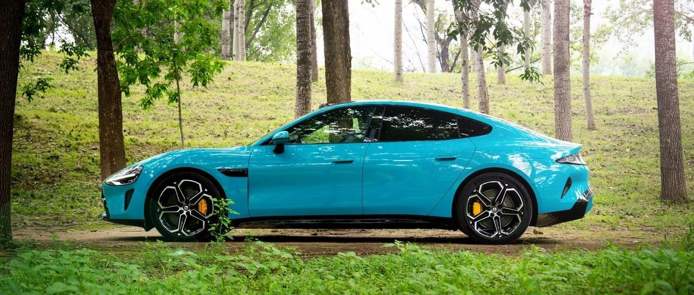
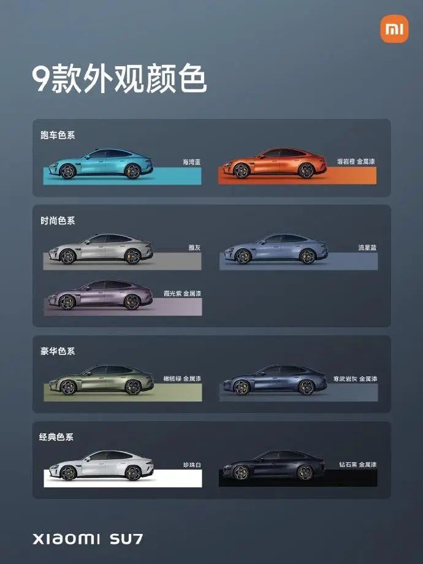
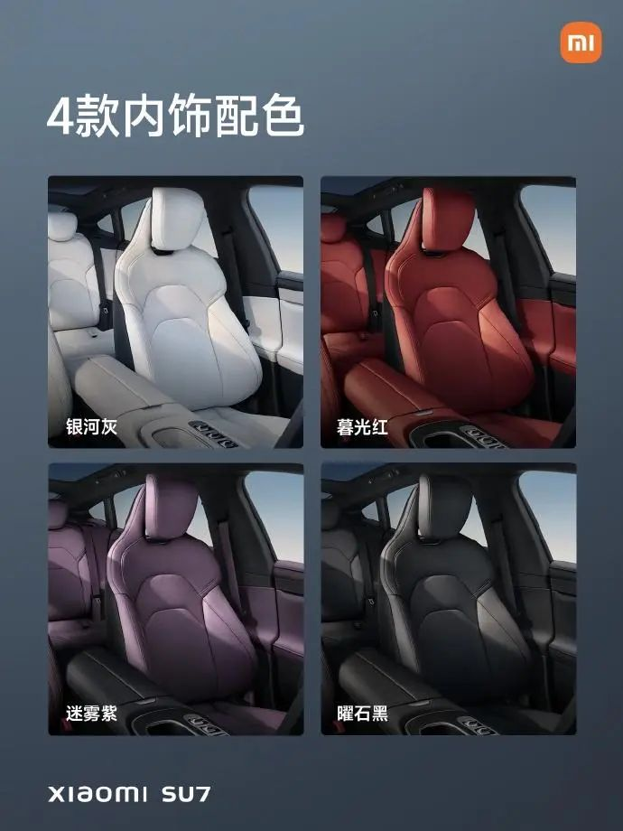

#  小米汽车答网友问（第102集）

[ 小米汽车 ](<javascript:void\(0\);>)

______

  

到今天为止，《小米汽车答网友问》第三季将收官，不知不觉已经超过了100集，感谢大家一路以来的支持。

  

后续《小米汽车答网友问》将重新转为不定期更新，我们将持续关注大家关心的问题，用最快的速度解答，欢迎大家持续提问，多多反馈。再次向各位致以最诚挚的感谢！

  

  

****01****

**在导航去充电站的过程中，车机屏幕提示“正在预热电池”是什么意思？**

小米SU7有可能在导航过程中提示“正在预热电池，以便快速充电”，这是小米SU7全系标配的「导航电池预热」功能，目的是在低温环境提升车辆充电速度。

低温下导航到充电站，车辆会结合目的地充电桩功率、当前电池温度、行驶时长、抵达充电站的预测电量等因素综合判断，智能开启电池预热、智能调节电池加热速率，以确保车辆到达充电站时，电池达到适宜温度，从而提升充电速度。当然，电池加热过程会耗费些许电量，如您有充足的时间充电，也可通过车辆设置—充放电—导航电池预热，关闭该功能。

  

**02**

**准备下定小米SU7了，但比较纠结颜色，有什么建议么？**

小米SU7提供同级最丰富的9种外观颜色供大家选择，包含“海湾蓝”、“雅灰”、“橄榄绿 金属漆”3款免费色，及 “流星蓝”、“珍珠白”、“熔岩橙 金属漆”、“寒武岩灰 金属漆”、“霞光紫 金属漆”、“钻石黑 金属漆”6款付费色，售价7000元。不仅颜色更丰富，在抗氧化、防腐蚀等性能方面，我们也有自信在行业中有领先的表现，自正式发布以来，深受大家喜爱。

我们充分地考虑到了大家的不同喜好，将9款颜色分为4个不同风格的系列，供大家选择参考：

  * 喜欢高饱和度的跑车色，可以选择“海湾蓝” 和 “熔岩橙 金属漆”，这样的颜色只有豪华车才会使用；

  * 喜欢低饱和度的用户，可以选择 “雅灰”、“流星蓝”、“霞光紫 金属漆”3个时尚色系；

  * 以及豪华色系“橄榄绿 金属漆”、“寒武岩灰 金属漆”；

  * 当然经典的黑白色系，“珍珠白”、“钻石黑 金属漆”都非常受欢迎。

内饰方面，我们提供了 “银河灰”、“暮光红”、“迷雾紫”和“曜石黑”四种，均免费。欢迎大家搭配和分享属于自己的内外饰组合，也可以在小米汽车APP-社区版块与其他车主一起讨论。

**03**

**我可以更换非原厂型号的小米SU7轮胎么？**

在型号、规格均匹配且符合相关国标的情况下，小米SU7用户可以使用第三方品牌提供的轮胎；但是请一定要关注和注意轮胎销售方资质及产品质量，以确保行车安全；

同时，由于非官方渠道的轮胎与车辆的匹配度和适配性与官方渠道的轮胎会存在差异，所以用户使用非官方渠道的轮胎时，车辆的性能、驾驶感受、能耗表现、安全性均可能会因轮胎产品本身的不同而受到影响。

**04**

**万一发生事故，如果去非小米官方授权维修店，会有什么影响么？**

非官方授权店未经过小米汽车在服务标准、技术能力、维修配件、维修工具/设备等方面的官方培训和认证，同时在用户服务和门店管理等方面与小米汽车官方授权店也可能存在不同的标准；

发生事故后，用户在非授权汽车维修店进行车辆维修，其维修质量、配件品质、用户体验可能都无法获得跟小米汽车官方服务渠道一样的保障，因此我们建议用户还是选择到小米汽车官方的直营/授权服务中心对车辆进行维修和保养。

  

  

预览时标签不可点

微信扫一扫  
关注该公众号

继续滑动看下一个

轻触阅读原文

小米汽车 

向上滑动看下一个

[知道了](<javascript:;>)

微信扫一扫  
使用小程序

****

[取消](<javascript:void\(0\);>) [允许](<javascript:void\(0\);>)

****

[取消](<javascript:void\(0\);>) [允许](<javascript:void\(0\);>)

****

[取消](<javascript:void\(0\);>) [允许](<javascript:void\(0\);>)

× 分析

__

微信扫一扫可打开此内容，  
使用完整服务

： ， ， ， ， ， ， ， ， ， ， ， ， 。 视频 小程序 赞 ，轻点两下取消赞 在看 ，轻点两下取消在看 分享 留言 收藏 听过