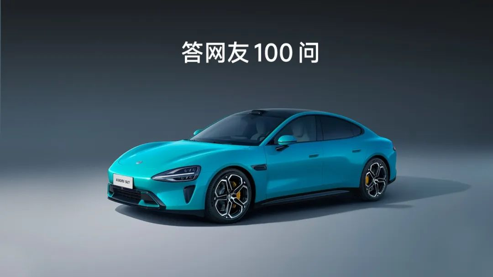

#  小米汽车答网友问（第104集）

[ 小米汽车 ](<javascript:void\(0\);>)

______

****  
****

****01****

**我不是小米汽车的用户，能报名参加「小米汽车精英驾驶」培训么？**

「小米汽车精英驾驶」初衷是为驾驶爱好者提供更低门槛的专业驾驶培训，并从中了解和掌握赛道、漂移、安全操控等进阶驾驶技巧，享受到纯正的赛道驾驶乐趣，让每一位学员从「驾驶车辆」成长为「操控车辆」。

因此无论您是否是小米SU7用户，都可以报名参与此次「小米汽车精英驾驶」活动。如果您是小米SU7 Ultra的小订用户，在培训结束后还将获得价值9999元的SU7 Ultra大定定金礼券，可用于抵扣定金金额。

更多活动报名信息，也欢迎大家前往小米汽车APP了解。

  

**02**

**我没有驾照，能参加「小米汽车精英驾驶」培训么？培训结束后，官方会颁发赛照么？**

「小米汽车精英驾驶」虽在封闭场地内进行培训，但项目要求驾驶员对于车辆驾驶能力和安全意识有基本了解，因此学员需持有合法有效的中华人民共和国机动车辆驾驶证，同时获得驾驶证并实际驾龄需满一年后，才可报名参加此次培训活动。

此外，完成培训的学员会在结束后被颁发「小米汽车精英驾驶」专属结业证书，该结业证书将会是学员后续参加进阶培训的资格证明。而赛照是由中国汽车摩托车运动联合会负责并监管，在完成由该协会组织的相关专业培训和考试后颁发。「小米汽车精英驾驶」培训目的是让学员掌握专业驾驶技巧，但并不会进行赛照培训，因此在培训结束后不会颁发赛照。

**03**

**这次驾驶培训的活动地点在哪？用的什么培训车辆？**

本次培训将在极富挑战性的浙江国际赛车场展开。该赛车场是国内最专业的赛车场之一，全程长3.20km、最大宽度12m、弯道16个、高度差19m，拥有国际汽联（FIA）认证的二级赛道和顶尖配套设备，确保您能充分体验赛道和漂移的乐趣，同时在专业教练的指导下，感受高性能车辆的驾控快感。

因小米SU7 Ultra还未上市，本次培训用车是经过专业赛道安全改装后的小米SU7 MAX。

**  
**

**04**

**  
**

**  
**

**「小米汽车精英驾驶」培训主要包括哪些培训项目？是谁来培训？**

「小米汽车精英驾驶」特邀了经过中汽摩联认证的专业教官担任此次培训的主教练。

培训科目主要包括赛道驾驶培训和漂移培训两部分。您将会学习赛道理论知识、赛道安全训练、赛道训练及漂移训练等课程。此外，培训将通过大量理论学习和实操训练，指导如何正确且安全的驾驭高性能车型。

  

**05**

**  
**

**以后还会去到其他城市/赛道举办么？**

「小米汽车精英驾驶」培训将会在全国范围内陆续广泛开展，后续还会通过适配不同驾驶经验的学员，上线更多专业丰富的驾驶培训内容。

如果您也非常希望参加，也非常欢迎在评论区留言告诉我们下一个推荐举办的城市。

  

预览时标签不可点

微信扫一扫  
关注该公众号

继续滑动看下一个

轻触阅读原文

小米汽车 

向上滑动看下一个

[知道了](<javascript:;>)

微信扫一扫  
使用小程序

****

[取消](<javascript:void\(0\);>) [允许](<javascript:void\(0\);>)

****

[取消](<javascript:void\(0\);>) [允许](<javascript:void\(0\);>)

****

[取消](<javascript:void\(0\);>) [允许](<javascript:void\(0\);>)

× 分析

__

微信扫一扫可打开此内容，  
使用完整服务

： ， ， ， ， ， ， ， ， ， ， ， ， 。 视频 小程序 赞 ，轻点两下取消赞 在看 ，轻点两下取消在看 分享 留言 收藏 听过