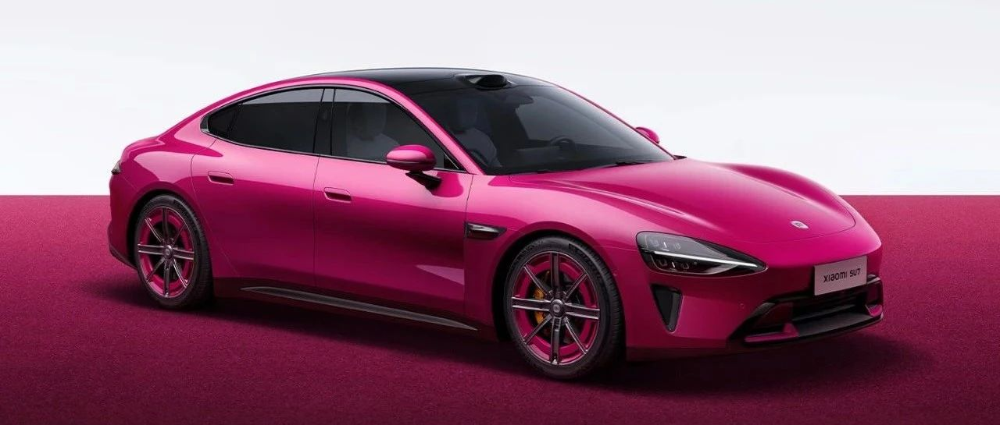

#  小米汽车答网友问（第105集）

[ 小米汽车 ](<javascript:void\(0\);>)

______

  

**小米汽车祝大家，2025新年快乐，万事顺遂。**

****  
****

****01****

**我已经选配了流星蓝车漆，还能保留么？**

您可以选择保留流星蓝车漆，或者在限时改配时间段内（2025年1月1日0点-2025年1月5日24点）将车漆选配颜色改成璀璨洋红。

  

**02**

**除了车漆颜色，我还能更改哪些配置？能改车型么？**

此次限时改配仅支持将原有选配更改为「SU7小米15周年限定系列」新上线的配置，如15周年限定色璀璨洋红、全新米灰色内饰或4款新轮毂样式。

此次限时改配不支持任何与新上线配置无关的调整，以及跨车型版本的变更，感谢您的理解。

  

**03**

**更改颜色/配置的话，我的车辆交付周期会受影响么？**

改配成功后，工厂需要重新安排车辆生产计划，因此您的车辆交付时间将重新开始计算。详情您可参考小米汽车APP内的预计交付周期，但实际交付时间还请以交付同事向您发送的交付通知为准。

**  
**

**04**

**  
**

  

**我现在下单选择曜石黑/银河灰内饰还是免费么？如果我暂不锁单，过几天再选择需要付费么？**

****

只要您在2024年12月31日24点前下单（大定），曜石黑/银河灰两款内饰颜色依然免费。

请放心，任何定价/购车权益都将以您下单（大定）的时间节点为准。因此只要您在2024年12月31日24点前下单，无论您何时锁单或是否更改了其他配置，曜石黑/银河灰两款内饰颜色均不用单独付费。

**  
**

**05**

**小米SU7其他选配色都是7000元，为什么璀璨洋红需要9000元？璀璨洋红是限量色么？**

璀璨洋红是专门为小米SU7专门定制，且全系车型均可选配，是小米15周年的「限定色」，但非「限量色」。

璀璨洋红采用独特的色彩配方，洋红底色加红色珠光粉点缀，让车漆在不同光线下具有不同的质感。室内、夜晚显得柔和，白日则显得活泼明艳。作为小米汽车首款红色系色漆，璀璨洋红极具纪念意义，也彰显了小米SU7非凡的运动格调与时尚气息。

**  
**

**06**

**我什么时候能看到璀璨洋红的小米SU7实车？**

璀璨洋红色的小米SU7正在紧锣密鼓的生产当中，预计展车会在2025年2月上旬开始进入门店。更多详情请关注小米汽车官方信息。

  

  

  

预览时标签不可点

微信扫一扫  
关注该公众号

继续滑动看下一个

轻触阅读原文

小米汽车 

向上滑动看下一个

[知道了](<javascript:;>)

微信扫一扫  
使用小程序

****

[取消](<javascript:void\(0\);>) [允许](<javascript:void\(0\);>)

****

[取消](<javascript:void\(0\);>) [允许](<javascript:void\(0\);>)

****

[取消](<javascript:void\(0\);>) [允许](<javascript:void\(0\);>)

× 分析

__

微信扫一扫可打开此内容，  
使用完整服务

： ， ， ， ， ， ， ， ， ， ， ， ， 。 视频 小程序 赞 ，轻点两下取消赞 在看 ，轻点两下取消在看 分享 留言 收藏 听过