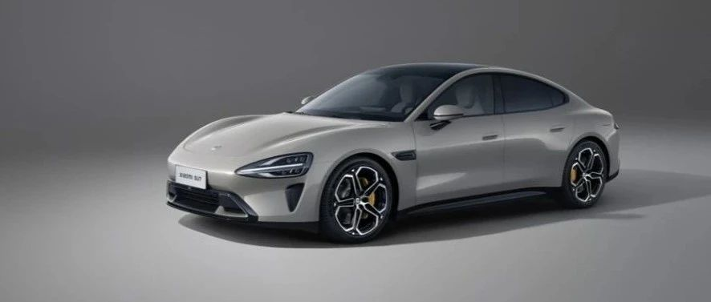

#  小米汽车答网友问（第106集）

[ 小米汽车 ](<javascript:void\(0\);>)

______

  

今日我们**主动** 向国家市场监督管理总局备案小米SU7标准版召回计划。召回2024年2月6日至2024年11月26日生产的部分SU7标准版电动汽车，共计30931台（车辆型号BJ7000MBEVR2涉及车辆18410台；车辆型号XMA7000MBEVR2涉及车辆12117台；车辆型号XMA7000MBEVR5涉及车辆404台）。经主管部门确认，相关投诉总量为**255例** 。现就网友关注问题集中作答：

  

****01****

**此次OTA召回需要车主驾驶车辆到服务点么？**

此次OTA召回仅通过对车辆进行免费远程升级（OTA）即可完成，不需要车辆进店进行任何检查或处理。我们将以短信、手机APP等方式通知相关车主，用户也可致电小米汽车科技有限公司客户服务热线：400-182-6888，了解更多关于此次OTA召回的详细信息。

  

**02**

**既然是软件升级，直接通过远程OTA不就行了么，为什么要叫主动召回？**

我们将通过汽车远程升级（OTA）技术，为召回范围内的标准版小米SU7车辆免费升级软件。

本次OTA软件升级召回，意在进一步提升智能泊车辅助功能的可靠性。小米汽车永远把用户安全作为第一原则，虽然本次升级不需要物理更换任何零件，但我们仍按照召回的程序进行管理和备案。相关说明已经在国家市场监督管理总局网站上公示，您可前往做更多具体信息的了解。

小米汽车将不断的为用户追求更高的安全标准，致力于为所有用户带来更高品质、更安全的汽车产品。

  

**03**

**只有标准版小米SU7在此次OTA召回范围内？小米SU7 Pro和Max版本不需要么？**

本次OTA软件升级召回，仅针对24年11月26号前生产的部分小米SU7标准版车型，并不涉及其他版本的小米SU7。我们已经通过APP和短信方式通知了涉及OTA召回车辆的主控账号所有人，将通过推送OTA升级的方式强化其智能泊车功能。

**04**

**“本次召回涉及2024年2月6日至2024年11月26日生产的部分标准版SU7”，小米SU7标准版不是2024年3月28日发布，4月3日才交付么，为什么2月份就开始生产了?**

在小米SU7正式上市前，为了使其经历更细致、更全面的长时间路测，我们生产了大量仅用于内部测试的工程车辆。其中有部分测试车也在此次通过OTA软件升级召回的车辆范围之内。

**  
**

**05**

**为什么小米SU7标准版智能泊车事故11月发生，现在才发公告？**

11月14日事情发生后我们第一时间确定了问题原因，为云端服务偶发故障引起的软件授时同步异常，并通过云端服务先实施了有效的防范措施，随后又在智能泊车辅助中加入了更多冗余保护策略措施，已确认排除风险可能。此后，又经过两个月的长时间版本反复测试验证，验证确认安全稳妥。在与主管部门沟通和协商后，本着对用户认真负责的态度，主动发起了本次OTA软件升级召回。

  

  

预览时标签不可点

微信扫一扫  
关注该公众号

继续滑动看下一个

轻触阅读原文

小米汽车 

向上滑动看下一个

[知道了](<javascript:;>)

微信扫一扫  
使用小程序

****

[取消](<javascript:void\(0\);>) [允许](<javascript:void\(0\);>)

****

[取消](<javascript:void\(0\);>) [允许](<javascript:void\(0\);>)

****

[取消](<javascript:void\(0\);>) [允许](<javascript:void\(0\);>)

× 分析

__

微信扫一扫可打开此内容，  
使用完整服务

： ， ， ， ， ， ， ， ， ， ， ， ， 。 视频 小程序 赞 ，轻点两下取消赞 在看 ，轻点两下取消在看 分享 留言 收藏 听过