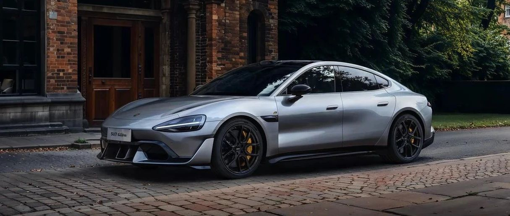

#  小米汽车答网友问（第107集）

[ 小米汽车 ](<javascript:void\(0\);>)

______

****01****

**这次连续挑战4个赛道，驾驶小米SU7 Ultra的车手是谁？**

我们隆重地再次向大家介绍，车手是小米汽车整车动态性能开发负责人、小米首席车手：任周灿@LifeDynamics灿，在小米内部大家都亲切地叫他“灿哥”。《小米 SU7 Ultra 纽北纪录片》里那个霸气喊出 “我们只需要7分钟” 的人，也是他。

他既是工程师，也是一位冠军车手，曾经拿下众多赛车比赛的冠军。作为小米首席车手，他驾驶着小米SU7 Ultra接连刷新了全国各大赛道的最速圈速成绩。

不只是阿灿，在小米汽车团队里云集了很多赛车手。正因为如此的爱车、懂车，我们才能造出好评如潮的小米SU7系列。

  

**02**

**完成上赛最速量产车圈速的小米SU7 Ultra，车子是什么状态，改过吗？**

完成圈速纪录的小米SU7 Ultra 为纯原厂状态，配置为官方原装。为了保障车手连续刷圈的安全性，我们还在车内加装了重量为80kg全笼防滚架，整车状态经过了上海国际赛车场的量产车官方认证。

**  
**

**03**

**赛道状态和气候对圈速影响很大，小米SU7 Ultra完成上赛最速量产车圈速当天是什么情况？**

2月13日，上海国际赛车场天气晴，气温为4摄氏度左右，路面为干地。

4摄氏度的气温属于低温环境，此时车辆轮胎、刹车及动力等性能表现会差于20摄氏度左右的常温环境。

  

**04**

**上赛最速量产车这个刷圈成绩是怎么达成的，过程顺利吗？**

结果意料之中，过程更加精彩。

2月10日练习日，小米SU7 Ultra第一次在上赛做官方刷圈练习，当天我们已经取得了2:10.620的好成绩。

2月13日正式刷圈日，车手任周灿对赛道更加熟悉后，几经尝试，傍晚最后一圈成绩锁定在2:09.944，刷新上赛官方认证量产车圈速，成为上海国际赛车场最速量产车。

  

**05**

**有人说，上赛圈速冲线时，是不是踩了刹车？这是怎么回事？**

非常感谢网友对我们一镜到底的视频进行逐帧分析。赛道挑战充满未知的可能，期待我们下次赛道冲击进入新的境界。

  

**06**

**今天保时捷也公开祝贺了小米SU7 Ultra上赛圈速，意外吗？**

我们诚挚感谢保时捷的祝贺，真心钦佩保时捷的格局与胸怀。

今天我们的圈速比保时捷快了1.33秒，但这不意味着小米汽车就超越了保时捷。保时捷依然是这个世界上最好的车，保时捷依然是我们学习的标杆。

  

**07**

**后续小米SU7 Ultra还会继续挑战赛道么？什么时候去纽北？**

正如今天早晨我们官宣圈速时所说，“这是一个新传奇的开始”。没错，只是开始。

我们将持续优化、验证小米SU7 Ultra的车辆极限性能，并持续挑战国内各大专业赛道。

当然大家都关心的纽北挑战，我们正在按计划准备中。小米SU7 Ultra源于纽北调校，我们有信心，把纽北也变成我们的主场。

  

**08**

**小米SU7 Ultra为什么叫新豪车？**

性能其实只是小米SU7 Ultra 魅力的一部分，小米SU7 Ultra的设计初衷，就是打造属于这个时代的新豪车。

“性能比肩保时捷、科技紧追特斯拉、豪华媲美BBA”，这是小米SU7 Ultra的目标。从一开始，小米汽车团队，就渴望做一台，设计豪华、科技豪华、运动豪华，都做到极高水准的开创之作。

什么是豪华？我们是这样理解：是“心有猛虎、细嗅蔷薇”的强大且优雅；是每个时代中，时代精神的先进旗帜；是充满自信，开创全新天地的实力与成就。

属于这个时代的新豪车，是时候登场了。

  

**09**

**雷总之前说小米SU7 Ultra有5种颜色，今天银色亮相真的好帅，还有哪些其他颜色可选？**

雷总在元宵直播中说过，小米SU7 Ultra另外几款车身色，非常适合城市用车环境。

更多颜色的亮相，敬请期待2月底的发布会。相信大家会更深切地感受到，小米SU7 Ultra的“强大且优雅”。

  

**10**

**今天发布的太空银官图不带大尾翼，大尾翼是选装么？**

是的，碳纤维大尾翼是选装项。选装大尾翼外观更运动，可以获得更好的下压力表现，提升赛道成绩；不选装大尾翼可以获得更好的日常驾驶能耗表现，实现更长的续航，同时在城市日常用车的诸多场景中适用性更好。

正式上市时，大家可以根据自己的使用情况选装碳纤维大尾翼。

  

**11**

**现在还可以下订小米SU7 Ultra么？小订有哪些权益？**

可以。下载 「小米汽车APP」 或 打开「小米汽车微信小程序 」就能快速预订。

现在预订可享优先交付权益，意向金10000元正式发布后随时可退。

同时，小米SU7 Ultra，在全国42城112店已正式开放静态品鉴，欢迎大家预约。

  

  

  

  

预览时标签不可点

微信扫一扫  
关注该公众号

继续滑动看下一个

轻触阅读原文

小米汽车 

向上滑动看下一个

[知道了](<javascript:;>)

微信扫一扫  
使用小程序

****

[取消](<javascript:void\(0\);>) [允许](<javascript:void\(0\);>)

****

[取消](<javascript:void\(0\);>) [允许](<javascript:void\(0\);>)

****

[取消](<javascript:void\(0\);>) [允许](<javascript:void\(0\);>)

× 分析

__

微信扫一扫可打开此内容，  
使用完整服务

： ， ， ， ， ， ， ， ， ， ， ， ， 。 视频 小程序 赞 ，轻点两下取消赞 在看 ，轻点两下取消在看 分享 留言 收藏 听过