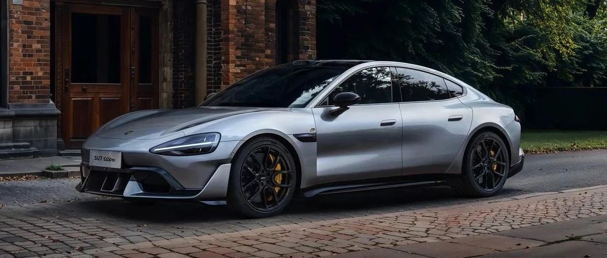

#  小米汽车答网友问（第110集）

[ 小米汽车 ](<javascript:void\(0\);>)

______

****01****

**明天小米SU7 Ultra就要正式上市了，怎么样才能第一时间下定？**

小米15 Ultra 暨 小米SU7 Ultra新品发布会将在明晚（2月27日）晚7点在小米公司、小米手机、小米汽车等官方账号多平台直播，同时也将在多个数码媒体、汽车媒体、电商等平台同步播出，请关注的朋友们准时收看。

另外，想要第一时间下定小米SU7 Ultra的朋友，也**一定请在发布会前，前往各大应用商店将小米汽车APP更新至最新版本：安卓版本号1.12.2，苹果版本号1.12.0。**

  

**02**

**小米SU7 Ultra提出了一年一万台的销量目标，产能情况怎么样？下单后需要等很久么？**

作为这个时代的「新豪车」，我们对SU7 Ultra全年一万台的销售目标很有信心。同时，我们也做好了小米SU7 Ultra发布上市的充分准备，有信心在其正式上市后，以最快的速度向用户交付。

现在距离小订关闭仅剩最后不到一天时间了。如果您想尽早提车，请抓紧时间在2月27日晚7点小米SU7 Ultra发布会开场前，通过「小米汽车APP」 或 「小米汽车微信小程序 」支付10000元意向金，并在小米SU7 Ultra正式上市后转下定，享受优先交付权益。

**03**

**除了今天公布的24K金碳纤维车标和5m² Alcantara全系标配，小米SU7 Ultra还有哪些配置标配/可供选配？**

除了24K金碳纤维车标和5m² Alcantara全系标配，还全系标配超大尺寸「碳陶瓷制动盘」，今日公布了「21英寸U型锻造轮毂」「21处碳纤维部件」「碳纤维双风道前舱盖」全系可选。小米SU7 Ultra还有很多令人兴奋的配置，敬请期待明日的发布会。

  

**04**

**碳纤维双风道前舱盖是什么？有什么作用？**

很多准车主，都非常期待碳纤维双风道前舱盖。他们说，无他，就是觉得非常帅气。

我们使用了热压罐工艺的碳纤维制造了小米SU7 Ultra的前舱盖，可选装替换原来的铝合金前舱盖，碳纤维面积高达1.73m²，可以使整车重量降低1.3kg。

碳纤维双风道前舱盖完全复刻小米SU7 Ultra原型车，采用了相同的空气动力学设计，2个贯穿风道，实现前部空气高效导流。

需要注意的是，选择铝合金前舱盖更优雅、实用，带有一个105L前备箱，且支持电动开合；选择碳纤维双风道更运动、硬核，让你拥有更贴近「纽北最速四门车」的惊艳外型。

  

**05**

**端到端全场景智能驾驶功能（HAD），小米SU7 Ultra什么时候可以有？**

小米SU7 Ultra出厂即搭载小米端到端全场景智能驾驶功能（HAD）。

作为一台性能比肩保时捷、科技紧追特斯拉、豪华媲美BBA的「新豪车」，所有小米SU7 Ultra的用户都将在第一时间享受到行业领先的智驾功能，享有全场景豪华用车体验。

**06**

**我的小米SU7为什么还没收到HyperOS 1.5.5的OTA更新推送？**

带有小米端到端全场景智能驾驶（HAD）功能的Xiaomi HyperOS 1.5.5，正**陆续** 向全量用户推送中。若您暂时未收到推送，请您不要着急，OS 1.5.5 OTA升级安装包将和以往一样分批次推送给所有用户，大家收到OTA更新提醒的时间可能略有差异。

此外，在完成HyperOS 1.5.5升级后，为了安全考量，您仍需满足安全智驾里程达到1000km以上（含ACC/LCC/高速NOA），才能使用端到端全场景智能驾驶（HAD）功能。

  

  

  

预览时标签不可点

修改于

微信扫一扫  
关注该公众号

继续滑动看下一个

轻触阅读原文

小米汽车 

向上滑动看下一个

[知道了](<javascript:;>)

微信扫一扫  
使用小程序

****

[取消](<javascript:void\(0\);>) [允许](<javascript:void\(0\);>)

****

[取消](<javascript:void\(0\);>) [允许](<javascript:void\(0\);>)

****

[取消](<javascript:void\(0\);>) [允许](<javascript:void\(0\);>)

× 分析

__

微信扫一扫可打开此内容，  
使用完整服务

： ， ， ， ， ， ， ， ， ， ， ， ， 。 视频 小程序 赞 ，轻点两下取消赞 在看 ，轻点两下取消在看 分享 留言 收藏 听过