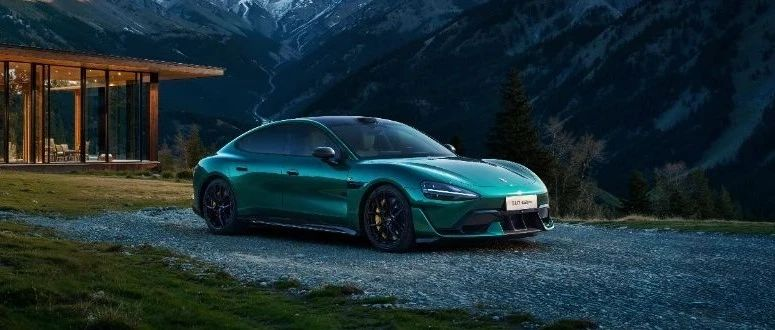

#  小米汽车答网友问（第115集）

[ 小米汽车 ](<javascript:void\(0\);>)

______

****01****

**我选装了碳纤维双风道前舱盖，为什么小米汽车APP里的交付周期又延后了？**

在小米SU7 Ultra上市后，碳纤维双风道前舱盖的选配量远超我们的预期。我们根据最新的工厂备料和生产计划重新计算了新的预估交付周期，对此带来的不便请予以理解。就如我们之前所提到，碳纤维双风道前舱盖是紧急开发并投入量产的选配项，请各位准车主再多给我们一些时间，我们会尽最大的努力提拉零部件产能，缩短交期，早日将您的爱车交付到您手上。

此外，**明早10点（2025年3月5日上午10点）我们将在「小米汽车APP」 开启限时改配活动** ，非现车的锁单用户将有一次机会进行改配，交付周期也会随选配内容的变化而调整更新。请注意，**一旦提交改配成功后不可退回** ，请谨慎选择。小米汽车再次感谢各位车主朋友的支持与理解。

  

**02**

**购买小米SU7 Ultra有购置税么？**

**有** ，根据最新的《关于延续和优化新能源汽车车龄购置税减免政策的公告》（2023年10月公告），针对在2025年12月31日完成开票的新能源车，国家对于每辆新能源乘用车的购置税补贴上限为3万元。因此，小米SU7 Ultra的用户需要缴纳3万元免税额以外的部分购置税，详情可以咨询您的专属Ultra Master。

  

**03**

**小米SU7 Ultra上的拉花会影响上牌吗？如果后期想更换可以自行处理么？**

小米SU7 Ultra拉花为原厂拉花，在上市前已登陆过工信部公告，对新车上牌不会产生任何影响；

在首销期（3月31日24:00前）下定SU7 Ultra，用户将享受到至高价值90000元的限时购车权益，其中包括免费赠送价值2000元的经典拉花。若您后续想更换拉花，可以将其移除，仅需去当地车管所重新备案外观即可正常用车。详情可咨询当地车管所或您的专属Ultra Master。

  

****04****

**「漫游寻位泊车」和「极窄库位泊出」功能什么时候能上线？小米SU7 Ultra和小米SU7 Pro或Max都支持么？**

小米SU7 Pro、Max及SU7 Ultra均支持「漫游寻位泊车」和「极窄库位泊出」功能。我们计划于本月下旬开启这两个功能的先锋体验，敬请期待。

「漫游寻位泊车」功能指当车辆驶入存有泊车路线的停车场后，如固定车位被占用或无固定车位，车辆会持续沿路线进行漫游，自动泊入沿途空车位：比如在商场高峰期自动搜索可用车位并自主泊入，让用户彻底告别找车位难的烦恼。而「极窄车位泊出」功能将辅助开启HAD后的车辆自动泊出车位并按导航路线开启智驾行驶，解决极窄车位“停车难出车更难”的问题。您可以观看以下视频来更直观地了解这两个功能：

  

****05****

**小米智驾保障服务是什么？**

为了保障用户无忧使用小米智驾功能，小米汽车将联合行业头部保险机构推出「小米智驾保障服务」，计划为用户提供最高300万的保障金额。小米汽车官方渠道会及时更新本项服务的最新进展，具体的保障范围等后续公布的内容为准，敬请关注。

  

  

  

  

  

预览时标签不可点

微信扫一扫  
关注该公众号

继续滑动看下一个

轻触阅读原文

小米汽车 

向上滑动看下一个

[知道了](<javascript:;>)

微信扫一扫  
使用小程序

****

[取消](<javascript:void\(0\);>) [允许](<javascript:void\(0\);>)

****

[取消](<javascript:void\(0\);>) [允许](<javascript:void\(0\);>)

****

[取消](<javascript:void\(0\);>) [允许](<javascript:void\(0\);>)

× 分析

__

微信扫一扫可打开此内容，  
使用完整服务

： ， ， ， ， ， ， ， ， ， ， ， ， 。 视频 小程序 赞 ，轻点两下取消赞 在看 ，轻点两下取消在看 分享 留言 收藏 听过