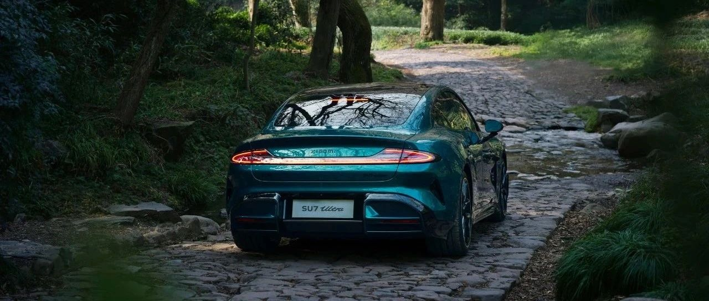

#  小米汽车答网友问（第116集）

[ 小米汽车 ](<javascript:void\(0\);>)

______

  

**01**

**小米SU7 Ultra最高高达1548匹马力，我该如何适应驾驭？**

小米SU7 Ultra有着极为出众性能表现的同时，驾驶质感也非常稳健，只要经过适应并注意安全，您就可以操控自如。

首先，您需要在充分了解并熟悉小米SU7 Ultra的驾控特性之后，才能逐级释放其峰值的动力性能。

当您的小米SU7 Ultra总里程在300km以内时，「驾驶安全保护功能」将强制开启且无法关闭。「驾驶安全保护功能」会执行以下操作：车辆最高时速限制为140km/h，车辆最大动力性能限制，禁用Boost模式、弹射模式和赛道大师模式。当车辆累计行驶里程超过300km后，您可通过点击“车辆设置-驾驶偏好”，来关闭 「驾驶安全保护功能」。

通过"车辆设置-驾驶偏好"完成《驾驶安全注意事项》的学习并通过驾驶安全测试。（测试结果与当前车主账号绑定，更换账号需重新测试）测试通过后，该账号将解锁「直线竞速模式」和「赛道模式」。在「直线竞速模式」下，同时踩下加速和制动踏板将启动弹射起步，即可实现1548PS最大马力；在「赛道模式」中切换至「排位模式」，并按下“一键Boost”按钮，也可实现1548PS最大马力。

此外，请注意：「直线竞速模式」和「赛道模式」严禁在开放道路中使用。在驾驶前请您仔细检查车辆及周边状态，我们不建议您在湿滑路面上使用这两种驾驶模式，可能会造成性能下降、甚至引起车辆打滑、失稳等安全隐患。

  

**02**

**参与小米SU7 Ultra试驾对驾龄有要求么？**

为了确保初次接触大马力高性能豪华车时，就能稳妥驾驭，您需持有中国大陆地区（不含港澳台）C级以上的合法驾照**满2年** ，方可进行试驾。

如果您的驾龄不满2年，或未持有在有效期内的合法驾照，我们将安排您在产品专家的陪同下参与试乘。感谢您的支持与理解。

  

**03**

**小米SU7 Ultra的电动前备箱有防夹功能么？**

小米SU7 Ultra的前/后备箱均支持电动开启和关闭，并带有防夹功能。在前/后备箱关闭过程中如遇到障碍物将会反向弹开，避免误伤用户或使车辆受损。

但我们仍需提醒大家，该功能仅限紧急情况下启用，请勿主动用手指等其他身体部位测试防夹效果。

  

****04****

**小米SU7 Ultra的官方质保政策是怎么样的？**

我们为小米SU7 Ultra用户提供了5年或者行驶里程10万公里（以先到者为准）的整车质保（易损耗零部件除外），和关键零部件（如动力电池及管理系统、驱动电机及控制器）8年/16万公里的质保权益。

除此之外，所有小米SU7 Ultra车主还将享受多项尊享用车服务：尊享维保服务、免费提供维修代步用车、终身免费上门补胎（不限次数/交付中心城市）、免费事故道路救援、3年免费车载网络、整车质保/关键零部件质保、2V1专属管家服务等，详情请咨询您的专属Ultra Master。

  

****05****

**小米汽车是否有免息购车方案？**

目前小米汽车官方没有推出任何免息产品。

小米汽车金融服务是小米汽车唯一官方金融服务品牌，官方合作金融机构包括建行/招行/平安等银行机构。请大家认准官方合作金融机构，谨防外部机构贷款风险，保护个人财产及信息安全。

  

  

  

预览时标签不可点

微信扫一扫  
关注该公众号

继续滑动看下一个

轻触阅读原文

小米汽车 

向上滑动看下一个

[知道了](<javascript:;>)

微信扫一扫  
使用小程序

****

[取消](<javascript:void\(0\);>) [允许](<javascript:void\(0\);>)

****

[取消](<javascript:void\(0\);>) [允许](<javascript:void\(0\);>)

****

[取消](<javascript:void\(0\);>) [允许](<javascript:void\(0\);>)

× 分析

__

微信扫一扫可打开此内容，  
使用完整服务

： ， ， ， ， ， ， ， ， ， ， ， ， 。 视频 小程序 赞 ，轻点两下取消赞 在看 ，轻点两下取消在看 分享 留言 收藏 听过