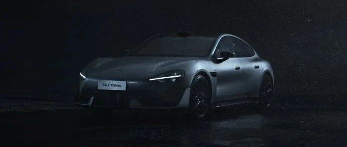

#  小米汽车答网友问（第117集）

[ 小米汽车 ](<javascript:void\(0\);>)

______

  

**01**

**小米SU7 Ultra的主动尾部扩散器有什么作用，是如何工作的？**

小米SU7 Ultra为了更好的兼顾日常驾驶的能耗需求和运动驾驶的操控需求，特别设计了主动尾部扩散器。它位于小米SU7 Ultra的尾部下方，不但可根据行驶车速进行 0° 和 32° 的自适应调节，也可手动调节。

扩散器在 0° （即打开）状态下，可降低风阻、提高续航里程；在32°（即关闭）状态下，可提高下压力、增强车辆的操控稳定性。是一个让小米SU7 Ultra可街可赛的标志性配置。

  

**02**

**小米SU7 Ultra的碳纤维双风道前舱盖如果发生碰撞，能维修么？**

如果您的碳纤维双风道前舱盖受损，大部分情况下只能更换不能维修。小米SU7 Ultra的碳纤维双风道前舱盖完全采用碳纤维材质打造，其是一种高强度、轻量化的材质；但同时它的韧性相对较低，在发生碰撞/挤压时容易发生脆性断裂。如果是表面漆面的划伤通常是可以修复的，但如果损伤已经到达碳纤维层，就无法通过维修的方式复原了。

因此，我们温馨提醒各位用户，小米SU7 Ultra的碳纤维双风道前舱盖采用了顶级的热压罐工艺、面积大且造价高，更换的价格会比较高，请大家日常驾驶时多多注意。

  

**03**

**小米SU7 Ultra的长续航轮胎和高性能轮胎在外观上有区别么？**

两种轮胎的花纹和胎肩造型完全一致，只有胎侧的定制小标有区别，高性能的定制标是“XM”，长续航的定制标是“XM-E”。

小米SU7 Ultra可自由选配倍耐力®P ZERO第五代长续航轮胎和高性能轮胎。两种轮胎均为小米专门定制，对结构、配方和花纹做了专项开发，并带有倍耐力®轮胎噪音消除技术，可有效降低胎噪。

其中长续航轮胎能有效增加续航里程，让小米SU7 Ultra的CLTC续航里程最高达到630km；而高性能轮胎则更注重操控表现，可获得更快的加速、并进一步缩短制动距离，建议您按需选择。

****04****

**新提的小米SU7 Ultra不小心被蹭了，听说官方可以提供免费代步车？**

是的，所有小米SU7 Ultra用户都可享受八大专属车主权益，其中包括免费提供维修代步车。

当您的车辆进店维保时，可直接向服务中心提出需求，或致电官方400热线申请，服务中心将提供每年至多7天（可分多次）的代步车免费使用权。如遇门店代步车无档期而暂不能向您提供代步车，您也可选择积分补偿的形式兑换该权益。

此外，代步车为小米汽车官方品牌车型，不同门店提供的代步车型号可能会有差异，请您理解。

  

  

  

预览时标签不可点

微信扫一扫  
关注该公众号

继续滑动看下一个

轻触阅读原文

小米汽车 

向上滑动看下一个

[知道了](<javascript:;>)

微信扫一扫  
使用小程序

****

[取消](<javascript:void\(0\);>) [允许](<javascript:void\(0\);>)

****

[取消](<javascript:void\(0\);>) [允许](<javascript:void\(0\);>)

****

[取消](<javascript:void\(0\);>) [允许](<javascript:void\(0\);>)

× 分析

__

微信扫一扫可打开此内容，  
使用完整服务

： ， ， ， ， ， ， ， ， ， ， ， ， 。 视频 小程序 赞 ，轻点两下取消赞 在看 ，轻点两下取消在看 分享 留言 收藏 听过