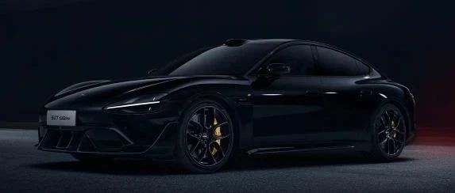

#  小米汽车答网友问（第118集）

[ 小米汽车 ](<javascript:void\(0\);>)

______

  

**01**

**小米SU7 Ultra内饰里使用了大面积的 Alcantara® 材料，日常应该如何保养？**

小米SU7 Ultra在车内大面积使用了昂贵的Alcantara® 超细纤维面料，它除了具有防滑、耐磨、抗污、易保养等特性外，其细腻的手感及远超真皮的摩擦系数，还能够提供更稳定的驾驶表现，兼顾豪华与运动性能。为了保证Alcantara®表面持久如新，在日常使用时您可注意以下几点：

  * 避免液体接触：及时清理液体（如饮料、雨水），防止渗透后留下水渍或霉斑。

  * 防晒防高温：长时间阳光直射会导致褪色和硬化，停车时使用遮阳挡或选择阴凉处。

  * 尖锐物品：避免钥匙、拉链等硬物刮擦表面。

您也可以使用以下几种方式来清洁Alcantara® 面料：

  * 轻柔除尘：用软毛刷（如化妆刷、专用Alcantara® 刷）或吸尘器（配软毛刷头）定期清除表面灰尘。

  * 局部污渍处理：轻微污渍可用干净微湿的白色棉布（避免染色）轻轻按压擦拭，不要用力摩擦。

  * 专用清洁剂：使用Alcantara® 官方推荐的清洁剂，或中性pH值的肥皂水（如婴儿洗发水）。

  * 在清洁时请注意不要使用酒精、漂白剂、强酸碱清洁剂；避免用力刷洗、浸泡或蒸汽清洁；不要用粗糙布料（如毛巾）或纸巾擦拭，以免掉屑或划伤表面。

此外，您也可定期使用Alcantara® 专用防护喷雾，增强其防污、防水性能（喷后需充分干燥）。‍

  

**02**

**小米SU7 Ultra的「曜石黑」和SU7的「钻石黑」是一个颜色么？有什么区别？**

小米SU7 Ultra的「曜石黑」和SU7的「钻石黑」看似相近，但其实各具特色。

小米SU7 Ultra的「曜石黑」灵感来自岩浆喷发、冷却、凝固而成的黑曜石。它是一种极致的纯黑色，与整车的“黑化”部件如大灯、下包围、窗线饰条和碳纤维车标等相得益彰，打造出冷酷的“黑武士”风格，散发出神秘而优雅的气息。配合黄色经典系列拉花，更能够营造出浓烈的运动气息。

小米SU7的「钻石黑」则为金属漆，在色漆中加入了致密的珠光粉，在阳光下呈现出如黑钻石般闪耀且深邃的光泽，别有一番低调豪华的质感。

  

**03**

**我在订车时选择了全款，提车时还能选择其他金融方案么？**

可以，您在提车前可随时更改付款方式，或选择其他金融方案；

小米汽车官方金融服务提供多种产品供您自由选择，而且也支持线上办理，详情请咨询您的专属产品专家。

  

****04****

**小米汽车有官方置换服务吗？我想换购小米汽车应该如何操作？**

小米汽车提供官方置换服务。您可以通过小米汽车APP-置换服务发起置换需求，也可以联系您的专属产品专家或交付专员为您发起置换需求。

当您发起置换后，小米合作的置换服务商将尽快与您联系并沟通车辆评估相关事宜，您也可以在APP-置换服务-置换记录中查看您的所有评估工单、当前置换进展、您的爱车报价等；同时，我们也会在置换页面中为您展示您的专属评估师姓名及联系方式，方便您核实来电身份，避免其他第三方冒充，损害您的利益。

  

  

  

预览时标签不可点

修改于

微信扫一扫  
关注该公众号

继续滑动看下一个

轻触阅读原文

小米汽车 

向上滑动看下一个

[知道了](<javascript:;>)

微信扫一扫  
使用小程序

****

[取消](<javascript:void\(0\);>) [允许](<javascript:void\(0\);>)

****

[取消](<javascript:void\(0\);>) [允许](<javascript:void\(0\);>)

****

[取消](<javascript:void\(0\);>) [允许](<javascript:void\(0\);>)

× 分析

__

微信扫一扫可打开此内容，  
使用完整服务

： ， ， ， ， ， ， ， ， ， ， ， ， 。 视频 小程序 赞 ，轻点两下取消赞 在看 ，轻点两下取消在看 分享 留言 收藏 听过