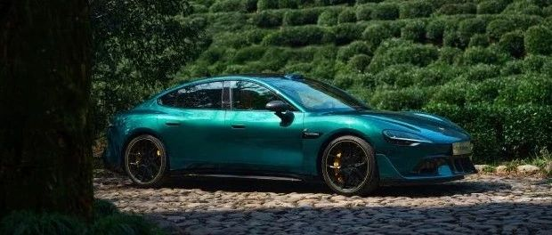

#  小米汽车答网友问（第119集）

[ 小米汽车 ](<javascript:void\(0\);>)

______

  

**01**

**现在选装碳纤维双风道前机盖的小米SU7 Ultra，什么时候能提车？**

经过一周的努力，我们成功提拉了小米SU7 Ultra碳纤维双风道前舱盖的产能。今天对部分锁单且选装碳机盖的订单进行了提拉，提拉幅度在0~11周不等（请以小米汽车APP里的信息为准）；同时，新下单的用户选装碳机盖的预计交期也提拉了11周。我们仍会持续努力，争取将您的爱车早日交付到您手中。

  

**02**

**小米SU7 Ultra装备了很多碳纤维套件，日常使用时需要注意什么？**

小米SU7 Ultra在全车装备了21处碳纤维部件，在日常用车中，您可注意以下事项：

  * 虽然碳纤维的韧性和强度较高，但日常用车过程中也请避免与硬物碰撞，以防损伤；

  * 请定期使用软毛刷或湿布清洁碳纤维表面，防止因灰尘或污渍沉积损伤、腐蚀碳纤维部件；

  * 请勿在装配有拉花的车辆上或碳纤维部件贴装车衣或改色膜，因为在贴装车衣或改色膜过程中可能损伤拉花及碳纤维部件。此外，车衣的贴装粘度较高，在去除过程中可能损坏拉花或碳纤维部件表面；

  * 洗车时，请您使用中性清洁剂，禁止使用含有强酸或强碱类的清洁剂，避免使用粗糙海绵清洗拉花或碳纤维件，也请勿使用高压水枪对准拉花处；

  * 请勿高温烘烤碳纤维部件，避免损坏碳纤维部件。

  

**03**

**小米SU7 Ultra上的所有车载生态配件都跟小米SU7是通用的吗？**

小米SU7 Ultra与小米SU7的30余种CarIoT生态配件均可通用，可畅享常用常新的生态拓展体验。其中，由于底盘结构有一定的调整，因此“底盘灯”与小米SU7非通用，我们为小米SU7 Ultra推出了专用的底盘灯产品，您可至小米汽车App选购。

不仅如此，小米SU7 Ultra全系标配最新版澎湃智能座舱、可融合“人车家全生态”体验、并对苹果产品生态友好，是一款时刻能给您带来一流智能体验的“新豪车”。

  
‍

****04****

**小米1000万Clips 智驾数据模型已经上线了么，什么时候可以体验到？**

带有小米端到端全场景智能驾驶（HAD）功能的Xiaomi HyperOS 1.5.5已于前段时间推送给用户，它是基于300万Clips优质场景片段积累而来的版本，其覆盖了更多复杂城市场景，车辆在拥堵、窄路会车等场景下的表现会更流畅、更安全。

1000万Clips的版本估计很快就将和大家见面，我们将随时跟大家同步进展，敬请期待。

  

  

  

预览时标签不可点

微信扫一扫  
关注该公众号

继续滑动看下一个

轻触阅读原文

小米汽车 

向上滑动看下一个

[知道了](<javascript:;>)

微信扫一扫  
使用小程序

****

[取消](<javascript:void\(0\);>) [允许](<javascript:void\(0\);>)

****

[取消](<javascript:void\(0\);>) [允许](<javascript:void\(0\);>)

****

[取消](<javascript:void\(0\);>) [允许](<javascript:void\(0\);>)

× 分析

__

微信扫一扫可打开此内容，  
使用完整服务

： ， ， ， ， ， ， ， ， ， ， ， ， 。 视频 小程序 赞 ，轻点两下取消赞 在看 ，轻点两下取消在看 分享 留言 收藏 听过