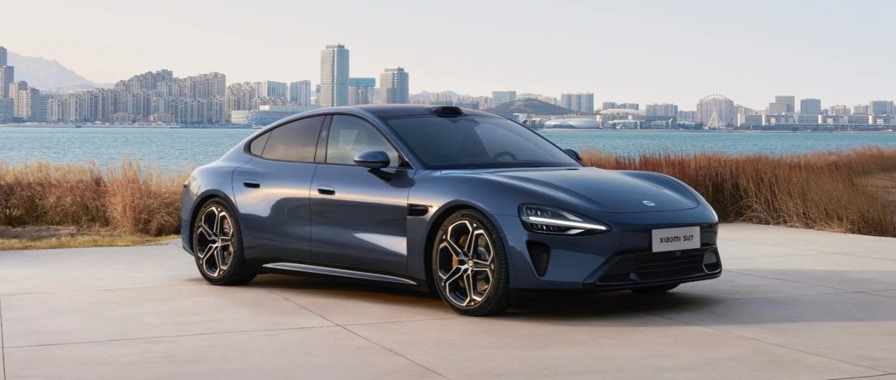

#  小米SU7答网友问（第十一集）

[ 小米汽车 ](<javascript:void\(0\);>)

______

小米SU7答网友问  

持续进行中...

[小米SU7答网友问（第一集）](<http://mp.weixin.qq.com/s?__biz=MzkyNzU3MDI3Nw==&mid=2247486958&idx=1&sn=fa1835ddd2eee3bdafefcad5b74d2d94&chksm=c2274de4f550c4f28c7b9e54f1a6a8bcacc3459e88bbe256c362a899a36ca32c80be4f87c45a&scene=21#wechat_redirect>)

[小米SU7答网友问（第二集）](<http://mp.weixin.qq.com/s?__biz=MzkyNzU3MDI3Nw==&mid=2247487024&idx=1&sn=0c7cfca4d7c560dedf8062fa3a7230e3&chksm=c2274e3af550c72cdf2c4b04f2e6f3f66f10eac3634f77346b68be322d895dfb1398978ccbcf&scene=21#wechat_redirect>)

[小米SU7答网友问（第三集）](<http://mp.weixin.qq.com/s?__biz=MzkyNzU3MDI3Nw==&mid=2247487063&idx=2&sn=a0651af985a684e2379d3805947abc23&chksm=c2274e5df550c74b86d3871da393feb8fcadab0dfcdc8e77c806309341c89f1b37396b0e6318&scene=21#wechat_redirect>)

[小米SU7答网友问（第四集）](<http://mp.weixin.qq.com/s?__biz=MzkyNzU3MDI3Nw==&mid=2247487079&idx=1&sn=9cf62cd9e760babefdd444d29ee00b68&chksm=c2274e6df550c77b506f07fb315efff406bc12a55eba23c69b349cba973f61811d88fd0ade33&scene=21#wechat_redirect>)

[小米SU7答网友问（第五集）](<http://mp.weixin.qq.com/s?__biz=MzkyNzU3MDI3Nw==&mid=2247487101&idx=1&sn=9e00cc3239d1e6d9cb373f2efad42e3c&chksm=c2274e77f550c76157349d363d8e0c17ceadab29fae7538c156149e37c9c89e7cc22644201b2&scene=21#wechat_redirect>)

[小米SU7答网友问（第六集）](<http://mp.weixin.qq.com/s?__biz=MzkyNzU3MDI3Nw==&mid=2247487835&idx=2&sn=30cf8170af01397c46dc34cf495f7c02&chksm=c2275151f550d847fcc5d8d333c20a5d27d60276888d7192f51064f53e6fa738e21bf375ef29&scene=21#wechat_redirect>)

[小米SU7答网友问（第七集）](<http://mp.weixin.qq.com/s?__biz=MzkyNzU3MDI3Nw==&mid=2247487849&idx=1&sn=45b7ceae12489188c167129f3fb8b1a6&chksm=c2275163f550d87500cbacfac5ee05ea1b5083b97beb0d16e375b98480c98c823fbfdcc4d45a&scene=21#wechat_redirect>)

[小米SU7答网友问（第八集）](<http://mp.weixin.qq.com/s?__biz=MzkyNzU3MDI3Nw==&mid=2247487860&idx=1&sn=337ffc5a7972e5758d3208fb1eb7a28d&chksm=c227517ef550d86838d64b08036486d07a6ea303f0f8e2e9bb93b097750beeb6b2649b692ede&scene=21#wechat_redirect>)

[小米SU7答网友问（第九集）](<http://mp.weixin.qq.com/s?__biz=MzkyNzU3MDI3Nw==&mid=2247487868&idx=1&sn=8021638c108d845fab76580a6cc405e9&chksm=c2275176f550d86086dc3bcdbc3b4cf518b1ba41a294c3ad5d39504791907edcc6422b015131&scene=21#wechat_redirect>)

[小米SU7答网友问（第十集）](<http://mp.weixin.qq.com/s?__biz=MzkyNzU3MDI3Nw==&mid=2247487890&idx=1&sn=47696df25bbc82e7c5aea71ccd30030e&chksm=c2275198f550d88e577cf942e5f0b4a7a6a21cc2cec4b0f04562b6acaa878177be8d8f2507b9&scene=21#wechat_redirect>)

  

## **01**

**哨兵模式能否用APP远程查看视频，或者车辆四周的实时状况？**

当然可以。小米SU7的哨兵模式可调取六颗高清摄像头同时录制画面，覆盖视野广、盲区小、畸变小。

当哨兵模式触发报警时，可以通过小米汽车APP远程查看车辆周围的实时状况，且可以闪灯、鸣笛，甚至远程喊话警告（声音经脱敏化处理）。

出于对公共信息安全的考虑，在小米汽车APP上查看到的车牌、人脸等信息都是经过模糊化处理的，且设置了每天一小时的远程查看限制，以更好保护公共信息安全。

  

## **02**

**如果开启哨兵模式，一晚上的耗电量大概是多少？**

根据工程师的综合测试，在约10℃的户外环境下，开启哨兵模式每晚（10小时）约消耗1.2-2.5kWh电量。

小米SU7的哨兵模式可调取六颗摄像头实时录制画面，本身比采用四颗摄像头录制方案的车型能耗要稍高一些。

哨兵模式的实际耗电量，也和环境温度、警报触发次数密切相关。即环境温度越低，耗电量越大；警报次数越多，耗电量越大。最近小米SU7十分火爆，停在公开场合可能会被围观，也一定程度上提高了触发哨兵模式报警的概率。

如果想节约能耗，可以开启“常用地点自动关闭”功能。开启此功能后，当用户位于在地图中设置的家和公司时，会自动关闭哨兵模式。

  

## **03**

**下雨天小米SU7是否可以涉水，深度如何？**

小米SU7在半载状态下（乘员150kg+行李30kg），车辆最大涉水深度为350mm。如意外超过该水深，建议立即联系售后进行车辆状态检查。

350mm相当于车轮轮心的高度，当车辆通过静止水面时，车速建议控制在5-7km/h，经过流动水面时，需更加小心。

特别提醒，车辆涉水只是为了避险，建议用户不要故意涉水，更不要高速涉水，以免造成额外安全隐患。此外，涉水时若车速过高，也有可能面临车辆外饰件及车底护板冲脱的风险。

正常车辆涉水后，也建议用户自行检查车辆的制动、喇叭、转向助力以及车灯是否良好，若发现问题，可联系小米汽车服务中心进行检查。

当用户无法判断路面水深时，建议绕行而非贸然强行通过。

  

## **04**

**无边框后视镜下雨天会比较影响视线，应该如何处理？**

小米SU7在研发过程中进行了大量水管理仿真分析及实车测试，行车状态下，外后视镜主视野区域基本不会出现水流现象，不会对行车安全造成影响。车辆在低速或静止状态下，雨滴可能会飘落和附着到镜片上，进而可能会影响视线，而小米SU7全系标配外后视镜加热功能，建议在雨天有需要时开启外后视镜加热，以保证最佳视野。后视镜加热开启方法：通过中控屏下方控制栏可进入空调控制界面，点击「后风挡加热/外后视镜加热功能」图标即可打开相关功能；或直接呼唤“小爱同学”下达指令，也可开启外后视镜加热功能。

  

## **05**

**下雨天，前备箱是否会进水？如果进水了怎么办？**

小米SU7前备箱有密封条，所以正常使用情况下，前备箱不会进水；如果前备箱载物出现液体遗洒，前备箱的前端有两个橡胶塞，用手拔开橡胶塞即可排水，排水后请注意将橡胶塞复位。

  

## **06**

**电动尾翼能否频繁的上升下降，冬天结冰冻住了怎么办？**

小米SU7电动尾翼，如果两次手动操作间隔小于10秒，且连续操作15次后，将会进入防玩保护模式。此时会限制尾翼关闭，等待150s后会退出防玩保护模式。

此外，小米SU7电动尾翼配备破冰功能，当检测到环境温度低于0度后，若尾翼正常开启时发生堵转，则会触发破冰功能。

破冰功能会以90%的最大扭矩尝试开启，如果3次开启不成功则会自动停止。此时，车辆重新进行上下电操作，会重置开启次数。

若电动尾翼遇到极端天气无法正常打开，为了保护尾翼电机机构，建议用户先手动除冰，避免持续使用破冰功能造成机构损坏。

  

## **07**

**如果在路上遇到扎胎/爆胎等意外情况，官方售后会提供什么服务吗？**

针对扎胎/爆胎情况，小米有两项服务可以覆盖用户需求：

第一，在移动服务已经覆盖的城市，用户可以通过线上服务中心（专属服务群/400热线）预约移动上门服务，完成对车辆的补胎/换胎。补胎和换胎的服务费用需用户自理，但购买了官方惠享服务包和保险产品的用户，可享受免费上门补胎服务，合同期内不限次数；

第二，用户可以通过线上服务中心，呼叫道路救援服务，将车辆拖运至最近的服务中心/维修站，再对车辆进行补胎/换胎。但免费的事故类道路救援服务，暂仅对购买了官方惠享服务包和保险产品的用户提供；其他用户，则需自己承担事故类道路救援费用；

针对高速场景，只能通过道路救援方式提供服务，因为高速路段不允许现场对车辆施工作业。

  

## **08**

**第一次开有前备箱的车，有什么要注意的地方吗？**

前备箱与车内空间是隔绝的，所以储存物品的气味不会窜入座舱，可以放心收纳外卖、渔具等。

通过车载小爱同学，可以非常方便地语音开启前备箱。在关闭小米SU7前备箱盖时，建议缓慢降下前备箱盖，直到锁扣触碰锁体后，将双手或单手放在小米LOGO前方，也就是前备箱盖的最前端，向下按压前备箱盖，直到锁扣与锁完全啮合，并检查是否关闭到位。

  

## **09**

**后备厢底部隐藏的储物格，是否有承重限制？**

为保障合理承重及行车体验，小米SU7、小米SU7 Pro建议在后备厢底部隐藏储物格装载不超过15kg的物品。而小米SU7 Max因为是四驱车型，后备厢储物载重能力会有些不同，建议在该储物格装载不超过10kg的物品。

  

## **10**

**有用户反应，车机自带的网络为什么三天后断网了？是需要提前做什么操作吗？**

根据工信部相关规定要求，车联网用SIM卡必须进行实名认证。如果在提车后3天内未完成认证，则车机将自动断开网络连接。

建议大家在提车前，打开小米汽车APP，点击「用车服务」-「车联网卡实名办理」完成实名登记，以便有更好的用车体验。

如现场提车后，未及时完成实名认证，可以打开小米汽车APP，点击「我的」-「设置」-「账号与安全」-「车联网卡实名认证」完成实名登记，信息提交后等待审核，审核通过后即完成实名认证，车机网络将自动打开。

  

## **11**

**小米SU7 Max极速最高支持265km/h，如果想限制速度应该如何操作？**

小米SU7可在P档驻车状态下，在车机系统「安全与服务」界面中进行「最高车速限制」设置，最高车速设置范围为80-160km/h。

此外，当车辆切换至「新手」驾驶模式后，最高车速将被限制为140km/h。另外，我们也正在考虑在初次启用车机的流程中，加入“确认是否启用‘最高限速’”的强制提示通知，如果您有更好的建议，请在评论中告诉我们。

小米SU7拥有舒适、运动、运动+、经济、新手五种默认驾驶模式，兼顾了经济性、舒适性以及运动性等不同的需求。日常在城市内驾驶，也建议用户根据路况等因素选择适合的驾驶模式。

小米SU7拥有强大的性能表现，最高车速可达265km/h。该数据是在有安全防护的专业封闭测试场地，由专业驾驶人员进行的测试认证。在公共道路上，不建议大家尝试，也请大家遵守道路交通法规要求，切忌超速驾驶，一同倡导安全行车。

  

## **12**

**当多人共用小米SU7的时候，车主如何授权他人使用？可以做到每个账号自定义设置吗？**

和小米生态的其他产品一样，小米账号是您在小米SU7上的“身份证”。通过登录小米账号，您可以在车上保存个性化设置、配合小米手机和米家生态产品使用「人车家全生态」的各种功能。

当然，我们也提供了共享权限，车主可以通过小米汽车APP（车辆-钥匙与安全-钥匙分享）给最多7名用车人授权用车权限。您的朋友和家人获得授权之后，相当于每个被授权方都有了自己的独立用车账号。既可以使用自己的手机数字钥匙解锁、用自己的账号登录小米SU7，也可以保存属于自己的个性化设置。

同时车主可以自主选择如：车辆位置、远程控车、米家控车等细分权限授权，并且通过账号隔离等手段，实现全面的数据隐私保护。

我们建议每一位用车人，都使用自己的账号登录车辆，享受完整的最佳用车体验。

  

  

预览时标签不可点

修改于

微信扫一扫  
关注该公众号

继续滑动看下一个

轻触阅读原文

小米汽车 

向上滑动看下一个

[知道了](<javascript:;>)

微信扫一扫  
使用小程序

****

[取消](<javascript:void\(0\);>) [允许](<javascript:void\(0\);>)

****

[取消](<javascript:void\(0\);>) [允许](<javascript:void\(0\);>)

****

[取消](<javascript:void\(0\);>) [允许](<javascript:void\(0\);>)

× 分析

__

微信扫一扫可打开此内容，  
使用完整服务

： ， ， ， ， ， ， ， ， ， ， ， ， 。 视频 小程序 赞 ，轻点两下取消赞 在看 ，轻点两下取消在看 分享 留言 收藏 听过