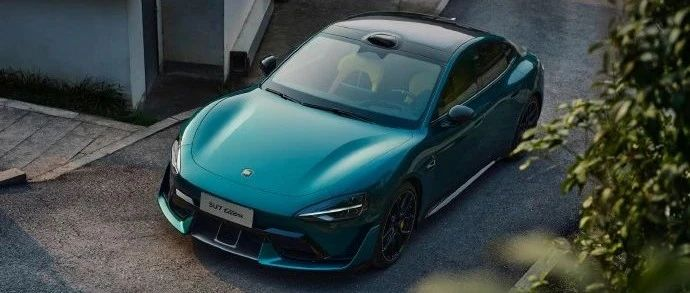

#  小米汽车答网友问（第121集）

[ 小米汽车 ](<javascript:void\(0\);>)

______

**  
**

**01**  

**为什么要给小米SU7 Ultra设置300km的「新手期」？什么是「驾驶安全保护功能」？**

我们为所有小米SU7 Ultra的用户设置了300km的「新手期」，以确保用户在充分了解并熟悉小米SU7 Ultra的驾控特性之后，在保证安全的情况下逐级解锁小米SU7 Ultra的全部动力。  

当您的小米SU7 Ultra总里程在300km以内时，「驾驶安全保护功能」会强制开启并执行以下操作：车辆最高时速限制为140km/h、车辆最大动力性能限制、禁用一键Boost、直线竞速模式和赛道模式。在里程数超过300km后，您也可以随时重新开启「驾驶安全保护功能」，以持续保证您的驾驶安全。

我们再三呼吁所有小米SU7 Ultra的车主朋友们，在车辆度过300km的「新手期」后也一定要加倍注意驾驶安全，遵守法律，敬畏生命。

  

**02**

**为什么我的小米SU7 Ultra续航里程不是标称的630km？**

小米SU7 Ultra具备丰富的选装配置，是否选配碳纤维尾翼和选择何种轮胎都会对车辆的风阻及能耗表现产生一定的影响，车辆的续航里程数也会发生变化，具体如下：

  * 若不选装碳纤维尾翼并选装长续航轮胎，CLTC续航里程为630km；

  * 若选装碳纤维尾翼和长续航轮胎，CLTC续航里程为600km；

  * 若不选装碳纤维尾翼、选装高性能轮胎，CLTC续航里程为555km；

  * 若选装碳纤维尾翼和高性能轮胎，CLTC续航里程为520km；

此外，车辆的具体实际续航数值也会受到驾驶风格和驾驶环境等多种因素影响，请您以实际驾驶情况为准。

  

**03**

**我的小米SU7提车快一年了，什么时候能开始续保？**

通常车险在到期**前30至60天** 可以进行续保，不同城市可以开始续保的时间也会不同。当您的小米SU7可以续保时，小米汽车APP将会向您推送提示信息，建议您注意查收；您也可随时通过小米汽车APP -「我的」-「服务」-「我的保险」查询您的爱车续保信息。

以下为各大城市可提前续保时段，供您参考：北京、河北、天津：60天；上海：55天；江西、海南：45天，其他省市：30天（具体请以相应城市保险公司为准）。建议您在可续保期开始后尽早办理，以获取更充分的选择时间。

  

****04****

**如果我选择了0首付方案购买小米SU7 Ultra，那2万的定金如何退还？**

成功办理0首付金融产品的小米SU7 Ultra用户，2万元定金将在车辆完成交付后原路退回。

  

  

  

  

预览时标签不可点

微信扫一扫  
关注该公众号

继续滑动看下一个

轻触阅读原文

小米汽车 

向上滑动看下一个

[知道了](<javascript:;>)

微信扫一扫  
使用小程序

****

[取消](<javascript:void\(0\);>) [允许](<javascript:void\(0\);>)

****

[取消](<javascript:void\(0\);>) [允许](<javascript:void\(0\);>)

****

[取消](<javascript:void\(0\);>) [允许](<javascript:void\(0\);>)

× 分析

__

微信扫一扫可打开此内容，  
使用完整服务

： ， ， ， ， ， ， ， ， ， ， ， ， 。 视频 小程序 赞 ，轻点两下取消赞 在看 ，轻点两下取消在看 分享 留言 收藏 听过