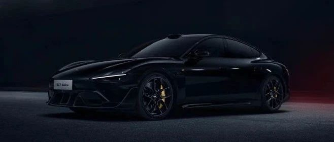

#  小米汽车答网友问（第123集）

[ 小米汽车 ](<javascript:void\(0\);>)

______

**  
**

**01**

**如果我想经常下赛道玩，车辆的哪些部分要特别注意保养？**

  
与日常驾驶相比，赛道激烈驾驶会对汽车的状态有更高的要求。总体而言，小米SU7 Ultra在德国纽博格林北环赛道及国内多家顶级赛车场均做了充分的验证和调校，即便在长时间赛道工况下，也能满足可靠性需求。但我们仍然建议您在下赛道前/后都及时至小米汽车官方售后服务中心对车辆进行全面检查和保养，以确保车辆的状态和安全性。同时，我们也建议您在赛道驾驶前也要充分了解车辆性能，参加专业的驾驶培训，以充分地掌握赛道驾驶的专业知识和规则。此外，大家也需要在以下几个方面多加注意：  

  * **制动系统** ：在赛道上，车辆需要频繁且大力地制动，这会导致制动片的磨损速度加快。同时，长时间的激烈驾驶会使制动系统产生大量的热量，频繁的高温环境可能导致制动液的性能下降，影响制动效果。小米SU7 Ultra全系标配碳陶瓷制动盘，不但可以耐高温、防止制动热衰减，同时还极为耐磨，即便赛道激烈驾驶也能拥有远超钢制动盘的寿命。

  * **轮胎** ：在赛道上，车辆需要频繁地加速、减速以及高速过弯，这会对轮胎产生较大的侧向力和纵向力，导致轮胎胎面的磨损加剧，尤其是轮胎的外侧和中间部分。赛道驾驶时轮胎与地面的摩擦产生的高温，会加速轮胎橡胶的老化，使其弹性降低，容易出现龟裂、硬化的现象。小米SU7 Ultra采用的轮胎均针对车辆性能原厂定制，可大大降低上述风险。建议您在更换轮胎时选择原厂轮胎，否则其操控性和耐久性均可能大幅降低。

  

**02**

**能详细介绍下小米SU7 Ultra的制动系统吗？**

小米SU7 Ultra采用性能先进、安全性出色的博世DPB+ESP10全解耦制动系统，因此可实现制动系统的**「四重安全冗余」** ，全方位保障驾驶安全：

  * 如果制动踏板失灵或卡滞，可以通过长按P档紧急制动，减速度可达0.8g；

  * 如果DPB或ESP任意一方失效，DPB与ESP互为备份，均能保证足够的制动能力；

  * 如果DPB与ESP同时失效，依然可以依靠机械液压制动备份，通过深踩制动踏板产生有效减速，可达法规要求的制动减速度；

  * 最后，如果液压及机械制动系统完全失效，小米SU7 Ultra还可以通过长按P档激活能量回收系统进行有效减速，最大减速度也可达0.25g。

此外，为防止制动系统过热带来的安全隐患，小米SU7 Ultra还特别配备了**三级制动报警功能** ，其中：

  * 在制动盘温度过高时会触发一级提示，车机系统将通过文字提示+报警音的形式告知驾驶员注意；

  * 在制动液温度接近沸腾时会触发二级报警，车机系统将以文字提示+报警灯+报警音的形式发出警报，同时会大幅限制驱动系统功率；

  * 在制动片剩余厚度不足时将触发三级报警，车机系统将以文字提示+报警灯+报警音的形式发出警报，同时会大幅限制驱动系统功率并限制车速不超过60km/h。

因此，在「四重冗余」设计和「三级制动报警」功能之下，加上小米SU7 Ultra全系标配由超大尺寸碳陶制动盘、Akebono®前六后四活塞固定卡钳等组成的赛道版制动系统，您可以充分信任其可靠性和稳定性。

  

**03**

**据说小米SU7 Ultra上的化妆镜也有升级，主要升级了哪些地方？**

小米SU7 Ultra的前排遮阳板化妆镜光源支持三档的亮度可调和三档的色温可调，其面积和补光效果都非常优秀。其不同的光源色温将会带来不同的面光效果：

  * 暖光色温为3500k左右，能柔化面部瑕疵，光线在面部形成的阴影明暗柔和，立体感强，容易打造出温馨、典雅的妆容效果。

  * 中性光色温为5000k左右，能真实还原妆容的颜色，使妆容看起来更加自然、真实。同时，妆容的细节能够被清晰地展现出来，适合打造日常的自然妆容。

  * 冷光色温为6500k左右，皮肤的瑕疵和纹理会更明显，妆容也会显得更加清晰、艳丽，适合精细的化妆操作，如修眉、眼部护理、化唇妆等，能够营造出清冷、干净的妆容效果。

您可按需调节化妆镜光源的亮度和色温，打造出适合的妆容效果。

  

****04****

**小米SU7 Ultra的21英寸U型锻造轮毂和标配的轮毂有什么区别？**

****

小米SU7 Ultra的21英寸U型锻造轮毂采用了航空6系铝材质，使用锻造、铣削工艺打造，从材质和工艺上都与标配的铸造轮毂有明显区别，也带来了诸多优势：

  * 更美观的造型：由于采用了铣削工艺，小米SU7 Ultra的21英寸U型锻造轮毂有着比21英寸U型铸造轮毂更纤细的辐条设计，能营造出独特的性能观感。

  * 高强度、轻量化：21英寸U型锻造轮毂在拥有更纤细的造型同时保证了强度，通过计算，如果使用铸造工艺达成相近的造型和强度、其重量会比锻造工艺高30%左右。

锻造轮毂拥有比铸造轮毂更好的材质和更复杂的工艺，因此其成本也远高于铸造轮毂，故而成为了小米SU7 Ultra的选装件。您可以单独选装21英寸U型锻造轮毂，也可选装后续上市的「竞速套件」，其中包含该21英寸U型锻造轮毂。

  

  

  

  

预览时标签不可点

微信扫一扫  
关注该公众号

继续滑动看下一个

轻触阅读原文

小米汽车 

向上滑动看下一个

[知道了](<javascript:;>)

微信扫一扫  
使用小程序

****

[取消](<javascript:void\(0\);>) [允许](<javascript:void\(0\);>)

****

[取消](<javascript:void\(0\);>) [允许](<javascript:void\(0\);>)

****

[取消](<javascript:void\(0\);>) [允许](<javascript:void\(0\);>)

× 分析

__

微信扫一扫可打开此内容，  
使用完整服务

： ， ， ， ， ， ， ， ， ， ， ， ， 。 视频 小程序 赞 ，轻点两下取消赞 在看 ，轻点两下取消在看 分享 留言 收藏 听过