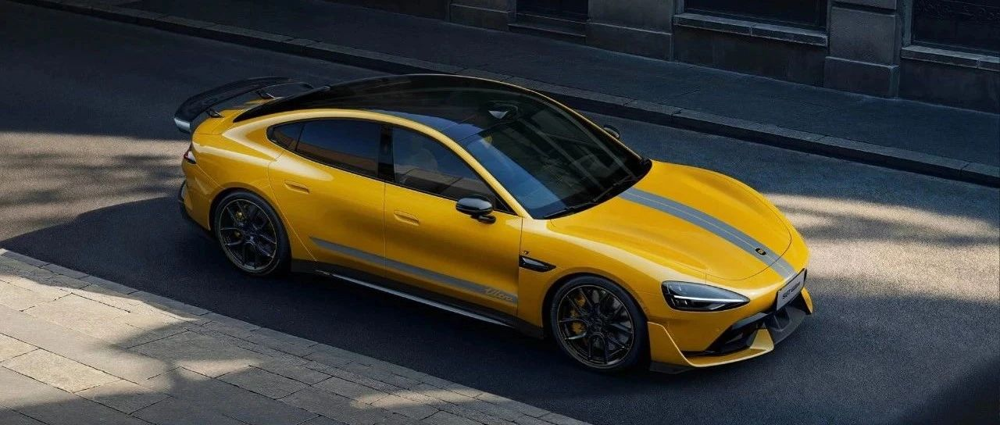

#  小米汽车答网友问（第124集）

[ 小米汽车 ](<javascript:void\(0\);>)

______

**  
**

**01**

**小米SU7 Ultra可以支持哪些苹果设备？**

小米SU7 Ultra全面支持苹果生态产品，如iPhone、iPad等。其搭载的小米澎湃智能座舱有着非常丰富的生态拓展能力，对苹果生态用户非常友好，目前有超过50%的小米汽车车主都是苹果用户。

  * 小米SU7 Ultra支持无线Apple CarPlay互联，您可以轻松享受您iPhone中的音乐、导航等功能。在CarPlay连接状态下，您可以正常使用小爱同学，同时CarPlay也支持Siri语音唤醒。

  * 同时，小米SU7 Ultra的后排可支持iPad上车，在购买专用iPad拓展支架后，iPad可安装在前排椅背。下载安装“小米汽车拓展屏”APP后，还可实现座椅空调调节、多媒体调节、影音娱乐等原生车机般的体验。

苹果手机也已支持小米汽车APP小组件功能，可以通过其查看车辆续航和充电状态，并可通过四个快捷功能按键自由设置控车功能。请注意，添加小组件之前，您需要确认您的小米汽车APP已经升级到最新版本。

后续我们将持续通过OTA的形式为大家更新更多的苹果生态功能，敬请期待。

  

**02**

**我看到网上有卖“平替”的镀金碳纤维车标，我能买来装在自己车上么？**

为保障您的使用体验，我们不建议您购买此类产品。小米SU7 Ultra全系标配了24K金碳纤维车标，该车标使用碳纤维基材，并镶嵌了镀24K金的合金，制作工艺非常复杂；同时其还经历了严苛的耐久试验，保障其日常使用时的质量。而网络上售卖的碳纤维车标并非官方出品，其工艺质量很难保证，长期使用后有可能会因老化而发生损坏。

此外，根据国家相关法规，改变机动车标可能存在一定的法律风险，请您务必谨慎。

  

**03**

**小米SU7 Ultra的碳纤维套件经历长时间的风吹日晒是否会产生形变/褪色？其在整车质保范围内吗？**

请放心，小米SU7 Ultra的所有外饰碳纤维部件，包括碳纤维外后视镜、侧裙、车顶、尾翼等均经过严格的测试和质量验证；同时我们在车辆的研发阶段对整车和各碳纤维部件都进行了加速老化试验，确保其在用户日常长期使用的情况下稳定可靠，避免出现任何质量或老化问题。

小米SU7 Ultra整车，包含所有碳纤维部件均支持5年或10万公里质保，如果碳纤维部件在这一区间内出现任何问题，您可随时联系小米官方的售后服务中心进行处理。请注意，如果碳纤维部件因人为或外力损坏则不属于质保范围内；更多详情，请查看用户手册相关内容或联系小米官方售后服务中心咨询。

  

****04****

**听说赛道大师APP是专门为小米SU7 Ultra定制的，有哪些功能？**

小米赛道大师APP是小米SU7 Ultra的专属赛道工具，内置赛道信息和圈速排行，支持全车的丰富的参数调整和显示，强大的圈速数据管理分析能力，帮助赛后分析复盘，能进一步提升车手的赛道表现。小米赛道大师APP主要包含以下功能：

  * 赛前可深度调校车辆性能（转向/电子控制系统/动力分配等），并内置国内多条顶级赛道的地图数据、圈速排行榜。

  * 在支持的赛车场内点击“开始比赛”，车辆通过起点线时将自动开启圈速计时，此时中控屏、仪表、HUD各块屏幕上，将实时展示轮胎/电机温度和G值等车辆状态数据，以及圈速、对标圈秒差等成绩数据。

  * 赛后可自动生成跑圈记录，逐帧分析驾驶数据并一键合成带参数的赛道视频，支持成绩上传排行榜及社交分享，可帮助您快速提高赛道成绩。

  * 其中，车友圈速排行榜、赛道视频一键导出至手机等功能我们将在近期通过OTA的方式推送给大家。现有的圈速成绩已记录在本地，您可以在排行榜功能更新后上传至在线榜单中；赛道视频则存储在车辆自带的U盘中，您可以使用U盘拷贝到设备中使用与及分享。

  

  

  

  

预览时标签不可点

微信扫一扫  
关注该公众号

继续滑动看下一个

轻触阅读原文

小米汽车 

向上滑动看下一个

[知道了](<javascript:;>)

微信扫一扫  
使用小程序

****

[取消](<javascript:void\(0\);>) [允许](<javascript:void\(0\);>)

****

[取消](<javascript:void\(0\);>) [允许](<javascript:void\(0\);>)

****

[取消](<javascript:void\(0\);>) [允许](<javascript:void\(0\);>)

× 分析

__

微信扫一扫可打开此内容，  
使用完整服务

： ， ， ， ， ， ， ， ， ， ， ， ， 。 视频 小程序 赞 ，轻点两下取消赞 在看 ，轻点两下取消在看 分享 留言 收藏 听过