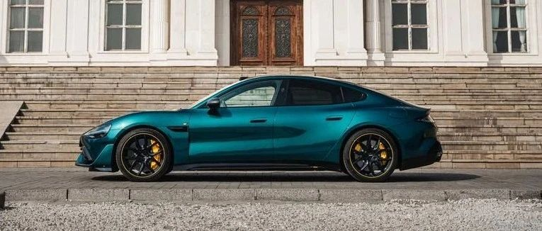
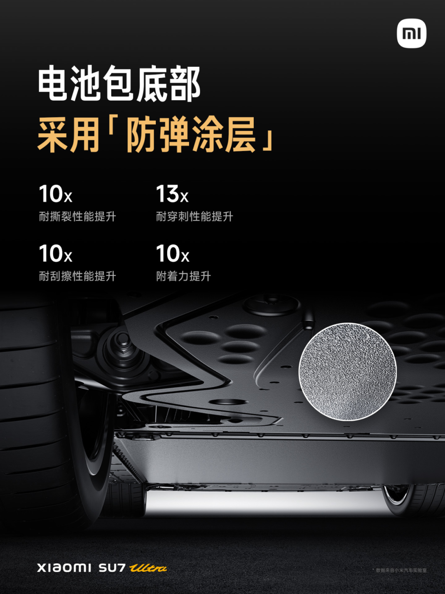
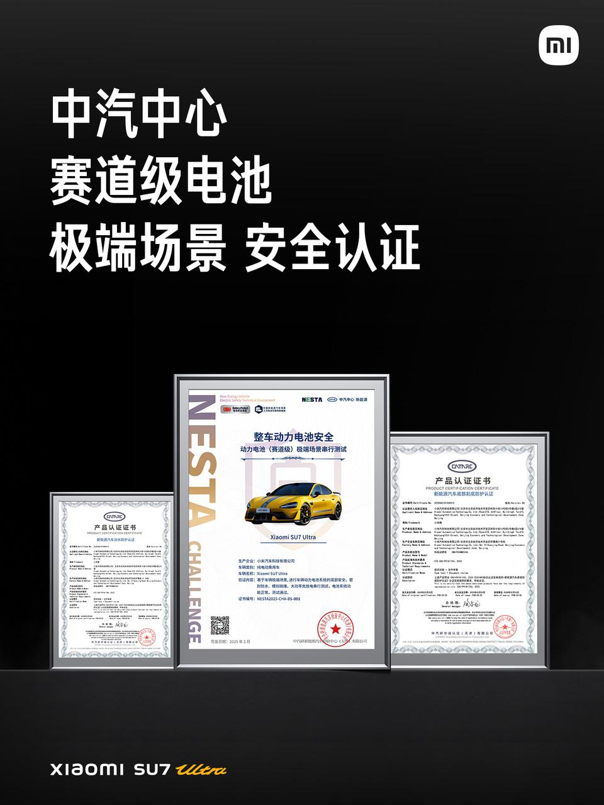

#  小米汽车答网友问（第125集）

[ 小米汽车 ](<javascript:void\(0\);>)

______

  

****01 ‍******我刚提了小米SU7 Ultra，有必要给车窗贴隔热膜么？** 您无需额外给小米SU7 Ultra贴膜，即可获得极佳的防晒隔热体验。小米SU7 Ultra的前风挡采用三层镀银玻璃，全景天幕采用双层镀银玻璃，四门车窗还全面升级了采用UV-IR涂层技术的声学夹层玻璃，除了进一步优化座舱内中高频噪音，让座舱更加的静谧舒适之外，其紫外线防晒和隔热能力得到了显著的提升。因此，小米SU7 Ultra的玻璃防晒隔热性能优异，可以不贴膜。如仍有贴膜需求，尤其前风挡玻璃建议选择高透光性的膜，以免影响您的行车视线。  
**02****小米SU7 Ultra是台电车，开起来怎么还有声浪？** 小米SU7 Ultra的运动声浪系统可以根据车辆的加速情况实时模拟引擎声浪，为驾驶者提供多种不同风格的音效体验，增强其驾驶乐趣。我们提供了三组特调的、各具特色的专属运动声浪供所有小米SU7 Ultra的用户们选择：

  * 电音：电动风格，提供沉浸式的驾驶快感；
  * 经典：灵感来自于经典的V8燃油发动机，带来更具有燃油车质感的声音；
  * 科幻：基于小米V8s超级电机的声音设计，带来更具有未来感的科幻风格；

此外，我们特地在小米SU7 Ultra的尾部配备了40W扬声器，可实现运动声浪外放，让车内车外都能感受其澎湃性能。当然，您也可以根据个人喜好选择是否开启外放扬声器。  
**03**

**小米SU7 Ultra电池包底部那个「防弹涂层」，具体有啥用？**

小米SU7 Ultra的电池包底部采用了坦克装甲级防护的「防弹涂层」，可以有效的防止在托底等事故中、因异物冲击、剐蹭造成的电芯损伤。

与比传统PVC涂层性能相比，「防弹涂层」的耐撕裂性能提升10倍，耐穿刺性能提升13倍，耐刮擦性能提升10倍，以及附着力（耐腐蚀）提升10倍。

值得一提的是，基于「防弹涂层」的强大性能，小米SU7 Ultra还成功通过了中汽中心动力电池（赛道级）极端场景串行测试，并获得了《新能源汽车底部刮底防护认证》。

<<左右滑动查看更多>>

****04****

**我在购车时获赠了3年15G/月的车载网络服务，还有必要购买今天上线的「车载网络服务包」吗？**  

您可根据您的实际需求，选择是否升级购买「车载网络服务包」服务。当您将每月赠送的15G车载网络服务耗尽后，将无法通过车载SIM卡的移动蜂窝数据使用相关车载网络应用，包括开启Wi-Fi热点共其他设备使用网络、下载与访问第三方应用（播放网络音乐、视频和KTV歌曲、玩游戏等用途）、以及哨兵模式远程查看视频等。

在购买「车载网络服务包」后，在其有效期内，您的车载网络服务将升级为**无忧畅享** ，不再有15G/月的限制，您可随时随地尽情畅享车载娱乐及应用功能。

  

  

  

  

预览时标签不可点

微信扫一扫  
关注该公众号

继续滑动看下一个

轻触阅读原文

小米汽车 

向上滑动看下一个

[知道了](<javascript:;>)

微信扫一扫  
使用小程序

****

[取消](<javascript:void\(0\);>) [允许](<javascript:void\(0\);>)

****

[取消](<javascript:void\(0\);>) [允许](<javascript:void\(0\);>)

****

[取消](<javascript:void\(0\);>) [允许](<javascript:void\(0\);>)

× 分析

__

微信扫一扫可打开此内容，  
使用完整服务

： ， ， ， ， ， ， ， ， ， ， ， ， 。 视频 小程序 赞 ，轻点两下取消赞 在看 ，轻点两下取消在看 分享 留言 收藏 听过