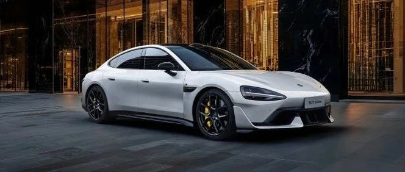

#  小米汽车答网友问（第126集）

[ 小米汽车 ](<javascript:void\(0\);>)

______

  

****01 ‍******我大部分在城市里面开，偶尔赛道驾驶，该如何选择小米SU7 Ultra的轮胎比较好？** 小米SU7 Ultra可选配倍耐力®P ZERO第五代长续航轮胎和高性能轮胎，您可按需选择。两种轮胎均为小米专门定制，对结构、配方和花纹做了专项开发，并带有倍耐力®轮胎噪音消除技术，可有效降低胎噪。如果您大部分在城区内驾驶，可以选择倍耐力®P ZERO第五代长续航轮胎。长续航轮胎能有效增加续航里程，让小米SU7 Ultra的CLTC续航里程最高达到630km；而如果您经常下赛道，且更注重操控表现，我们建议您选择倍耐力®P ZERO高性能轮胎，以获得更好的加速性能、并进一步缩短制动距离。您还可以选择即将上市的「竞速套装」，该套装搭载了两套轮胎，分别为倍耐力P ZERO TROFEO RS半热熔胎及倍耐力P ZERO 5高性能轮胎，均为小米与倍耐力的定制轮胎，可以分别满足赛道场景及日常使用需求。此外，如果您加入了Ultra Club，还将能享受到一站式赛道服务如免费整备和免费存胎等，方便您做上赛道前的整备工作和按需存胎或更换轮胎。我们再次提醒所有小米SU7 Ultra的用户在上赛道前一定要先参加专业的驾驶培训，在了解并掌握必要的赛道专业驾驶知识及规则后再充分享受赛道驾驶带来的乐趣。  
**02****看到有媒体在赛道试驾小米SU7 Ultra时刹车片烧红了，这是什么情况，会影响刹车性能吗？** 您不用担心，这是属于正常的情况，且小米SU7 Ultra的制动性能不会因此受到影响。在赛道驾驶时，车辆往往需要频繁的在高速行驶后紧急制动，此时制动系统承受的负荷将远高于日常驾驶。在这种工况下，制动盘温度会急剧上升，随着温度升高，制动盘的颜色会变红、变亮。我们深知制动系统在赛道极限工况驾驶时的关键作用，因此我们为小米SU7 Ultra全系标配了超大尺寸的碳陶瓷制动盘。碳陶瓷制动盘的最大工作温度高达1300摄氏度，其抗热衰性能极强，可以满足连续赛道驾驶的需求。在小米SU7 Ultra这套赛道版制动系统的加持下，小米SU7 Ultra的100-0km/h制动距离最低仅为30.8m，且180-0km/h制动测试可连续进行10次不衰减，满足连续高强度赛道驾驶的抗热衰减性能要求。  
**03****车机屏幕上提示我“激光雷达被遮挡”，是什么情况，我该怎么办？** 近日全国多个省份突发雨雪天气，如果您发现您的车辆中控屏提示“激光雷达遮挡，智驾功能受限”时，可能是因为传感器有异物/雨雪遮挡，请您使用干净的棉布轻轻擦拭激光雷达视窗表面，即可恢复正常。如擦拭后问题依然存在，请您及时联系小米汽车服务中心。值得一提的是，小米汽车高阶智驾版本拥有小米自研的激光雷达脏污/遮挡算法， 该算法可以有效降低雷达视窗脏污误报警和功能降级的频率， 进一步提升智驾功能的安全性与稳定性。  

****04****

**我能给我的小米SU7加装电动前备厢盖么？会影响质保吗？** 小米汽车官方售后暂时不提供该加装服务，感谢您的理解。在此我们提醒各位车主，根据三包政策，车主自行改装/加装的车身零件和附件均无法享受质保；因自行对车辆改装/加装导致的车辆原车件受损或功能使用异常，也无法享受质保政策。更多详细的质保政策，您可至小米汽车官方网站查询。

  

  

  

预览时标签不可点

微信扫一扫  
关注该公众号

继续滑动看下一个

轻触阅读原文

小米汽车 

向上滑动看下一个

[知道了](<javascript:;>)

微信扫一扫  
使用小程序

****

[取消](<javascript:void\(0\);>) [允许](<javascript:void\(0\);>)

****

[取消](<javascript:void\(0\);>) [允许](<javascript:void\(0\);>)

****

[取消](<javascript:void\(0\);>) [允许](<javascript:void\(0\);>)

× 分析

__

微信扫一扫可打开此内容，  
使用完整服务

： ， ， ， ， ， ， ， ， ， ， ， ， 。 视频 小程序 赞 ，轻点两下取消赞 在看 ，轻点两下取消在看 分享 留言 收藏 听过