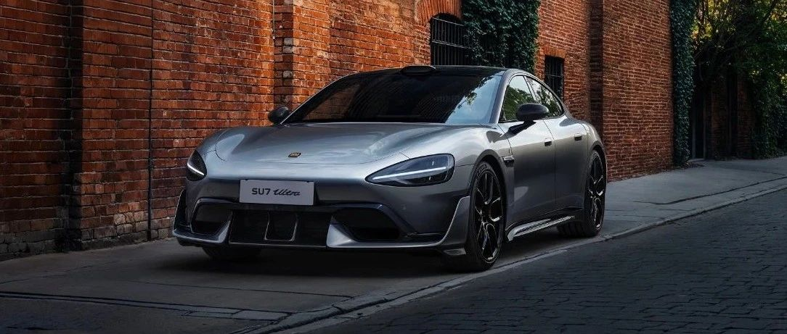

#  小米汽车答网友问（第127集）

[ 小米汽车 ](<javascript:void\(0\);>)

______

  

****01 ‍****

**我有点纠结**小米SU7 Ultra是选碳纤维车顶还是保留全景天窗，有什么建议么？****

全景天窗和碳纤维车顶各具特色，您可以根据您的实际用车需求来选择。

小米SU7 Ultra全系标配的全景天窗能带来更好的视野和采光，让车内空间更显开阔，尤其能增加后排乘客的空间感。同时，全景天幕采用了双层镀银设计，可有效隔绝紫外线和红外线，既防晒又隔热，适合日常驾驶为主的用户。

而长1462mm、宽1254mm，总面积达到1.7㎡的碳纤维车顶可以为小米SU7 Ultra整体减重12kg，其独特的碳纤维纹理和Alcantara® 超细纤维面料为整车带来了更强运动气息和更轻盈的驾驶感受。小米SU7 Ultra碳纤维车顶的选装价格为2.5万元，适合追求运动感和高性能的用户。

  

**02**

**我把我的小米SU7 Ultra借给朋友开了，能对车辆的功能做什么限制么？**

您可以通过小米汽车APP远程将您的小米SU7 Ultra设置为「代客模式」，在该模式下，驾驶模式默认为新手模式，且运动模式禁用，车辆动力性能会受到限制。此外，小米SU7 Ultra在使用卡片钥匙解锁时默认不登录账户，在该状态下，驾驶员也不能使用赛道模式、直线竞速模式和一键Boost功能。

同时，车辆的智能驾驶功能也会被禁用，借车人还无法查看您的导航记录或行车记录仪，也无法打开前备箱，以充分保证您的隐私安全。

  

**03**

**小米SU7 Ultra平时能用自动洗车机洗车吗？**

我们不建议将小米SU7 Ultra送至自动洗车机清洗。小米SU7 Ultra全车装备了大量的碳纤维部件，如碳纤维外后视镜、侧裙、车顶、尾翼等。尽管碳纤维材质具备优异的韧性与强度，但在日常使用中仍需避免与硬物发生剐蹭。自动洗车机的高强度清洗可能对车身漆面及碳纤维外饰件造成损伤。若碳纤维部件因人为或外力碰撞导致损坏（如与硬物接触等情况），此类问题将不在质保范围内，请您务必小心。

综上，我们建议您前往专业的洗车房清洗您的爱车。您也可以前往小米汽车商城选购「米家无线洗车机」产品，以获得高效、便携且强劲的自助洗车体验。请您在洗车时请选择中性清洁剂，严禁使用含强酸/强碱类产品，也避免使用粗糙海绵擦拭拉花图案及碳纤维部件，冲洗时请勿将高压水枪直接对准拉花区域。

  

****04****

**小米SU7 Ultra有哪些日常保养项目？**

关于小米SU7 Ultra的日常保养项目，您可以查看用户手册中的车辆保养章节，其中包括：

**日常维护：**

  * 检查洗涤液，必要时添加；

  * 检查轮胎的胎压及有无损坏和异常磨损情况；

  * 检查车顶激光雷达区域、毫米波雷达、超声波雷达、高清摄像头区域、360°环视摄像头区域是否有污物，如有污物，请按指导清洁；

**基础保养：** 分为单年度和双年度，仅包含以下保养项目

  * 单年度：车辆安全检查*、空调滤芯更换、车辆基础清洁、加注玻璃洗涤液。

  * 双年度：车辆安全检查*、空调滤芯更换、制动液更换、车辆基础清洁、加注玻璃洗涤液。

*更多车辆安全检查项以用户手册为准。

**说明：** 定期保养中的冷却液更换项目，不包含在基础保养项目中。

除日常用车的正常保养之外，我们也再次提醒，如您需要车辆进入赛道（包括但不限于正式赛道、非开放道路、半开放道路等激烈驾驶的道路或场地）驾驶，请在车辆进入赛道前和下赛道后，及时联系小米汽车官方售后服务中心对车辆进行全面检查、整备和专项保养。

  

  

  

  

预览时标签不可点

微信扫一扫  
关注该公众号

继续滑动看下一个

轻触阅读原文

小米汽车 

向上滑动看下一个

[知道了](<javascript:;>)

微信扫一扫  
使用小程序

****

[取消](<javascript:void\(0\);>) [允许](<javascript:void\(0\);>)

****

[取消](<javascript:void\(0\);>) [允许](<javascript:void\(0\);>)

****

[取消](<javascript:void\(0\);>) [允许](<javascript:void\(0\);>)

× 分析

__

微信扫一扫可打开此内容，  
使用完整服务

： ， ， ， ， ， ， ， ， ， ， ， ， 。 视频 小程序 赞 ，轻点两下取消赞 在看 ，轻点两下取消在看 分享 留言 收藏 听过