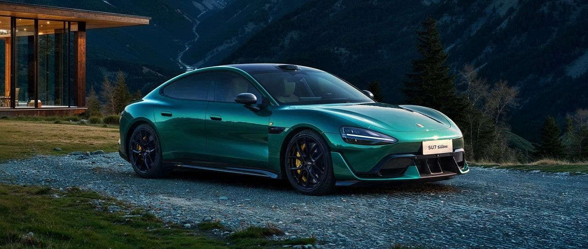

#  小米汽车答网友问（第128集）

[ 小米汽车 ](<javascript:void\(0\);>)

______

  

****01 ‍****

**今天你们把2025年的全年交付目标上调到了35万辆，有信心达到么？**

有信心。随着小米汽车工厂产线能力和全国销交服体系能力的顺利提升，我们有信心能够做到。

我们刚刚也发布了小米集团2024全年财报。这是小米史上的「最强年报」，其中汽车业务表现超预期，智能电动汽车等创新业务收入达328亿元，小米SU7全年交付136854台，连续5个月单月交付超20000台。同时，小米SU7 Ultra于前段时间正式上市发布，开售三天大定订单超19000台，提前完成全年10000台的销量目标。在「人车家全生态」战略驱动下，小米手机、大家电、汽车三条增长曲线共同成长，全品类高端向上登攀，小米业务正在步入高增长周期。我们由衷的感谢所有朋友们对小米的支持和认可。

今天我们也完成了第20万辆小米汽车的交付，也是「璀璨洋红」的首次交付。我们一直在努力的提升生产和交付速度：从第一个10万辆交付用了229天，到第二个10万交付仅用了119天。再次感谢每一位车主的选择和信任，希望小米汽车能陪伴大家的每一个璀璨时刻。 

**02**

**现在我还能把我的小米SU7锁单订单转成小米SU7 Ultra么？**

可以，**在3月31日24点前** ，您可以凭借小米SU7 Ultra的锁单订单找到交付同事申请处理您之前小米SU7锁单订单。请注意，您需要同时满足以下条件：

  * 在小米SU7 Ultra 锁单后一周内，向交付发起小米SU7订单的退单申请。申请时，小米SU7的订单在锁单且未开票状态；

  * **申请退单的小米SU7订单上牌人，需与对应的小米SU7 Ultra 锁单订单的MI ID和上牌人信息完全一致；**

  * 一单小米SU7 Ultra已锁单的订单，仅可申请退一单符合要求的小米SU7订单。

  

**03**

**小米SU7 Ultra的全景天幕足够安全么？是否选配了碳纤维车顶会更“硬”？**

请您放心，您无需担心全景天幕的安全问题。小米SU7 Ultra标配双层镀银全景天幕，不但能显著提升车内空间感，更能有效防晒隔热，同时我们也在研发之初就对其进行了严格的测试和验证，使其满足中欧五星和中保研3G+的被动安全标准。而小米SU7 Ultra选装的碳纤维车顶由于材质本身高强度的特性，在顶压、侧柱碰、侧碰等极特殊场景中可能对乘员舱的保护会更好。

尽管小米SU7 Ultra具备行业一流的被动安全性能，但我们也强烈呼吁大家在驾驶时系好安全带、注意交通安全、切勿违反交通法规，做好安全的第一责任人。

  

****04******我不是Ultra Club会员，但可以按需付费使用相关服务么？**

Ultra Club提供的一站式赛道服务，如免费整备服务、免费存胎、免费赛道救援，和独家官方活动等均为Ultra Club的会员专享权益，非会员暂不能单独付费参加，感谢您的理解和支持。

  

  

  

  

预览时标签不可点

微信扫一扫  
关注该公众号

继续滑动看下一个

轻触阅读原文

小米汽车 

向上滑动看下一个

[知道了](<javascript:;>)

微信扫一扫  
使用小程序

****

[取消](<javascript:void\(0\);>) [允许](<javascript:void\(0\);>)

****

[取消](<javascript:void\(0\);>) [允许](<javascript:void\(0\);>)

****

[取消](<javascript:void\(0\);>) [允许](<javascript:void\(0\);>)

× 分析

__

微信扫一扫可打开此内容，  
使用完整服务

： ， ， ， ， ， ， ， ， ， ， ， ， 。 视频 小程序 赞 ，轻点两下取消赞 在看 ，轻点两下取消在看 分享 留言 收藏 听过