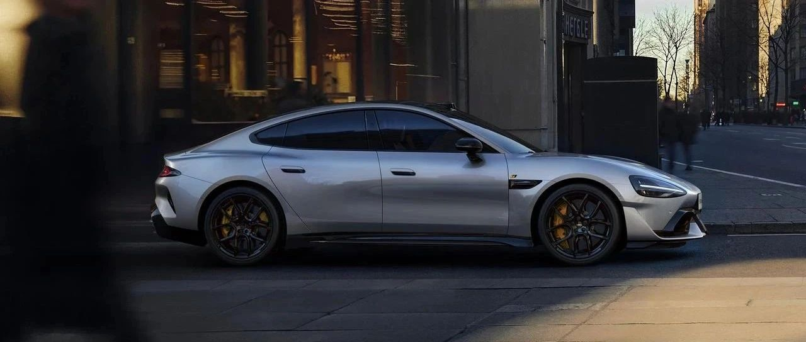

#  小米汽车答网友问（第129集）

[ 小米汽车 ](<javascript:void\(0\);>)

______

  

****01 ‍****

**我之前付小米SU7 Ultra定金的时候已经签了协议，为什么今天又收到推送，让我再签一次？**

两次签署的内容其实是不一样的。您的小米SU7 Ultra订单的选装配置中如果包含了碳纤维双风道前舱盖或21英寸U型锻造轮毂，在第一次下定时为预定阶段，您当时签署的是《预购意向书》；现在该配置已正式开启销售，您需在收到通知后的168小时内完成《小米汽车购买协议》的签署，我们将根据协议进行后续的排产及交付工作。请放心，我们仍然将根据锁单顺序进行排产，实际交付时间请以交付同事向您发送的交付通知为准。

  

**02**

**小米SU7 Ultra的刹车散热性怎么样？下赛道的话需要改装刹车通风系统么？**

小米SU7 Ultra是一款出厂即「可街可赛」的「新豪车」，其配备的赛道版制动系统可以提供出色的散热性能，您无需做任何改装就能够满足正常的赛道需求。小米SU7 Ultra除了标配最大工作温度高达1300摄氏度的碳陶制动系统和可提供高达0.6g减速度的动能回收系统之外，其前、后制动系统原厂带有散热导风设计，可以在使用耐力模式并开启制动能量回收增强功能的情况下，做到180-0km/h连续10次制动无衰减，满足连续高强度赛道驾驶的抗热衰减性能，从容应对您的赛道驾驶需求。

  

**03**

**小米SU7 Ultra的拉花在日常使用时有什么需要注意的么？**

关于小米SU7 Ultra拉花的日常使用注意事项，您可以查看用户手册中的外部清洁保养章节，其中您需特别注意：

  * 在使用高压水枪清洗车辆时，为确保车身拉花完好无损，务必与拉花保持安全距离。建议水枪与拉花的距离维持在50cm以上，压强控制在100bar以下，水温不得过高。冲洗过程中，尽量使水枪与车表面保持垂直角度。倘若超过上述标准，车辆拉花极有可能出现翘边状况，严重时甚至会导致拉花损坏，影响车辆外观。

  * 清洗拉花时，请采用中性清洁剂，请勿使用粗糙的海绵或带腐蚀性的清洁剂清洗拉花，避免拉花表面受损或变色。

  * 请勿在装配有拉花的车辆上贴装车衣或改色膜。因为在贴装车衣或改色膜过程中可能损伤拉花。而且，由于拉花与车辆漆面存在高度差，贴装后车衣或改色膜容易产生气泡等现象，进而损坏车衣或改色膜。此外，车衣或改色膜的贴装粘度较高，在去除时无法单独与拉花剥离，只能连同拉花一起被去除。

  * 为防止损伤拉花，应立即清除异物（如鸟粪、昆虫残留物、树脂及其他沉积物等），避免高温或强光照射，加剧腐蚀作用。

  * 请勿撕下车辆拉花，因为一旦撕下拉花将无法恢复到原有状态。

  * 请勿对车辆拉花进行抛光处理，以防拉花造成损坏。

  * 如车辆出厂时已配备拉花，此拉花状态符合车辆初始登记要求。为确保车辆在年检时能够顺利通过，请勿撕下车辆拉花，以免因外观与初始登记不符而引发年检问题。

  * 拉花粘贴完成后的24h内，严禁车辆以大于等于80km/h的车速行驶，严禁清洗车辆，避免车辆处于大风暴雨等极端恶劣天气下，以防拉花损坏。

****04******小米汽车APP商城里的金博制动片套装和ENDLESS®制动片套装有什么区别？我该如何选择？** 金博KPC500-1制动片是小米SU7 Ultra原厂标配的制动片，为小米SU7 Ultra定制开发，是一款「可街可赛」的碳陶盘专用制动片。在街道中，由于我们对该制动片做过大量的静音优化工作，可有效避免制动噪音及异响。该制动片也可直接用于赛道，最高工作温度可达850摄氏度，赛道工况的摩擦系数>0.28，可提供稳定的制动力。ENDLESS®️MA45B则是一款面向赛道驾驶的高性能制动片，同样为小米SU7 Ultra定制开发，可适用于长时间的赛道驾驶。如果您有极致的赛道需求，我们建议您选择这款高性能制动片。其采用了耐力赛配方，使其最高工作温度高达1100摄氏度，且在赛道工况拥有>0.38的摩擦系数；同时，该制动片还特别配备了带有「热障涂层」的隔热板，可对制动液形成有效的过温保护，可持久提供稳定、强大的制动力。您可以前往小米汽车App商城中按需选购两款制动片，更多详情也可咨询您的Ultra Master。

  

  

  

  

预览时标签不可点

微信扫一扫  
关注该公众号

继续滑动看下一个

轻触阅读原文

小米汽车 

向上滑动看下一个

[知道了](<javascript:;>)

微信扫一扫  
使用小程序

****

[取消](<javascript:void\(0\);>) [允许](<javascript:void\(0\);>)

****

[取消](<javascript:void\(0\);>) [允许](<javascript:void\(0\);>)

****

[取消](<javascript:void\(0\);>) [允许](<javascript:void\(0\);>)

× 分析

__

微信扫一扫可打开此内容，  
使用完整服务

： ， ， ， ， ， ， ， ， ， ， ， ， 。 视频 小程序 赞 ，轻点两下取消赞 在看 ，轻点两下取消在看 分享 留言 收藏 听过