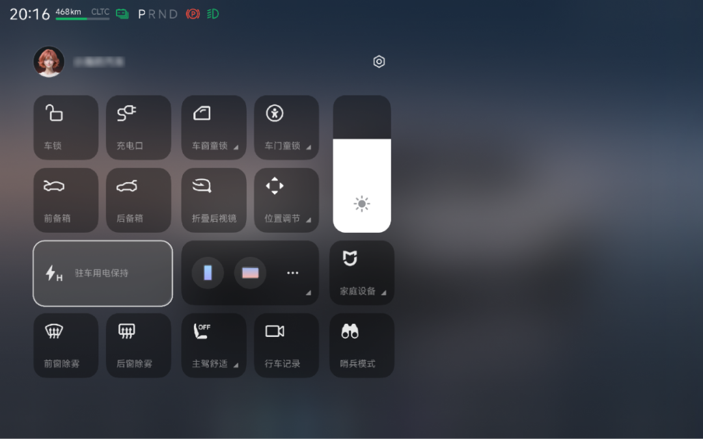

#  小米汽车答网友问（第132集）

[ 小米汽车 ](<javascript:void\(0\);>)

______

  

****01****

**我有宠物想要暂时留在车内，可以设置空调保持开启么？该如何操作？**

如果您有宠物想要暂时留在车内，可以使用小米汽车的「驻车用电保持」功能。该功能可以在车辆驻车时，即使锁闭车辆，仍将保持车内的电力供应，维持车内适宜的温度等环境，保障宠物在车内的安全与舒适。

开启方式为：请在中控屏上边缘向下滑动拉出「控制中心」，点击「驻车用电保持」，设置好关闭时间后即可开启。您可以将用电保持的时长设置为15分钟~6小时，车辆会在电量消耗至20%时自动退出。

**  
**

**02**

**小米汽车的「前车识别」功能是如何做到的？**

小米汽车的「前车识别」功能主要基于**小米自研多模态大模型** ，通过强大的图像理解能力实时识别前方车辆的品牌、型号等信息。您只需在行驶过程中唤醒车载语音助手“小爱同学”并提问“前面行驶的是什么车”，即可快速获取识别结果。该功能的实现依托三大核心技术优势：**精准识别与智能覆盖** ：通过智能算法精准锁定目标车辆，结合多角度动态分析，可适应不同天气、光线及复杂路况，实现高速公路、城市道路等全场景覆盖。**数据采集与训练** ：研发团队针对每款车型采集车头、车尾、侧面等关键角度的50-100张照片，涵盖昼夜、远近等多样化场景，以实现不同车型的识别。**技术融合与优化** ：我们的研发团队采用多模态数据融合和传感器融合，将图像与语义结对标注数据，通过微调数据提高模型对方位的理解能力。目前小米汽车的额「前车识别」功能对普通车型的识别准确率达90%，而对小米自家车型的识别准确率更是突破了99%。目前该功能已全量上线所有在售的小米汽车，您通过唤醒 “小爱同学” 即可体验。现已支持 1000 多辆常见车识别，涵盖中国市场各类市售车型。您无需额外操作，仅通过语音交互即可体验该功能，为人机交互功能增添实用性与趣味性。  

**03**

**「前车识别」功能除了识别车辆，还可以干啥？**

小米汽车的「前车识别」功能不仅仅局限于识别车辆，还可以回答有关该车辆的问题。例如，您可以唤醒小爱同学对目标车辆进行提问， “前面这款车什么时候上市的？”，小爱同学会自动跳转至年度新车时间轴；若问 “这是油车还是电车？”，它立刻化身环保小助手给出答案；要是问 “多少钱能拿下？”，小爱同学则会贴心显示网络可查询到的参考价格。

未来，小米将继续基于前车识别功能的开发经验，不断优化算法，借助大数据和人工智能技术，让识别更加精准、功能更加丰富。同时，小米也会持续探索多模态大模型在各类产品上的应用落地，挖掘更多有趣的、好玩的功能，给您的用车生活带来更多惊喜互动，敬请期待。

  

****04****

**「超级省电模式」太省电了，我可以一直用这个模式么？**

「超级省电模式」很省电，但会显著牺牲车辆的舒适性，虽然您可以随时开启或关闭，但为了您的用车体验，不建议一直使用。

「超级省电模式」是指车辆通过关闭智驾辅助功能、关闭或限制空调、座椅加热等舒适性功能、限制整车加速性能，以达到降低整车功耗、增加更多续航里程的目的。

在车辆预估续航里程低于50km时，中控屏会弹出相关设置项弹窗及说明，此时您可选择是否开启「超级省电模式」；同时您也可以在驾驶过程中的任意时刻主动开启或关闭「超级省电模式」。请在中控屏下方控制栏打开设置，进入驾驶偏好>超级省电模式，点击开启或关闭该功能。当车辆通过中控屏弹窗开启「超级省电模式」后，车辆会在开始充电时自动退出「超级省电模式」。

  

  

  

  

预览时标签不可点

微信扫一扫  
关注该公众号

继续滑动看下一个

轻触阅读原文

小米汽车 

向上滑动看下一个

[知道了](<javascript:;>)

微信扫一扫  
使用小程序

****

[取消](<javascript:void\(0\);>) [允许](<javascript:void\(0\);>)

****

[取消](<javascript:void\(0\);>) [允许](<javascript:void\(0\);>)

****

[取消](<javascript:void\(0\);>) [允许](<javascript:void\(0\);>)

× 分析

__

微信扫一扫可打开此内容，  
使用完整服务

： ， ， ， ， ， ， ， ， ， ， ， ， 。 视频 小程序 赞 ，轻点两下取消赞 在看 ，轻点两下取消在看 分享 留言 收藏 听过