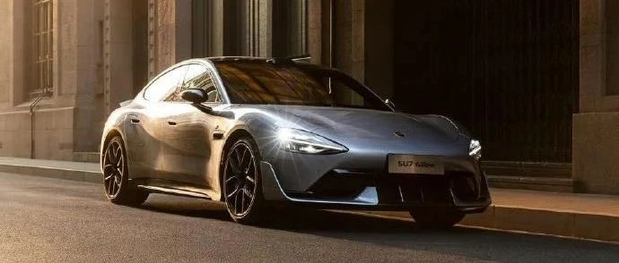

#  小米汽车答网友问（第133集）

[ 小米汽车 ](<javascript:void\(0\);>)

______

  

****01****

**C-NCAP是什么？2024版新规，和以前的测试规则区别在哪里？**

C-NCAP是由中国汽车技术研究中心发起的「中国新车评价规程」，旨在以更严格、更全面的要求，对车辆进行全方位安全性能测试，包括乘员保护、弱势交通参与者（VRU）保护、主动安全等，从而给到消费者更加系统、客观的车辆安全信息。

2024版C-NCAP评价规程共计23项变化，包括11项新增、12项改版，整体测试维度更全面、难度更高，例如:

  * 正面 100%重叠刚性壁障碰撞：碰撞速度由50km/h提升至56km/h；

  * 可变形移动壁障侧面碰撞：碰撞速度由50km/h提升至60km/h、壁障由1400kg提升至1700kg；

  * 侧面柱碰撞：增加后排儿童假人、远端乘员考核等。

即便如此，小米SU7仍以93.5%的综合得分率，获得C-NCAP（2024版）已测车型第一名的优异成绩。至此，小米SU7已集齐安全性测试“大满贯”：

  * C-NCAP五星认证，2024版规程综合得分率第一名；

  * 中保研新规测试，迄今唯一3G+/A的轿车；

  * 2024年度中国智能汽车指数最高评级，获4G+佳绩；

  * 2024年度中汽中心十佳车身评测，获「最佳结构奖」及「2024中国十佳车身」权威认证。

小米汽车会继续努力，不断提升安全性能，为大家打造更高品质、更安全的好车。

**02**

**小米SU7在C-NCAP中综合得分率93.5%意味着什么？为什么能拿到这个高分？**

小米SU7在C-NCAP评价结果中，综合得分率达到93.5%，位居C-NCAP（2024版）已测车型第一名，属于非常优异的成绩，充分彰显了小米SU7出色的安全性能。同时，小米SU7在「VRU保护」、「主动安全」测试项目中的得分率也位居C-NCAP（2024版）已测车型第一名，「乘员保护」得分率位居C-NCAP（2024版）已测乘用车第一名。

小米汽车始终坚信，安全没有捷径，我们始终坚持以最严苛的安全标准来设计我们的产品。小米SU7的铠甲笼式钢铝混合车身，在碰撞时能有效分散和抵御冲击力，在碰撞测试中均表现出色；在设计上，我们也充分考虑了对乘员及行人的保护，能有效减少事故伤害。此外，小米SU7全系标配16项主动安全功能，可实时动态监测道路前向和侧后向各类车辆、行人、二轮车碰撞风险，及时发出预警并在必要时介入制动或纠偏，尽可能避免或减缓碰撞事故。

值得一提的是，小米汽车是高低配同源、无选配的安全，所有车型的安全设计目标都是顶级高标准。

  

**03**

**C-NCAP 2024版中的主动安全测试项升级了什么？小米SU7的表现怎么样？**

除主动安全功能的常规测试项如AEB（自动紧急制动）、FCW（前向碰撞预警）、LDW（车道偏离预警）、LDP（车道偏离纠偏）、ELK（紧急车道保持）、RCTA（倒车穿行预警）等，C-NCAP 2024版规程对主动安全功能带来了更大的挑战，新增了交叉路口行人横穿场景测试、新增了AEB误作用测试场景、提升了夜间行人避撞的速度要求等。

即便新规难度提升，小米SU7主动安全仍以95.25%的得分率，位居C-NCAP（2024版）已测车型第一名。小米汽车全系标配16项主动安全功能，凭借在传感器感知性能、融合算法、执行器响应等环节的突破，能够全面、实时观察车辆周围复杂情况，并能针对复杂道路交通环境下潜在碰撞风险提前做出预警、制动；例如AEB功能支持对有碰撞风险的前向静止及横穿车辆目标做出告警、制动，LDW、LDP和ELK功能可以对无意识偏离车道进行告警或纠偏，尽量避免车辆偏离车道发生危险。

  

****04****

**看到有媒体把小米SU7 Ultra开去珠峰了，高原环境一般对车辆有哪些影响？**

高原环境的主要特点是气温低、气压低。其中低温主要影响纯电车的续航里程、充电和放电性能；而低气压则对电池包的密封性和空气悬架的调节性能提出了挑战。但请大家放心，无论是小米SU7 Ultra还是小米SU7，我们在车辆上市前就经过了充分的路试和耐久测试，确保车辆所有的功能都能在极限条件下（如极热、极寒或高原等）正常使用。

小米SU7 Ultra的热管理系统具备三热源逐级加热的能力，能充分保证电池在低温状态下的充放电性能，并有效提高车辆在低温状态下的续航里程，同时保持车内时刻处于舒适的环境温度。其次，小米SU7 Ultra的电池包针对低气压状态下的密封性有专门的设计、并做过充分的试验验证，能够保证其在高海拔地区的密封性。此外，小米SU7 Ultra标配的空气弹簧为闭式系统，其充放气均在封闭管路内进行，充放气效率不受外界气压影响，因此在高原地区仍能保持与平原地区相同的升降速度。

  

  

  

  

预览时标签不可点

微信扫一扫  
关注该公众号

继续滑动看下一个

轻触阅读原文

小米汽车 

向上滑动看下一个

[知道了](<javascript:;>)

微信扫一扫  
使用小程序

****

[取消](<javascript:void\(0\);>) [允许](<javascript:void\(0\);>)

****

[取消](<javascript:void\(0\);>) [允许](<javascript:void\(0\);>)

****

[取消](<javascript:void\(0\);>) [允许](<javascript:void\(0\);>)

× 分析

__

微信扫一扫可打开此内容，  
使用完整服务

： ， ， ， ， ， ， ， ， ， ， ， ， 。 视频 小程序 赞 ，轻点两下取消赞 在看 ，轻点两下取消在看 分享 留言 收藏 听过