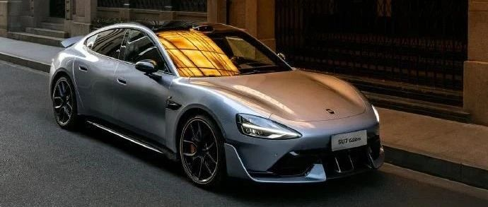

#  小米汽车答网友问（第134集）

[ 小米汽车 ](<javascript:void\(0\);>)

______

  

****01****

**C-NCAP测试中，「VRU保护」指的是什么？有哪些测试项目？**

VRU是「Vulnerable Road Users」的缩写，指车辆对在交通事故中相对弱势群体（如行人、骑二轮车等非机动车的人）的保护技术。VRU保护有两类测试项目，分别是头型加腿型冲击试验和针对行人或二轮车的AEB试验：

  * 头型和腿型冲击试验是模拟不幸撞到行人，头部、腿部受到冲撞后的伤害情况；

  * 针对行人或二轮车的AEB是考验本车直行或转弯时，面对行人、二轮车的主动预警、自动紧急制动能力。

针对行人保护，小米SU7车头采用了大量缓冲性能的材料和结构，比如主动式机盖、可压溃的前大灯、可变形的前保险杠支架结构等，可有效减少碰撞对行人头部、腿部的伤害。在AEB部分，小米SU7针对中国道路特色VRU场景进行了大量的优化，即使面对严苛的儿童和二轮车横穿场景，也能快速发现碰撞风险并及时介入紧急制动避免碰撞，保障道路弱势群体交通安全。

最终凭借优异表现，小米SU7在VRU保护项目的得分率达到90.42%，在C-NCAP（2024版）已测车型中获得第一名，且远超本项已测车型平均得分率77.28%。

**02**

**在主动安全测试中，除了AEB测试，还有什么其他的测试项么？**

除了AEB C2C（车对车自动刹车能力），整车的灯光性能也在C-NCAP主动安全项目考察范围内。该项目主要用来考验测试车辆的近光灯性能、远光灯光学性能、ADB自适应远光的遮蔽性能等。

小米SU7拥有160°超宽近光照明，可有效拓展照明范围，再加上小米SU7全系标配ADB自适应大灯，可有效避免对其他车辆造成眩光，可大大提升其夜间行车安全。另外，小米SU7大灯采用了行业最先进、最静谧的反射和投射光学系统，能做到分区的精细化光调控，视线更佳的光能分布。

最终，小米SU7在整车灯光性能项得到了96.4%的得分率，位居2024版已测车型第一名，远超本项已测车型平均得分率83.96%。

  

**03**

**小米SU7 Ultra的车内一共有几个USB和Type-C接口？分别的充电功率是多少？**

小米SU7 Ultra车上共具有5个Type-C和1个USB接口，用于数据传输、手机充电或为其它设备提供电源。前排有两个Type-C接口，位于中控屏下方，左侧接口支持DP投屏和充电，右侧接口支持数据传输和充电，最大输出功率均为67W。希望连接迷你主机进行游戏投屏的车主，可以选择小米商城6A双Type-C数据线连接左侧接口进行投屏。期间我们也收到部分车主反馈，希望OLED版本游戏主机也可以进行游戏投屏，为了满足这部分用户的需求，小米商城正在筹备支持该功能的HDMI 转Type-C数据线，敬请期待。后排有两个Type-C接口，位于扶手箱后部，仅支持充电，最大输出功率均为18W。

内后视镜底座装饰罩上设置有一个Type-C接口，用于为后加装的行车记录仪和运动相机供电，最大输出功率为12W。

手套箱内设置有一个USB接口，用于连接哨兵模式和行车记录U盘，进行数据传输。

  

****04****

**我的小米SU7 Ultra前保险杠下面有个“塑料挡板”，有什么用？**

这个「塑料挡板」是小米SU7 Ultra的前气坝，是一个重要的空气动力学部件。前气坝可大幅减少进入车底的气流，有效避免因气流聚集而产生的升力，因此可明显提升车辆前轴的下压力。

小米SU7 Ultra可选装碳纤维尾翼，在选装尾翼时会同步配备前气坝，以保证车辆前后轴下压力的平衡，让小米SU7 Ultra拥有285kg的最大下压力，有效提升车辆在赛道中的操控稳定性。

  

  

  

预览时标签不可点

微信扫一扫  
关注该公众号

继续滑动看下一个

轻触阅读原文

小米汽车 

向上滑动看下一个

[知道了](<javascript:;>)

微信扫一扫  
使用小程序

****

[取消](<javascript:void\(0\);>) [允许](<javascript:void\(0\);>)

****

[取消](<javascript:void\(0\);>) [允许](<javascript:void\(0\);>)

****

[取消](<javascript:void\(0\);>) [允许](<javascript:void\(0\);>)

× 分析

__

微信扫一扫可打开此内容，  
使用完整服务

： ， ， ， ， ， ， ， ， ， ， ， ， 。 视频 小程序 赞 ，轻点两下取消赞 在看 ，轻点两下取消在看 分享 留言 收藏 听过