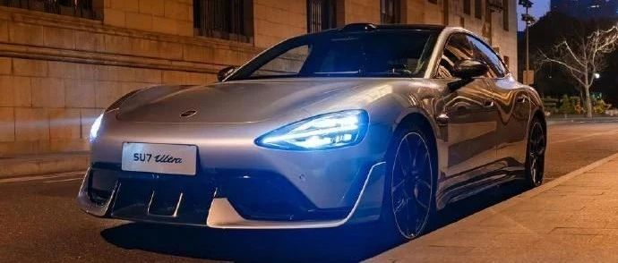

#  小米汽车答网友问（第135集）

[ 小米汽车 ](<javascript:void\(0\);>)

______

  

****01****

**最近新上的不锈钢直饮杯每次我都抢不到，到底什么时候能****补货****？**

不锈钢直饮杯以及小米汽车APP商城里的所有热销产品，我们都会根据每周的到货情况第一时间上架补货。一般来说，上架补货的时间会在每周五的上午10点。

以不锈钢直饮杯为例，如果当周有到货，您可于周五上午10点登录小米汽车APP，在「商城」-「生活」频道的不锈钢直饮杯产品页查看补货情况并购买。您也可关注商城小掌柜发布的小米汽车APP商城开售日历，查看商品的到货情况。具体请您以实际销售为准。

**02**

**获取小米汽车****APP****商城积分的途径有哪些？**

获取小米汽车APP商城积分的方法主要有两种：复购车型获取积分（比如小米SU7 Ultra复购享积分），以及会员特殊权益获取积分（比如加入Ultra Club送积分等）。小米汽车APP商城还会不定期的开展车主购买特定商品赠送积分的活动，您可关注商城发布的活动信息，具体积分额度等详情请以活动规则为准。其他积分获取途径，请以小米汽车官方发布为准。

更多有关积分的细则，您可通过小米汽车APP「我的」-「积分」-「规则」页面查询《积分规则》。

  

**03**

**为什么我的小米****SU7 Ultra****跑不出来标称的****CLTC****续航成绩？**

首先，CLTC续航里程是基于国家相关部门制定的CLTC（中国新能源轻型汽车行驶工况标准）标准，在理想测试环境下测试出的数据。在实际使用过程中，整车载荷、驾驶强度、道路工况、环境温度、不同车主的驾驶方式以及使用车内娱乐功能等不同条件，会导致实际行驶里程与CLTC测试标准下测试出的里程不同，属于正常情况。

其次，小米SU7 Ultra目前正处于首销期（2025年3月31日前），在此期间下定小米SU7 Ultra您将享受到至高价值90000元的限时购车权益，其中包括免费升级碳纤维大尾翼，若您还同时选装了高性能轮胎，这两个配置虽然能有效提升车辆性能，但也可能对车辆的续航里程造成一定影响。

最后，我们温馨提示您，您可在「车辆设置」-「充放电」中，将剩余续航里程的显示模式切换为「预估续航」。「预估续航」在标称工况的基础上，加入了高低温环境的影响，融合成更贴近实际使用的工况，续航拟合度提高了18%，更加真实的表显续航里程会让您的驾驶更安心。

**  
****04**

**小米****SU7 Ultra****的前备箱的承重有限制吗？**

为了保证您的车辆的合理承重及行车体验，我们建议小米SU7 Ultra的前备箱装载物品重量不超过20KG。

**  
**

  

  

  

预览时标签不可点

修改于

微信扫一扫  
关注该公众号

继续滑动看下一个

轻触阅读原文

小米汽车 

向上滑动看下一个

[知道了](<javascript:;>)

微信扫一扫  
使用小程序

****

[取消](<javascript:void\(0\);>) [允许](<javascript:void\(0\);>)

****

[取消](<javascript:void\(0\);>) [允许](<javascript:void\(0\);>)

****

[取消](<javascript:void\(0\);>) [允许](<javascript:void\(0\);>)

× 分析

__

微信扫一扫可打开此内容，  
使用完整服务

： ， ， ， ， ， ， ， ， ， ， ， ， 。 视频 小程序 赞 ，轻点两下取消赞 在看 ，轻点两下取消在看 分享 留言 收藏 听过