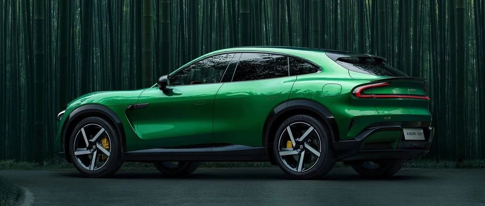

#  小米汽车答网友问（第139集）

[ 小米汽车 ](<javascript:void\(0\);>)

______

  

****01  
****

**明天小米YU7就要亮相了，怎样才能第一时间了解这款车？**

感谢您对小米YU7的关注。小米YU7的预约咨询通道现已开启，您可扫描下图的二维码进行预约。更多详情，敬请期待于明日（5月22日）晚7点举办的「小米15周年战略新品发布会」。

温馨提示：为避免您的个人信息受到不法侵害，请大家在扫码留资时认准官方渠道，同时我们也建议通过小米汽车APP进行预约。

  

**  
**

**02**

**预约小米YU7的咨询顺序会影响我后续排产/提车的顺序么？**

请您放心，扫码预约不会影响后续排产及提车的顺序。当您成功预约后，系统将安排专属购车顾问为您提供咨询服务，该流程并不会对后续排产或提车等顺序产生任何影响。

  

**03**

**小米YU7除了已经公布的寒武岩灰和宝石绿色，还有什么其他颜色可选么？**

作为一款「豪华高性能SUV」，小米YU7将会提供丰富的外观颜色供大家选择。除了之前已经亮相过的寒武岩灰，今天我们公布了小米YU7的全新配色：宝石绿。其灵感取自哥伦比亚绿宝石，通过双层色漆工艺，还原了绿宝石的高级质感，随光影流转，呈现丰富的色彩层次。

更多颜色的亮相，敬请期待明日的发布会。

  

*左右滑动 查看更多

  

  

**04**

**这次发布会除了小米YU7，还有什么其他新品？在哪里可以收看这次发布会？**

本次发布会亮相的重磅新品特别多：除了备受期待的小米首款SUV「小米YU7」，还有小米自主研发设计的手机SoC芯片「小米玄戒O1」，以及搭载「小米玄戒O1」两款旗舰：高端旗舰手机小米15S Pro和超高端OLED平板小米平板7 Ultra等。

我们诚邀您于5月22日晚7点收看「小米15周年战略新品发布会」，一起见证小米15周年的新起点。本次发布会将在小米公司、小米手机、小米汽车等官方账号多平台直播，同时将在多个数码媒体、汽车媒体、电商等平台同步播出，敬请关注小米官方账号直播动态。

  

  

  

< img alt="图片" class="rich_pages wxw-img" data-ratio="0.8824074074074074" src="https://mmbiz.qpic.cn/sz_mmbiz_png/UaK4PTh6Zpk2TaVLh0tUHxviapUIsTcXOFp1ATh7VRDuqnQr3V3oDvw9DodpJKDZDh0fV2YVzbrgHETVM5DzIqA/640?wx_fmt=png&from=appmsg&wxfrom=5&wx_lazy=1&wx_co=1" data-w="1080" style="visibility: visible !important;width: 350px !important;height: auto !important;" width="100%" data-imgqrcoded="1">

预览时标签不可点

微信扫一扫  
关注该公众号

继续滑动看下一个

轻触阅读原文

小米汽车 

向上滑动看下一个

[知道了](<javascript:;>)

微信扫一扫  
使用小程序

****

[取消](<javascript:void\(0\);>) [允许](<javascript:void\(0\);>)

****

[取消](<javascript:void\(0\);>) [允许](<javascript:void\(0\);>)

****

[取消](<javascript:void\(0\);>) [允许](<javascript:void\(0\);>)

× 分析

__

微信扫一扫可打开此内容，  
使用完整服务

： ， ， ， ， ， ， ， ， ， ， ， ， 。 视频 小程序 赞 ，轻点两下取消赞 在看 ，轻点两下取消在看 分享 留言 收藏 听过