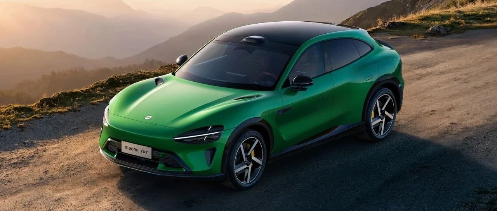
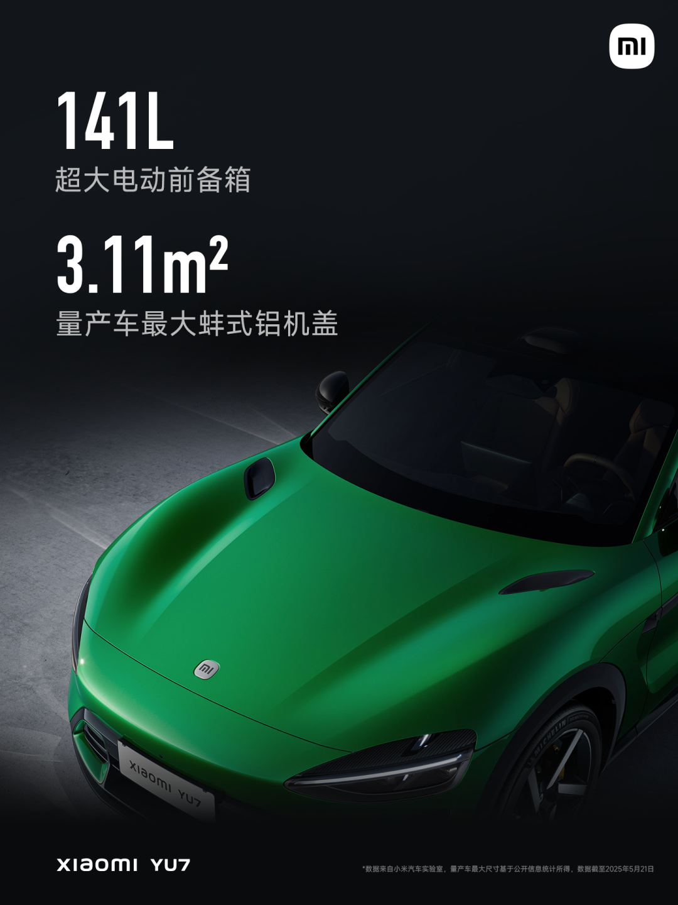

#  小米汽车答网友问（第142集）

[ 小米汽车 ](<javascript:void\(0\);>)

______

  

****01  
****

**小米YU7配备的蚌式铝机盖，除了帅，有什么作用？**

小米YU7配备了现如今量产车中最大的蚌式铝机盖，面积高达3.11 ㎡，兼顾美学和实用性。小米汽车工程师团队经历了7个月的数百次优化，持续挑战工艺极限，减少分缝，最终实现了与整车型面浑然一体的超大蚌式铝机盖。其一体式的空气动力学造型设计，有效降低风阻系数2个Counts，助力小米YU7的整车风阻系数低至0.245。同时，铝制机盖比传统钢制机盖重量轻了近1/2，为整车轻量化做出了贡献。

值得一提的是，在小米YU7的超大蚌式铝机盖之下还容纳了141L的超大电动前备箱， 最多支持8种开合方式，既好看又好用。

  

  

**02**

**小米YU7的主动进气格栅有100挡自动调节，是如何工作的？**

小米YU7创新性地配备了100挡主动进气格栅，可以根据不同的工况自动调节开度。100挡的精细划分可以使它的控制调节更加精准细腻，在保证散热的需求下，降低车辆行驶阻力，提高续航里程。在全关闭状态下，它可以降低整车风阻系数18 Counts，最高可以提升14km的续航里程。

主动进气格栅的控制策略其实非常复杂，但简单来说，就是在不同车速下，主动进气格栅会根据进风量需求自动调节开度。例如在高速行驶时，尽量减少进气格栅的开合度，以降低风阻服务于整车能耗；低速行驶时，格栅开度加大，降低进风阻力，利于整车散热。此外，小米YU7还可以对不同的场景进行智能识别，例如触发激烈驾驶、化冰、抗结冰、充电等场景时，均可实时判断且快速响应，让格栅处于最佳位置状态。

  

**03**

**小米天际屏全景显示Xiaomi HyperVision有什么优势？**

相较于传统HUD，小米天际屏全景显示（Xiaomi HyperVision）是一套更符合直觉的视觉交互系统，它不是一块简单的屏幕，而是一个集成投影显示领域先进技术和先进交互体验的高端投影。其具有以下特点：

  * 观感更震撼：小米天际屏全景显示由三块 Mini LED屏幕组合而成，将信息直接反射到前风挡下黑区，形成1.1m 超宽全景显示，相比传统HUD的显示区域更宽。

  * 视野无遮挡：区别于传统HUD将图像投影至风挡玻璃上，小米天际屏全景显示的画面呈现于风挡黑区，显示内容不会与前方路况重叠。

  * 成像更清晰：全球量产首发「全景曲面投影技术」，108PPD 超视网膜级高清显示，1200nits 可视峰值亮度，烈日依旧清晰。全局903分区控光，亮度控制更加细腻。内嵌超黑显示涂层避免了光在多层玻璃间多次反射，融合畸变矫正算法，透光率 ≤ 0.01%，实现零重影、畸变率＜1%。

  * 信息更丰富：开车时主驾一眼看清关键信息，仪表/导航/安全等信息悬浮主驾平视视野，跟随驾驶需求，全局显示可变换；副驾位还可以显示娱乐信息；5类信息卡片自由组合，好看又好用。

  

  

**04**

**小米YU7整车一共有多少个摄像头和雷达？**

小米YU7全系标配了1颗激光雷达、1颗4D毫米波雷达、11颗高清摄像头和12颗超声波雷达，为小米辅助驾驶功能带来了更好的表现。

小米YU7全系搭载激光雷达，在暗光环境和异形障碍物识别方面看得更准，最远有效点云距离达到200米，功耗降低 55%，是守护驾驶安全的坚实防线。同时小米YU7全系搭载4D毫米波雷达，相比3D毫米波增加了高度信息，分辨率与识别距离大幅强化，最远有效点云距离为车：200米，人：100米。比如跟车行驶，当前车发生急刹时，辅助驾驶系统可以增强预警提示能力；遇到雨雾等恶劣天气时4D毫米波雷达也能更好感知肉眼看不清的交通状况。此外，小米YU7全车搭载了11颗高清摄像头，其中7颗为超透防眩摄像头，其镜头应用ALD镀膜技术，模组采用COB封装工艺，减少光在镜头内部的反射，增加透光率，实现更清晰通透的画质，有效抑制逆光、眩光产生的视觉干扰。

除此以外，小米YU7在辅助驾驶计算芯片上也进行了重磅升级，搭载了NVIDIA DRIVE AGX Thor™车载计算平台，具有700TOPS超强算力，可以更好的支持大模型上车，带来更好的辅助驾驶体验。

  

  

< img alt="图片" class="rich_pages wxw-img" data-ratio="0.8824074074074074" src="https://mmbiz.qpic.cn/sz_mmbiz_png/UaK4PTh6Zpk2TaVLh0tUHxviapUIsTcXOFp1ATh7VRDuqnQr3V3oDvw9DodpJKDZDh0fV2YVzbrgHETVM5DzIqA/640?wx_fmt=png&from=appmsg&wxfrom=5&wx_lazy=1&wx_co=1" data-w="1080" style="visibility: visible !important;width: 350px !important;height: auto !important;" width="100%" data-imgqrcoded="1">

预览时标签不可点

微信扫一扫  
关注该公众号

继续滑动看下一个

轻触阅读原文

小米汽车 

向上滑动看下一个

[知道了](<javascript:;>)

微信扫一扫  
使用小程序

****

[取消](<javascript:void\(0\);>) [允许](<javascript:void\(0\);>)

****

[取消](<javascript:void\(0\);>) [允许](<javascript:void\(0\);>)

****

[取消](<javascript:void\(0\);>) [允许](<javascript:void\(0\);>)

× 分析

__

微信扫一扫可打开此内容，  
使用完整服务

： ， ， ， ， ， ， ， ， ， ， ， ， 。 视频 小程序 赞 ，轻点两下取消赞 在看 ，轻点两下取消在看 分享 留言 收藏 听过