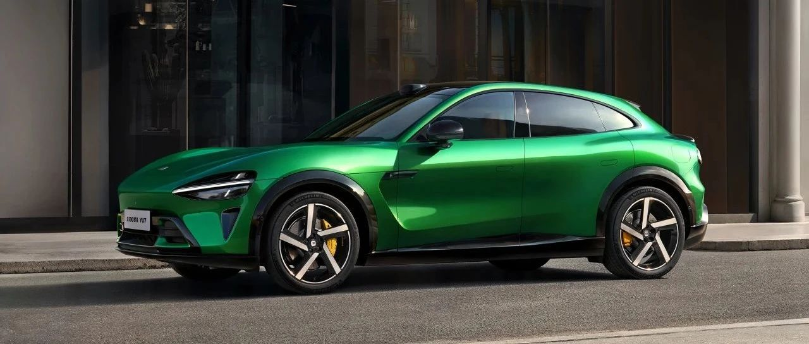

#  小米汽车答网友问（第146集）

[ 小米汽车 ](<javascript:void\(0\);>)

______

**01**

**在强光的条件下，小米天际屏全景显示还能看得清么？**

看得清。小米天际屏全景显示利用了前风挡的下黑区，采用三块Mini LED屏幕将屏幕信息直接反射到前风挡下黑区，可视峰值亮度高达1200nits；此外，这三块Mini LED屏幕还具备全局903分区控光能力，每个区域可单独调节亮度，从而让亮部更亮、暗部更暗，显著提升画面的对比度，让显示画面更加清晰。

**02**

**小米YU7上宝石绿配色看着很独特，从工艺上有什么特别之处么？**

「宝石绿」是一款高饱和度的颜色，这样一个颜色的开发，往往需要花费13个月以上。其颜色灵感来源于哥伦比亚的绿宝石，我们通过「双层色漆工艺」，还原了绿宝石的高级质感。

「双层色漆」需要用到三套色罐，喷涂三次，而普通的色漆只需要一个色罐。第一个色罐装的是黄绿色的金属漆，喷涂在外表面第一层，来还原宝石的深邃色泽。其使用了粒径极小的细腻的铝粉，不仅能够使颜色在视觉上更加细腻，还有助于提升漆膜的平整度和光滑度，让车身表面呈现出更好的质感。第二个色罐装的是细腻透明的珠光漆，叠加在外表面第二层，让车漆在不同的光照角度下呈现出丰富的色彩变化，还原了宝石的光影流动效果。第三个罐是珠光和金属色漆的混合漆，喷在内表面，使其也有珠光闪烁效果。

小米YU7饱满立体的型面搭配细腻流动的「宝石绿」，使得整车在光线的折射下，变化丰富，灵动高级。小米YU7「宝石绿」展车将陆续登陆小米汽车全国展厅，欢迎您到店品鉴。

**03**

**小米****SU7****今天获得了由J.D. Power颁发的“产品魅力指数”奖项，这是个什么奖？**

小米SU7今日荣膺 J.D. Power丨君迪发布的奖项 - 在2025年度中国新能源汽车产品魅力指数研究（NEV-APEAL）大型纯电动细分市场中排名第一，这个奖项最核心的价值在于它完全通过调研新能源汽车车主在购车2至6个月内拥有和驾驶车辆的各方面体验，覆盖81个城市的21211名受访者，是完全基于车主真实的体验和评价而来。

该榜单是J.D. Power第五年在中国发布这一研究。该研究涉及11个车辆表现类别（外观造型、设置和启动、上/下车、车身内装、车辆性能、驾驶感受、安全感、车载信息娱乐系统、驾乘舒适性、燃油经济性和续航里程以及充电体验）的45个要素，全面覆盖了新能源汽车车主在购车以来各方面的体验。

此次是小米SU7首次登上榜单，更是以825分的绝对领先获得大型纯电动细分市场排名第一的成绩，同时也创造了NEV-APEAL榜单历史最高分。感谢小米汽车车主的厚爱和支持！

**04**

**2025粤港澳大湾区车展马上就要开幕了，小米汽车展台有什么看点？**

本次2025年粤港澳大湾区车展，「豪华高性能SUV」小米YU7将开启车展首秀，同时还有小米SU7和小米SU7 Ultra的全方位展示。您可展台现场沉浸式体验小米「人车家全生态」，还可自由体验车辆选配与米家设备展区。我们将安排1对1的专业销售讲解，为您全面细致的解答疑惑。

我们还为到场的朋友准备了逛展福利：不仅有备受欢迎的车展限定矿泉水，在整个车展展期内限量免费送；还有六一儿童节限定矿泉水，在「六一」当天限量发放。欢迎大家前来粤港澳大湾区车展6号馆·06展位打卡！

  

  

< img alt="图片" class="rich_pages wxw-img" data-ratio="0.8824074074074074" src="https://mmbiz.qpic.cn/sz_mmbiz_png/UaK4PTh6Zpk2TaVLh0tUHxviapUIsTcXOFp1ATh7VRDuqnQr3V3oDvw9DodpJKDZDh0fV2YVzbrgHETVM5DzIqA/640?wx_fmt=png&from=appmsg&wxfrom=5&wx_lazy=1&wx_co=1" data-w="1080" style="visibility: visible !important;width: 350px !important;height: auto !important;" width="100%" data-imgqrcoded="1">

预览时标签不可点

微信扫一扫  
关注该公众号

继续滑动看下一个

轻触阅读原文

小米汽车 

向上滑动看下一个

[知道了](<javascript:;>)

微信扫一扫  
使用小程序

****

[取消](<javascript:void\(0\);>) [允许](<javascript:void\(0\);>)

****

[取消](<javascript:void\(0\);>) [允许](<javascript:void\(0\);>)

****

[取消](<javascript:void\(0\);>) [允许](<javascript:void\(0\);>)

× 分析

__

微信扫一扫可打开此内容，  
使用完整服务

： ， ， ， ， ， ， ， ， ， ， ， ， 。 视频 小程序 赞 ，轻点两下取消赞 在看 ，轻点两下取消在看 分享 留言 收藏 听过