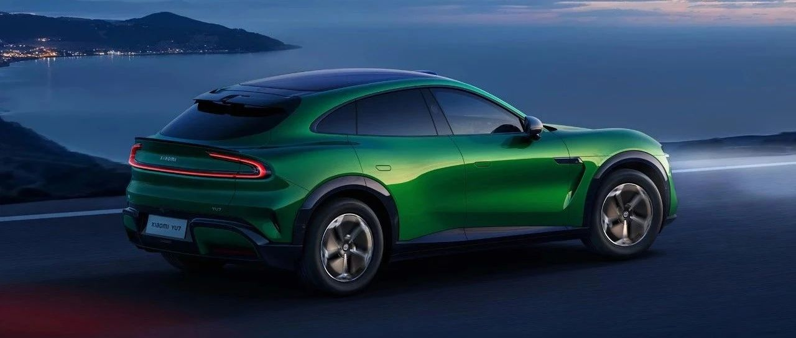

#  小米汽车答网友问（第148集）

[ 小米汽车 ](<javascript:void\(0\);>)

______

**01**

**中国汽车耐力锦标赛成都站今天正式开赛了，小米****SU7 Ultra****作为赛事安全车，主要有什么任务？**

安全车在主流场地赛事中的核心作用是在赛道出现危险情况时，确保所有参赛车辆、车手、赛道工作人员以及观众的安全，同时尽可能地维持比赛节奏。在中国汽车耐力锦标赛（CEC）中，由于采用动态发车程序，安全车还会作为引领车，引导参赛车辆进行发车程序开始正式比赛环节。

总之，安全车在赛车赛事中是一个至关重要的安全装置和比赛管理工具。它通过强制降低车速、禁止超车、压缩车阵的方式，在赛道出现危险时为救援和清理工作提供安全保障，同时最大限度地维持比赛的连续性，并在恢复比赛时创造一个相对公平的竞争环境。

作为目前在成都天府赛道的最速四门量产车，小米SU7 Ultra单圈圈速甚至可以媲美CEC部分组别的赛车，其出色的性能表现足以胜任赛事安全车的任务。

*左右滑动 查看更多

**02**

**小米YU7的大灯上半部分镂空，照明水平会受影响吗？**

请放心，照明水平不会受到影响。小米YU7的镂空水滴大灯采用家族化设计，位置灯加宽，更凌厉，更醒目。

小米YU7的大灯模组相较于小米SU7，由4个小模组改为2个大模组，并且配备LED矩阵式大灯，支持ADB自适应远光、AFS照明模式切换等功能。

除此之外，小米YU7还升级了180°超广角照明，夜间转向时，角灯自动由低亮调整到高亮，补充近光灯内侧的光照，扩大照明范围，进一步提升了行车安全。

**03**

**小米YU7的光环尾灯为什么换设计了？有些什么改进？**

**小米YU7的光环尾灯传承了小米汽车的家族设计，非常漂亮。在传承的基础上，小米YU7尾灯设计更立体，更符合SUV的力量感。它的转折更强，撑起了更有力量的双肩，匹配更高的车身姿态，为尾部增加稳重感和力量感。**

同时，小米YU7光环尾灯的功能区也被重新打造。尾灯由632nm超红光LED构成，这种红光穿透能力更强、人眼感知度更高，可以提升雨雾等恶劣天气下的行车安全。

有关小米YU7更多的产品信息，敬请期待后续小米汽车的官方信息。

**04**

**小米YU7除了已公布的钛金属色、宝石绿、熔岩橙和寒武岩灰外，还有什么其他颜色？**

如雷总在发布会上所说，作为一款「豪华高性能SUV」，除了已经发布的四款颜色外，小米YU7还有五款颜色即将发布。款款经典，敬请期待！

  

  

< img alt="图片" class="rich_pages wxw-img" data-ratio="0.8824074074074074" src="https://mmbiz.qpic.cn/sz_mmbiz_png/UaK4PTh6Zpk2TaVLh0tUHxviapUIsTcXOFp1ATh7VRDuqnQr3V3oDvw9DodpJKDZDh0fV2YVzbrgHETVM5DzIqA/640?wx_fmt=png&from=appmsg&wxfrom=5&wx_lazy=1&wx_co=1" data-w="1080" style="visibility: visible !important;width: 350px !important;height: auto !important;" width="100%" data-imgqrcoded="1">

预览时标签不可点

微信扫一扫  
关注该公众号

继续滑动看下一个

轻触阅读原文

小米汽车 

向上滑动看下一个

[知道了](<javascript:;>)

微信扫一扫  
使用小程序

****

[取消](<javascript:void\(0\);>) [允许](<javascript:void\(0\);>)

****

[取消](<javascript:void\(0\);>) [允许](<javascript:void\(0\);>)

****

[取消](<javascript:void\(0\);>) [允许](<javascript:void\(0\);>)

× 分析

__

微信扫一扫可打开此内容，  
使用完整服务

： ， ， ， ， ， ， ， ， ， ， ， ， 。 视频 小程序 赞 ，轻点两下取消赞 在看 ，轻点两下取消在看 分享 留言 收藏 听过