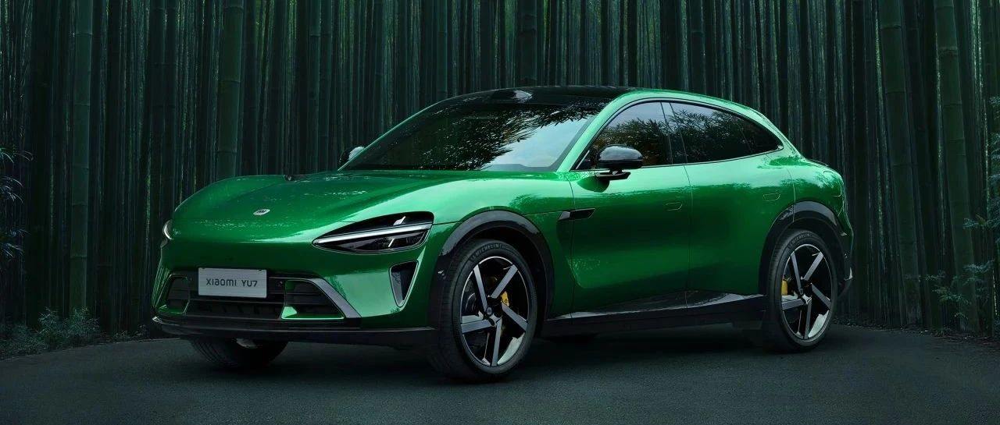

#  小米汽车答网友问（第149集）

[ 小米汽车 ](<javascript:void\(0\);>)

______

**01**

**小米之家****汽车体验店、销售服务中心和****交付****中心在功能上有什么区别？**

目前小米汽车门店一共分为四类，它们各自的职能稍有不同：

  * 小米之家汽车体验店：通常建于各大商场中，是小米「人车家全生态」的体验阵地，提供小米汽车及手机、大家电、智能穿戴设备等多品类的体验和销售服务。

  * 小米汽车销售服务中心：提供车辆销售、售后服务。

  * 小米汽车服务中心：专职提供车辆售后服务。

  * 小米汽车交付中心：建于汽车销售商圈或郊区，核心职能是新车交付，此外通常也会提供车辆体验、销售、售后服务功能。  

小米汽车在5月共新增29家门店，现一共覆盖全国82城，共298家门店；6月计划新增37家门店，预计覆盖宝鸡、沧州等10座城市。截止5月31日，全国已有153家服务网点，覆盖全国88城。 欢迎大家到店品鉴！

**02**

**我是Ultra Club的会员，如何获得中国汽车耐力锦标赛后续其它城市的观赛资格？**

后续中国汽车耐力锦标赛（宁波站，平潭站和武汉站）的观赛机会还会随着赛程继续发放，欢迎大家关注小米汽车APP的Ultra Club专属会员页面的活动专区，亲临现场观看中国汽车运动赛事！

**03**

**小米YU7的****NVH****表现怎么样？**

作为一款「豪华高性能SUV」，小米YU7的四门车窗都将配备夹层玻璃，在防晒隔热、隔音性能都比较出色；并且我们在小米YU7全车应用了大量的声学材料，在NVH上的表现绝对不会让您失望。更多详情请关注小米汽车后续信息。

**04**

**小米YU7的隔热防晒性能怎么样？**

自从小米汽车立项开始，我们在防晒方面就下了非常大的功夫，小米SU7和小米SU7 Ultra的防晒效果都受到了广大车主朋友们的好评；

请您放心，小米YU7也会延续小米汽车出色防晒基因，更多详情请关注小米汽车后续信息。

  

< img alt="图片" class="rich_pages wxw-img" data-ratio="0.8824074074074074" src="https://mmbiz.qpic.cn/sz_mmbiz_png/UaK4PTh6Zpk2TaVLh0tUHxviapUIsTcXOFp1ATh7VRDuqnQr3V3oDvw9DodpJKDZDh0fV2YVzbrgHETVM5DzIqA/640?wx_fmt=png&from=appmsg&wxfrom=5&wx_lazy=1&wx_co=1" data-w="1080" style="visibility: visible !important;width: 350px !important;height: auto !important;" width="100%" data-imgqrcoded="1">

预览时标签不可点

微信扫一扫  
关注该公众号

继续滑动看下一个

轻触阅读原文

小米汽车 

向上滑动看下一个

[知道了](<javascript:;>)

微信扫一扫  
使用小程序

****

[取消](<javascript:void\(0\);>) [允许](<javascript:void\(0\);>)

****

[取消](<javascript:void\(0\);>) [允许](<javascript:void\(0\);>)

****

[取消](<javascript:void\(0\);>) [允许](<javascript:void\(0\);>)

× 分析

__

微信扫一扫可打开此内容，  
使用完整服务

： ， ， ， ， ， ， ， ， ， ， ， ， 。 视频 小程序 赞 ，轻点两下取消赞 在看 ，轻点两下取消在看 分享 留言 收藏 听过