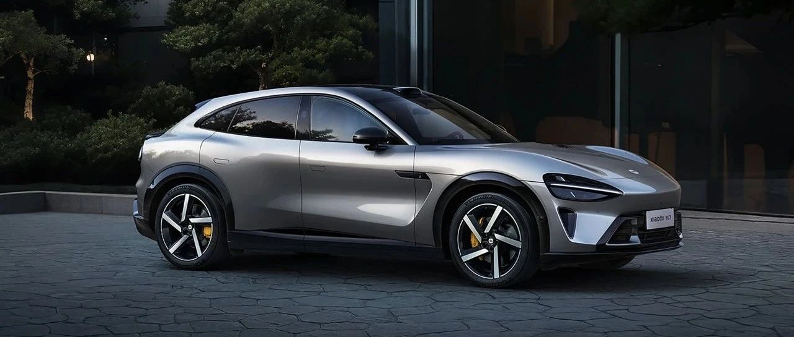

#  小米汽车答网友问（第150集）

[ 小米汽车 ](<javascript:void\(0\);>)

______

**01**

**UWB****智能钥匙****相比传统****蓝牙****钥匙有什么优势？**

UWB智能钥匙在定位精度、安全性和空间感知能力方面相对于蓝牙钥匙具有优势。这直接带来了更安全、更便捷、更智能的无钥匙进入和启动体验。

当您携带开通了UWB功能的智能钥匙接近小米YU7时，车辆会精确感知您与车的位置，并在合适的位置触发灯语交互和解闭锁动作。

Xiaomi 15S Pro现已支持UWB技术，可以实现上述流畅体验。同时该功能也适用于搭载了UWB技术的苹果手机，具体支持清单请参考苹果官方信息。

**02**

**之前在工信部****公告****上看到小米YU7给19寸轮毂配备的是245****mm****胎宽的轮胎，为什么这么选择？**

小米YU7将会提供多种的轮胎选项，来满足用户不同的性能及续航的需求。经过多轮测试调校后，我们为19英寸和20英寸的轮毂搭配了胎宽为245mm的轮胎。19英寸轮胎（245/55R19）将助力小米YU7标准版实现最高CLTC续航835km，同时55的轮胎扁平比意味着其相对同级车型有着更厚的胎壁，在保证续航表现的同时也充分兼顾了驾乘舒适性。

如果您对车辆的运动性能有更高要求，您也可以选装275mm后宽胎，显著提升抓地力，操控性和稳定性会更好，百公里最短制动距离仅为33.9m；同时视觉更具运动感，姿态更稳健，为整车增添高性能风格元素。

此外，我们对小米YU7的各款轮胎都做了定制调校，保证其制动性能出色，加上四重制动冗余，以保障驾驶安全。更多详情，敬请关注小米汽车后续信息。

**03**

**小米YU7的后排可移动控制屏有什么功能？**

我们在小米YU7的后排配备了一块6.68 英寸可移动控制屏，方便后排乘客实现导航、音乐、座椅、空调等便捷操控：

  * 车控：调节空调温度/风量、打开座椅加热、调节座椅角度等；

  * 娱乐：实现音乐播放的操作，比如切换歌曲、音量、歌词等；

  * 导航：设置目的地、途经点，也可以共享导航信息、路线、到达时间等；

更多有关小米YU7的产品信息，敬请期待后续官方信息。

**04**

**小米YU7上市后，产能够么？会不会要等很久才能提车？**

我们正在为小米YU7大规模量产做准备。我们有信心在其正式上市后，以最快的速度向用户交付。

您可持续关注小米汽车APP上的官方信息，敬请期待！

  

< img alt="图片" class="rich_pages wxw-img" data-ratio="0.8824074074074074" src="https://mmbiz.qpic.cn/sz_mmbiz_png/UaK4PTh6Zpk2TaVLh0tUHxviapUIsTcXOFp1ATh7VRDuqnQr3V3oDvw9DodpJKDZDh0fV2YVzbrgHETVM5DzIqA/640?wx_fmt=png&from=appmsg&wxfrom=5&wx_lazy=1&wx_co=1" data-w="1080" style="visibility: visible !important;width: 350px !important;height: auto !important;" width="100%" data-imgqrcoded="1">

预览时标签不可点

微信扫一扫  
关注该公众号

继续滑动看下一个

轻触阅读原文

小米汽车 

向上滑动看下一个

[知道了](<javascript:;>)

微信扫一扫  
使用小程序

****

[取消](<javascript:void\(0\);>) [允许](<javascript:void\(0\);>)

****

[取消](<javascript:void\(0\);>) [允许](<javascript:void\(0\);>)

****

[取消](<javascript:void\(0\);>) [允许](<javascript:void\(0\);>)

× 分析

__

微信扫一扫可打开此内容，  
使用完整服务

： ， ， ， ， ， ， ， ， ， ， ， ， 。 视频 小程序 赞 ，轻点两下取消赞 在看 ，轻点两下取消在看 分享 留言 收藏 听过