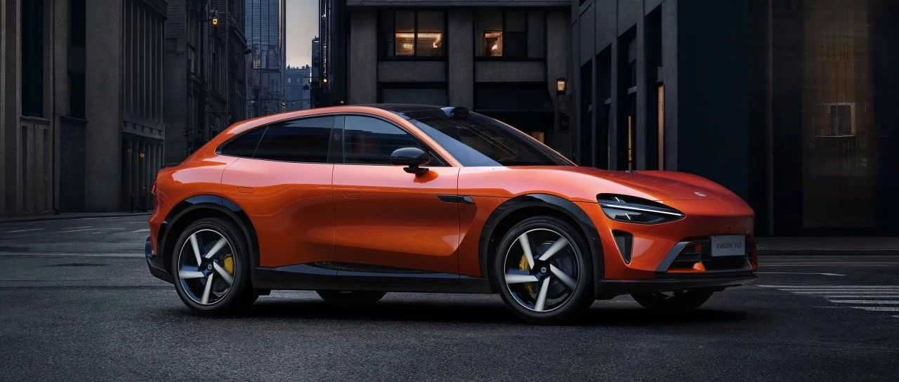

#  小米汽车答网友问（第151集）

[ 小米汽车 ](<javascript:void\(0\);>)

______

**01**

**小米YU7的辅助驾驶能力怎么样？**

小米YU7「标配即旗舰」，全系标配激光雷达，以及1颗4D毫米波雷达、11颗高清摄像头和12颗超声波雷达，这些硬件为小米YU7的辅助驾驶功能带来了更好的表现。

  * 全系标配的激光雷达可以让小米YU7在夜间或复杂环境下识别更精准，最远有效点云距离达200米，同时功耗降低55%，既安全又节能，是守护驾驶安全的坚实防线。

  * 小米YU7全系搭载4D毫米波雷达，相比3D毫米波增加了高度信息，分辨率与识别距离大幅强化。比如跟车行驶，当前车发生急刹时，辅助驾驶系统可以增强预警提示能力；遇到雨雾等恶劣天气时，4D毫米波雷达也能更好感知肉眼看不清的交通状况。

  * 小米YU7全车搭载了11颗高清摄像头，其中7颗为超透防眩摄像头，其镜头应用ALD镀膜技术，较好地抑制逆光、眩光产生的视觉干扰，画质更清晰、通透。

  * 全系算力提升：搭载了NVIDIA DRIVE AGX Thor™车载计算平台，算力达到700 TOPS，可以更好的支持大模型上车，带来更好的辅助驾驶体验。  

更多有关小米YU7辅助驾驶功能的详情，请关注小米汽车后续官方信息。

**02**

**小米YU7的不同型号分别使用的是什么品牌的电池？**

小米 YU7标准版和Pro均搭载由弗迪和宁德时代两大行业头部电池品牌提供的96.3kWh磷酸铁锂电池；小米YU7 Max 则搭载由宁德时代提供的101.7kWh三元锂电池。

小米汽车电池包始终坚持严苛的电池安全设计和高标准要求，无论搭载哪种电池都能达到同样的安全标准，同时也符合新国标电池安全的测试要求，请您放心。更多详情，敬请关注小米汽车后续信息。

**03**

**小米YU7有配备智能天幕么？**

**感谢您对小米YU7的关注。我们为小米YU7提供了智能可调光天幕可 选。**

**更多详情可以关注后续小米汽车官方信息，并请以实际上市为准。**

**04**

**近期到了雨季，如果在行驶过程中遇到路面大幅积水的情况，应该怎么办？**

在驾驶过程中如遇到积水路段，请一定小心，安全第一，我们建议您特别注意以下事项：

  * 判断水深：如您目测积水深度可能超过轮胎的一半，建议绕行，强行通过可能会损坏车辆或导致危险。

  * 缓慢通过：如果必须涉水，请一定减速行驶（建议车速不超过5-10km/h），避免车速过高形成的水浪对车辆部件造成损坏。

  * 水流湍急要小心：如果是流动积水，要格外谨慎，避免车辆被冲偏。不建议您在水流湍急的情况下涉水。

  * 涉水后检查：轻踩刹车，让刹车片干燥，确保制动正常。测试喇叭、灯光、转向，确认电子系统没受影响。

  * 温馨提示：积水行车易起水花，请在开车时注意尽量避免水花飞溅，影响行人和其他车辆。同时，也要请注意路边的行人、其他车辆的行车安全。

  

< img alt="图片" class="rich_pages wxw-img" data-ratio="0.8824074074074074" src="https://mmbiz.qpic.cn/sz_mmbiz_png/UaK4PTh6Zpk2TaVLh0tUHxviapUIsTcXOFp1ATh7VRDuqnQr3V3oDvw9DodpJKDZDh0fV2YVzbrgHETVM5DzIqA/640?wx_fmt=png&from=appmsg&wxfrom=5&wx_lazy=1&wx_co=1" data-w="1080" style="visibility: visible !important;width: 350px !important;height: auto !important;" width="100%" data-imgqrcoded="1">

预览时标签不可点

修改于

微信扫一扫  
关注该公众号

继续滑动看下一个

轻触阅读原文

小米汽车 

向上滑动看下一个

[知道了](<javascript:;>)

微信扫一扫  
使用小程序

****

[取消](<javascript:void\(0\);>) [允许](<javascript:void\(0\);>)

****

[取消](<javascript:void\(0\);>) [允许](<javascript:void\(0\);>)

****

[取消](<javascript:void\(0\);>) [允许](<javascript:void\(0\);>)

× 分析

__

微信扫一扫可打开此内容，  
使用完整服务

： ， ， ， ， ， ， ， ， ， ， ， ， 。 视频 小程序 赞 ，轻点两下取消赞 在看 ，轻点两下取消在看 分享 留言 收藏 听过