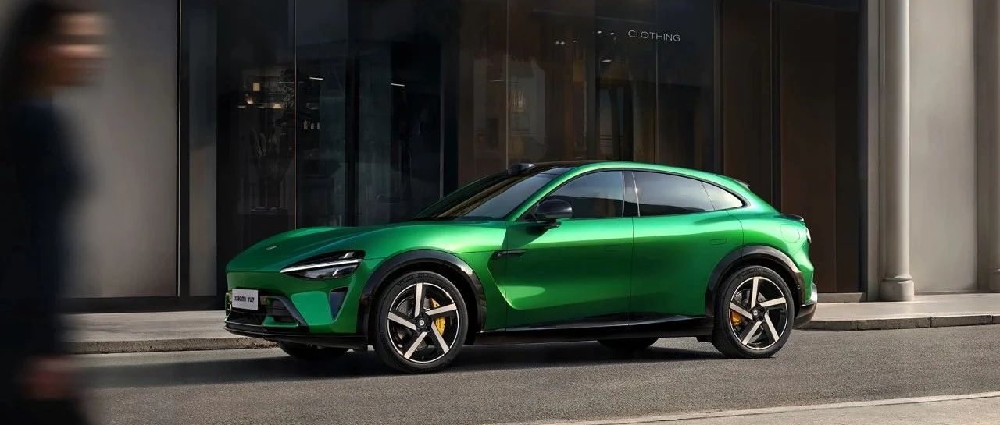

#  小米汽车答网友问（第154集）

[ 小米汽车 ](<javascript:void\(0\);>)

______

**01**

**现在气温越来越高了，在前备箱放东西时要注意什么？有什么不适合放的吗？**

时值夏季，小米SU7和小米SU7 Ultra的前备箱在日光暴晒和长时间驾驶后内部温度可能会明显升高，因此首先不适合存放易燃易爆物品，如锂电池、打火机等，容易造成安全隐患。其次，前备箱也不适合长期存放食物，尤其不适合存放需冷藏、冷冻的食物，高温条件会容易加速食物的变质。同时，出于安全考虑，我们强烈建议您切勿让宠物或小孩进入车辆前备箱或在其内滞留玩耍，以防意外发生。

我们建议您可在前备箱中存放不怕热的物品，如车衣、车辆清洁工具、户外用品等。此外，前备箱设有排水孔，可用水清洁；作为独立空间也可存放钓鱼用具等较容易造成脏污的物品。

**02**

**小米YU7全系标配的4D****毫米波雷达****和****ALD****镀膜技术，对辅助驾驶功能的表现有什么提升？**

4D毫米波雷达比以往的3D毫米波雷达增加了高度信息，在分辨率与识别距离方面进行了大幅度强化，可以最远识别200m外的车，或100m外的人 ；在雨雾等恶劣天气时，即便肉眼能见度很低，4D毫米波雷达可以识别到人眼已经看不清的交通状况，提升车辆在恶劣天气下的辅助驾驶表现。

而炫光干扰一直是辅助驾驶影像系统的难题，会影响车辆的目标识别和导致误判。小米YU7全车搭载了11颗高清摄像头，其中7颗为超透防眩摄像头，其镜头应用了ALD镀膜技术，可以减少光在镜头内部的反射，增加透光率，使整个画质清晰、通透性更佳，同时能较好的抑制白天逆光或是夜间后车的远光，降低强光源引起的鬼影炫光而产生的视觉干扰。

有关更多关于小米YU7辅助驾驶功能的相关信息，敬请期待后续小米汽车的官方信息。

**03**

**EEA****是什么东西，能再详细解释一下吗？**

EEA的全称是Electrical/Electronic Architecture，即电子电气架构，负责了车上各类传感器、控制器和执行器之间的信号传输，是整车智能化的底座。

小米YU7全系搭载了新一代小米汽车电子电气架构，采用了行业领先的四合一域控制模块、4nm 座舱SoC芯片及辅助驾驶计算芯片，实现了超高算力，打造了先进的智能座舱和辅助驾驶体验。

不同于采用四大域控制器的分布式架构的传统汽车EEA，小米YU7的电子电气架构将VCCD整车域控制器、DCD座舱域控制器、ADD辅助驾驶域控制器、T-Box通讯模块高度集成到一个中央计算大脑形成了「四合一域控制器」。其不仅降低了体积和重量，控制器数量减少75%、占用空间减少57%、零件重量从6.85kg 降低到3.6kg、零件减重47%，而且实现了全链路的能效优化，整个EEA提升续航超16km，其中哨兵模式实现功耗降低40%，续航提升超5公里。

对于智能座舱，小米YU7搭载了第三代骁龙®8移动平台，采用了4nm工艺制程，首次在汽车上带来移动计算领域出色的性能和能耗表现，智能座舱体验更流畅，开机快、启动快、升级更快。

辅助驾驶模块同样集成了全新一代NVIDIA DRIVE AGX ™ 4nm车载计算平台，首次搭载 Blackwell 架构，总算力提升至惊人的700TOPS，可以更好的支持大模型上车。

总而言之，更高集成化、更先进的EEA，可以给小米YU7带来性能、体验和可靠性上的全维度提升。

**04**

**小米YU7有多少种内饰颜色？**

小米YU7有三款风格各异、大方豪华内饰颜色可选，分别是浅色系的松石灰，以及深色系的珊瑚橙、暮影蓝。

材质方面，小米YU7的高频接触内饰面皆为软包覆盖，并获得OEKO-TEX一级国际认证，达到婴儿能直接碰触的标准；同时座椅采用了Nappa真皮包覆，触感细腻，兼具包裹性和支撑性。

更多关于小米YU7内饰的详情，敬请期待！

  
  
  
< img alt="图片" class="rich_pages wxw-img" data-ratio="0.8824074074074074" src="https://mmbiz.qpic.cn/sz_mmbiz_png/UaK4PTh6Zpk2TaVLh0tUHxviapUIsTcXOFp1ATh7VRDuqnQr3V3oDvw9DodpJKDZDh0fV2YVzbrgHETVM5DzIqA/640?wx_fmt=png&from=appmsg&wxfrom=5&wx_lazy=1&wx_co=1" data-w="1080" style="visibility: visible !important;width: 350px !important;height: auto !important;" width="100%" data-imgqrcoded="1">

预览时标签不可点

修改于

微信扫一扫  
关注该公众号

继续滑动看下一个

轻触阅读原文

小米汽车 

向上滑动看下一个

[知道了](<javascript:;>)

微信扫一扫  
使用小程序

****

[取消](<javascript:void\(0\);>) [允许](<javascript:void\(0\);>)

****

[取消](<javascript:void\(0\);>) [允许](<javascript:void\(0\);>)

****

[取消](<javascript:void\(0\);>) [允许](<javascript:void\(0\);>)

× 分析

__

微信扫一扫可打开此内容，  
使用完整服务

： ， ， ， ， ， ， ， ， ， ， ， ， 。 视频 小程序 赞 ，轻点两下取消赞 在看 ，轻点两下取消在看 分享 留言 收藏 听过