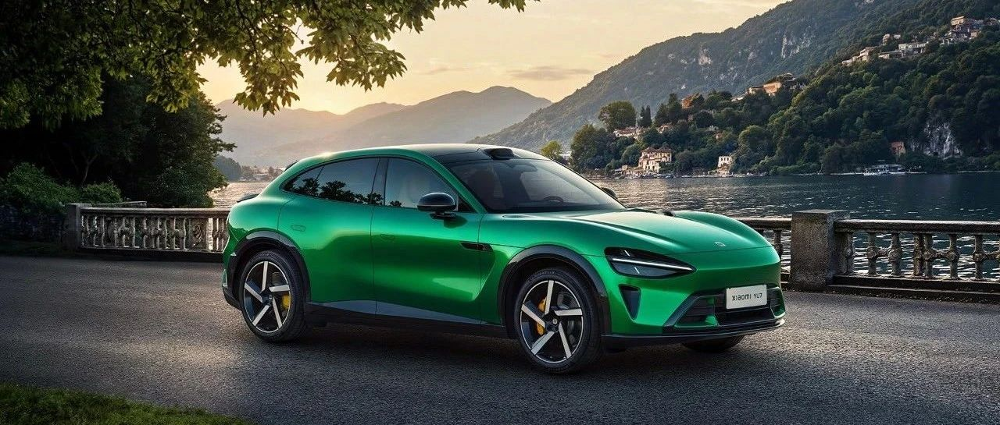

#  小米汽车答网友问（第155集）

[ 小米汽车 ](<javascript:void\(0\);>)

______

**01**

**此次打破****纽北****量产电动车圈速纪录的是小米****SU7 Ultra****的哪个版本？**

打破纽北量产电动车圈速纪录的小米SU7 Ultra选装了「赛道专业套装」选装包、「碳纤维双风道前舱盖」、「碳纤维尾翼」且配备了「空气动力学底护板」。同时，我们应纽北要求在车内进行了安全改装，包含全笼式防滚架、赛用桶型座椅和六点式安全带，并拆除部分内饰用以平衡防滚架的重量增加，是经过了纽北官方认证检测的量产车。

随着纽北成绩的公布，小米SU7 Ultra的「赛道专业套装」选装包也将于近期正式发售，其包含21英寸U型锻造轮毂、倍耐力®P ZERO™ TROFEO RS半热熔轮胎、倍适登®EVO R for Ultra绞牙减振器套装、ENDLESS®高性能制动片、1.7㎡碳纤维车顶等顶级性能装备，敬请赛道专业玩家期待。

**02**

**此次小米****SU7 Ultra****挑战****纽北****的过程是否顺利？一共用了几次挑战成功？**

相比小米SU7 Ultra原型车首次挑战纽北，这一次小米SU7 Ultra量产车挑战时的天气条件更好，以晴和多云为主，虽然2～9℃的气温偏低， 但路面更干燥、有利于车辆的操控。

我们用于挑战纽北的小米SU7 Ultra量产车一共有2台，其中车手Vincent Radermecker驾驶太空银色2号车的第2圈成绩最好，以7:04:957的圈速打破了纽北量产电动车的圈速纪录。

**03**

**为什么我看到圈速记录「一镜到底」视频中显示的时间是7:04:92，而最终发布的圈速却是7:04:957？**

「一镜到底」视频中的圈速计时是使用车载设备记录的，而最终发布的圈速则是使用纽北赛道计时器记录的，两种设备有千分之几秒的误差，最终的圈速成绩以纽北官方认证为准。

在「一镜到底」视频中，为了给车迷朋友们更好的观看体验，我们将车载设备记录到的车速、加速踏板开度、制动踏板开度和计时信息全部整合到了视频当中。为了数据的可靠性和呈现的统一性，均使用了车载设备记录的信息。

**04**

**小米****SU7 Ultra****量产版冲刺****纽北****成功，会有官方的长纪录片吗？去年原型车冲击成功后的纪录片非常看好，非常期待今年量产版背后冲击背后的故事**

感谢您一直关注和支持。量产版冲击纽北的故事，我们同样进行了记录。

今天我们公布了先行版的纪实视频。完整版本的纪录片，我们仍在准备中，敬请期待。

  
  
< img alt="图片" class="rich_pages wxw-img" data-ratio="0.8824074074074074" src="https://mmbiz.qpic.cn/sz_mmbiz_png/UaK4PTh6Zpk2TaVLh0tUHxviapUIsTcXOFp1ATh7VRDuqnQr3V3oDvw9DodpJKDZDh0fV2YVzbrgHETVM5DzIqA/640?wx_fmt=png&from=appmsg&wxfrom=5&wx_lazy=1&wx_co=1" data-w="1080" style="visibility: visible !important;width: 350px !important;height: auto !important;" width="100%" data-imgqrcoded="1">

预览时标签不可点

修改于

微信扫一扫  
关注该公众号

继续滑动看下一个

轻触阅读原文

小米汽车 

向上滑动看下一个

[知道了](<javascript:;>)

微信扫一扫  
使用小程序

****

[取消](<javascript:void\(0\);>) [允许](<javascript:void\(0\);>)

****

[取消](<javascript:void\(0\);>) [允许](<javascript:void\(0\);>)

****

[取消](<javascript:void\(0\);>) [允许](<javascript:void\(0\);>)

× 分析

__

微信扫一扫可打开此内容，  
使用完整服务

： ， ， ， ， ， ， ， ， ， ， ， ， 。 视频 小程序 赞 ，轻点两下取消赞 在看 ，轻点两下取消在看 分享 留言 收藏 听过