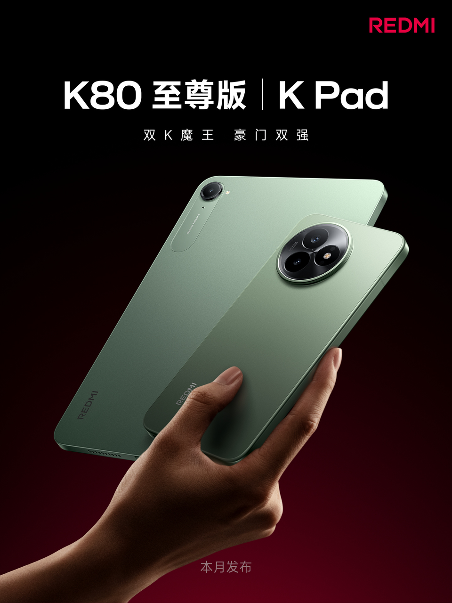

#  小米汽车答网友问（第157集）

[ 小米汽车 ](<javascript:void\(0\);>)

______

**01**

**小米YU7配备的245/55R19轮胎，其中245和55分别代表什么？为什么没有选择255宽度的轮胎？**

“245mm”代表轮胎的断面宽度，两个侧壁之间最宽处的直线距离。“55”则是一个百分比数字，它代表了轮胎侧壁高度占轮胎断面宽度的百分比，扁平比越高，轮胎看起来越“厚”，抗路面冲击能力越强，不仅能更好的保护轮毂，也意味着更好的舒适性和缓冲能力。除此之外，245mm胎宽的轮胎也为小米YU7提升了续航能力，助力标准版车型在CLTC工况下拥有最高835km的续航里程，全面兼顾了舒适性及续航表现。

“245/55”的宽度与扁平比搭配，常见于注重舒性和行驶质感，同时兼顾一定驾驶质感的车型。相比于采用了“255/50”更宽的轮胎型号，虽然损失了一定的操控性，但换来了更好的舒适以及续航表现。而在安全稳定性上，小米YU7对各款轮胎均做了定制调校，配合底盘系统ESP车身稳定控制和四重制动冗余，保障制动和驾驶安全。所以车辆的行驶稳定性，不仅在于轮胎的宽窄，而是系统性调校与匹配。

但如果您希望获得更好的轮胎操控性能表现，小米YU7后轮胎支持最高275/40 R21的尺寸选择，实现轮胎前窄后宽，让操控性能更好。同时小米YU7还有更多丰富的轮胎轮毂可选，能够满足续航、舒适、静音、运动的全方位需求，我们也会在后续向您详细介绍。

**02**

**小米YU7在电池包安全防护方面有什么特别的设计么？**

小米YU7在电池包安全方面采取了多项防护措施。首先，我们在小米YU7的电池包前方配备一根 1500MPa防刮底横梁，可将一般路面障碍物，如石块、树枝等直接推开，确保电池包不会受到直接碰撞，为电池包提供了坚实可靠的第一道防线。

此外，小米YU7还应用了小米SU7 Ultra电池包底部同款「防弹涂层」，当车辆底部遭遇刮擦时，可以有效地吸收冲击能量，大大减少底部刮擦对电池包造成的损伤，确保车辆的安全使用。

更多有关小米YU7的电池安全防护能力，敬请期待后续小米汽车官方信息。

**03**

**网上出现了一些自称“小米汽车大客户经理”的角色，声称通过其大客户渠道定车可以领取现金补贴，是真 的么？**

目前小米汽车官方没有任何大客户定车渠道或现金补贴，请大家切勿相信此类信息，更不要涉及金钱交易，避免经济损失。涉及类似销售信息，请大家一定要仔细甄别，并以小米汽车官方渠道发布的信息为准。

**04**

**这个月底小米YU7终于要发布了，除此之外还有什么其他新产品么？**

除了大家期待已久的小米YU7，还有很多重磅新品将同场一起发布。比如搭载玄戒O1芯片的第二款平板：小米平板 7S Pro，豪华性能小平板Redmi K Pad，以及豪华性能旗舰Redmi K80至尊版等。

此外，即将发布的重磅新品还有很多，@卢伟冰 将会在6月18日晚上8点，与@王腾 和 @李肖爽 一起，通过直播提前跟大家聊聊其中的几款新品，欢迎大家围观！

*左右滑动 查看更多

  
< img alt="图片" class="rich_pages wxw-img" data-ratio="0.8824074074074074" src="https://mmbiz.qpic.cn/sz_mmbiz_png/UaK4PTh6Zpk2TaVLh0tUHxviapUIsTcXOFp1ATh7VRDuqnQr3V3oDvw9DodpJKDZDh0fV2YVzbrgHETVM5DzIqA/640?wx_fmt=png&from=appmsg&wxfrom=5&wx_lazy=1&wx_co=1" data-w="1080" style="visibility: visible !important;width: 350px !important;height: auto !important;" width="100%" data-imgqrcoded="1">

预览时标签不可点

微信扫一扫  
关注该公众号

继续滑动看下一个

轻触阅读原文

小米汽车 

向上滑动看下一个

[知道了](<javascript:;>)

微信扫一扫  
使用小程序

****

[取消](<javascript:void\(0\);>) [允许](<javascript:void\(0\);>)

****

[取消](<javascript:void\(0\);>) [允许](<javascript:void\(0\);>)

****

[取消](<javascript:void\(0\);>) [允许](<javascript:void\(0\);>)

× 分析

__

微信扫一扫可打开此内容，  
使用完整服务

： ， ， ， ， ， ， ， ， ， ， ， ， 。 视频 小程序 赞 ，轻点两下取消赞 在看 ，轻点两下取消在看 分享 留言 收藏 听过