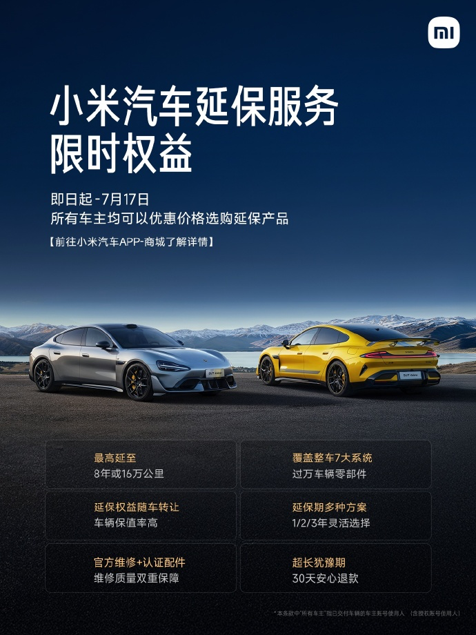

#  小米汽车答网友问（第158集）

[ 小米汽车 ](<javascript:void\(0\);>)

______

**01**

**小米汽车延保服务是什么？**

小米汽车延保服务是原厂整车保修的延续，其保障范围与新车整车质保保持一致（关键零部件、易损耗零部件、特类零部件除外），实现质保与延保的无缝衔接。

延保服务覆盖外观、底盘、热管理、智能座舱等7大系统，以及除关键零部件、易损耗零部件、特类零部件之外的上万种零部件，为您的长期用车提供了稳定可靠的保障。在延保服务有效期内，如果您的爱车出现质量问题，您可按照官方维修标准享受免费维修或免费更换相关零部件的服务（含工时费）。

您可根据用车周期灵活选择延保年限 - 最短可延长1年或行驶里程2万公里，最长可将保障范围内零件的质量保修期延长至8年或行驶里程16万公里（均以先到达者为准）。欢迎各位车主前往「小米汽车APP」-「商城」-「用车服务」-「小米汽车延保服务」，以了解更多详情。

**02**

**我发现针对不同的提车时间，目前延保服务的价格都是一样的，是系统出问题了么？**

不是系统问题，这是小米汽车延保服务首次上线的特惠政策。即日起至2025年7月17日23:59:59，所有已提车的小米汽车用户（无论何时提车），在活动时间内购买延保服务，都将享受统一的优惠价格。

活动结束后，延保服务将恢复标准服务价格。关于小米汽车延保服务限时权益的更多详情，请见「小米汽车APP」-「商城」-「用车服务」-「小米汽车延保服务」。

**03**

**小米YU7的镂空水滴前大灯，平时容易清理么？万一进蚊虫了怎么办？**

请您放心，我们在设计之初就考虑到了小米YU7镂空水滴前大灯的清洁问题。如果大灯风道在一些特殊场景中堆积了异物，您可使用高压水枪进行清洗；或者打开前机盖，用气枪对准美化板风道口吹气，将异物从大灯风道口吹出即可。

与此同时，我们在小米YU7的前机盖风道上也铺设了一层金属网罩，可以防止常见的落叶等杂物进入前机盖风道的内部。如果您的小米YU7风道中进入了灰尘、或极小的异物等，其可在洗车或下雨时自动从排水孔中排出（也可使用高压水枪清洗），您无需担心有堵塞风险。

**04**

**小米YU7标配的3.11㎡量产车最大蚌式铝机盖，后期维修起来会很贵么？****  
**

您不用过多担心小米YU7的蚌式铝机盖维修费用。小米YU7配备了当前量产车中最大的蚌式铝机盖，在保证了自身强度和轻量化的基础上，不仅造型更加优雅帅气，同时还满足了行人保护的要求。

在维修费用上，虽然小米YU7的前机盖外表面积比小米SU7增加了约50%，但其钣金工时费标准将和小米SU7维持不变，仅因面积增大而相应调整了喷漆工时费。如遇需更换小米YU7前机盖的情况，其维修配件的终端定价也仅略微高于小米SU7。

我们会全力将小米YU7的维修成本控制在合理范围内，更多详情请以小米汽车官方售后服务中心的信息为准。

  

  
< img alt="图片" class="rich_pages wxw-img" data-ratio="0.8824074074074074" src="https://mmbiz.qpic.cn/sz_mmbiz_png/UaK4PTh6Zpk2TaVLh0tUHxviapUIsTcXOFp1ATh7VRDuqnQr3V3oDvw9DodpJKDZDh0fV2YVzbrgHETVM5DzIqA/640?wx_fmt=png&from=appmsg&wxfrom=5&wx_lazy=1&wx_co=1" data-w="1080" style="visibility: visible !important;width: 350px !important;height: auto !important;" width="100%" data-imgqrcoded="1">

预览时标签不可点

微信扫一扫  
关注该公众号

继续滑动看下一个

轻触阅读原文

小米汽车 

向上滑动看下一个

[知道了](<javascript:;>)

微信扫一扫  
使用小程序

****

[取消](<javascript:void\(0\);>) [允许](<javascript:void\(0\);>)

****

[取消](<javascript:void\(0\);>) [允许](<javascript:void\(0\);>)

****

[取消](<javascript:void\(0\);>) [允许](<javascript:void\(0\);>)

× 分析

__

微信扫一扫可打开此内容，  
使用完整服务

： ， ， ， ， ， ， ， ， ， ， ， ， 。 视频 小程序 赞 ，轻点两下取消赞 在看 ，轻点两下取消在看 分享 留言 收藏 听过