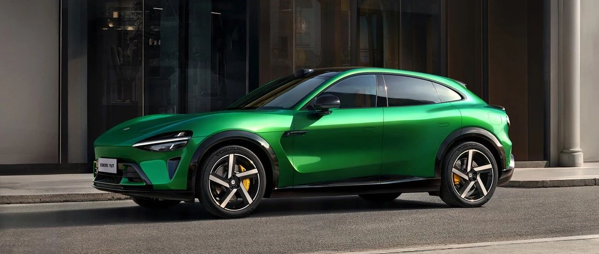
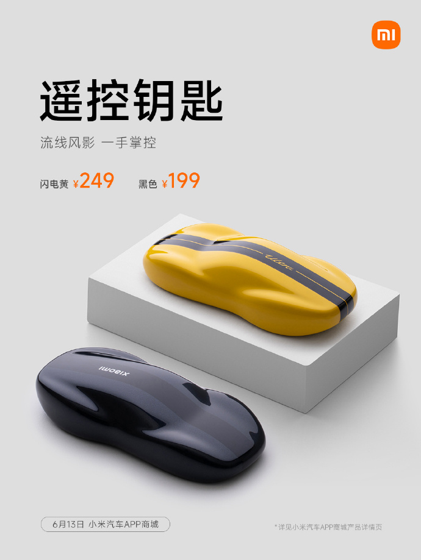

#  小米汽车答网友问（第159集）

[ 小米汽车 ](<javascript:void\(0\);>)

______

**01**

**小米YU7使用了2200MPa小米超强钢，车身材料强度是不是越高越好？**

车身材料的强度对于整车安全来说确实非常重要，但被动安全是整车系统性工程，材料需要根据应用部位进行针对性选择，并平衡多种性能，如强度、韧性、延伸率以及抗脆性断裂能力等。

比如A/B柱、四门防撞梁都是乘员舱的核心保护结构，需保证高强度，使乘员舱在碰撞中尽量不变形或减少变形；所以小米YU7将行业领先的2200MPa小米超强钢应用在了四门防撞梁、A/B柱“内嵌式防滚架”，能够在侧碰、翻滚等工况下更好的保护乘员安全。

除了高强度材料，车身也有溃缩吸能区域需要强度相对低的材料，比如防撞梁的吸能盒需要在碰撞中通过压缩变形来吸收碰撞能量，减少对乘员舱的冲击。所以吸能盒采用铝材，并设有诱导槽，可以利于溃缩吸能。

小米YU7在车身的用料上充分投入，使得小米YU7铠甲钢铝混合车身的高强度钢和铝合金占比达到90.2%。除车身用料外，在整车被动安全方面，小米YU7完成了50+项被动安全性能开发测试，覆盖C-NCAP、C-IASI所有碰撞测试标准。后续我们也将和大家分享更多有关小米YU7的整车安全方面的信息，敬请期待。

**02**

**小米汽车****APP****商城新上的****遥控钥匙****，闪电黄和黑色两个版本有什么区别么？**

它们的功能完全一致，主要是颜色区别。新款遥控钥匙有两种颜色可选：闪电黄和黑色。闪电黄版本采用了小米SU7 Ultra同款的闪电黄配色，其采用了四层烤漆，叠加紫光纳秒镭雕与高光UV工艺，最大程度还原了实车质感，色泽更鲜艳亮丽，质感更为细腻；黑色版本则应用三层烤漆，同样辅以紫光纳秒镭雕与高光UV工艺，并额外添加珠光漆，营造出了灵动优雅的黑色金属质感。两款配色均支持小米SU7全系车型。

新款遥控钥匙已经在小米汽车APP商城正式开售，欢迎大家前往选购！

  

**03**

**我在24年****锁单****购车，并在提车时购买了小米汽车无忧服务包，到期后又续购了1年无忧服务包；为什么我的免费无限流量权益显示只有2年/24个月，我24年购车获赠的首年流量权益是否被扣掉了 ？**

请放心，权益是不会被扣掉的。我们会尽快根据24年锁单用户的情况对系统做开发和更新设置，完成后，您将在小米汽车APP的权益中心中看到所有累计权益的有效期的顺延；在完成权益中心系统开发更新前，您的免费无限车载网络服务使用将不受到任何影响。

若您依然因此希望退掉尚未使用的无忧服务包，可拨打400客服电话办理。我们完全理解您的选择，对于给您带来的困扰和疑惑，我们深表歉意。

**04**

**近期，网络上出现一例疑似“小米销售人员与用户沟通小米YU7”的内容，对话中销售人员存在诋毁其他品牌产品行为，这是真的吗**

经内部调查确认，涉事人员并非小米员工，且小米严禁以任何形式诋毁竞品。新品上市前期，外界可能会出现较多虚假信息，请大家务必仔细甄别，并以小米官方渠道发布的信息为准，避免因不实信息造成误导或经济损失。

  

  
< img alt="图片" class="rich_pages wxw-img" data-ratio="0.8824074074074074" src="https://mmbiz.qpic.cn/sz_mmbiz_png/UaK4PTh6Zpk2TaVLh0tUHxviapUIsTcXOFp1ATh7VRDuqnQr3V3oDvw9DodpJKDZDh0fV2YVzbrgHETVM5DzIqA/640?wx_fmt=png&from=appmsg&wxfrom=5&wx_lazy=1&wx_co=1" data-w="1080" style="visibility: visible !important;width: 350px !important;height: auto !important;" width="100%" data-imgqrcoded="1">

预览时标签不可点

微信扫一扫  
关注该公众号

继续滑动看下一个

轻触阅读原文

小米汽车 

向上滑动看下一个

[知道了](<javascript:;>)

微信扫一扫  
使用小程序

****

[取消](<javascript:void\(0\);>) [允许](<javascript:void\(0\);>)

****

[取消](<javascript:void\(0\);>) [允许](<javascript:void\(0\);>)

****

[取消](<javascript:void\(0\);>) [允许](<javascript:void\(0\);>)

× 分析

__

微信扫一扫可打开此内容，  
使用完整服务

： ， ， ， ， ， ， ， ， ， ， ， ， 。 视频 小程序 赞 ，轻点两下取消赞 在看 ，轻点两下取消在看 分享 留言 收藏 听过