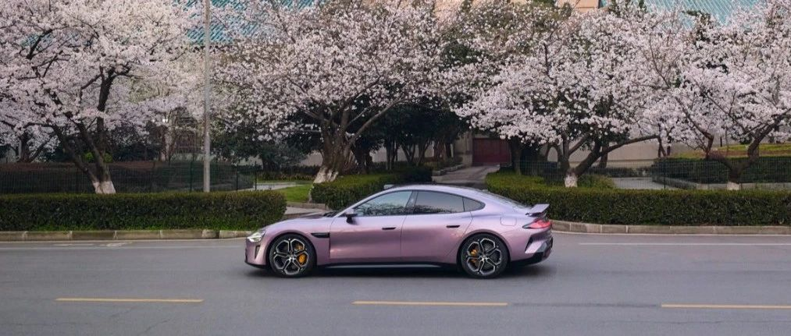

#  小米SU7答网友问（第十五集）

[ 小米汽车 ](<javascript:void\(0\);>)

______

小米SU7答网友问  

持续进行中...

[小米SU7答网友问（第一集）](<http://mp.weixin.qq.com/s?__biz=MzkyNzU3MDI3Nw==&mid=2247486958&idx=1&sn=fa1835ddd2eee3bdafefcad5b74d2d94&chksm=c2274de4f550c4f28c7b9e54f1a6a8bcacc3459e88bbe256c362a899a36ca32c80be4f87c45a&scene=21#wechat_redirect>)

[小米SU7答网友问（第二集）](<http://mp.weixin.qq.com/s?__biz=MzkyNzU3MDI3Nw==&mid=2247487024&idx=1&sn=0c7cfca4d7c560dedf8062fa3a7230e3&chksm=c2274e3af550c72cdf2c4b04f2e6f3f66f10eac3634f77346b68be322d895dfb1398978ccbcf&scene=21#wechat_redirect>)

[小米SU7答网友问（第三集）](<http://mp.weixin.qq.com/s?__biz=MzkyNzU3MDI3Nw==&mid=2247487063&idx=2&sn=a0651af985a684e2379d3805947abc23&chksm=c2274e5df550c74b86d3871da393feb8fcadab0dfcdc8e77c806309341c89f1b37396b0e6318&scene=21#wechat_redirect>)

[小米SU7答网友问（第四集）](<http://mp.weixin.qq.com/s?__biz=MzkyNzU3MDI3Nw==&mid=2247487079&idx=1&sn=9cf62cd9e760babefdd444d29ee00b68&chksm=c2274e6df550c77b506f07fb315efff406bc12a55eba23c69b349cba973f61811d88fd0ade33&scene=21#wechat_redirect>)

[小米SU7答网友问（第五集）](<http://mp.weixin.qq.com/s?__biz=MzkyNzU3MDI3Nw==&mid=2247487101&idx=1&sn=9e00cc3239d1e6d9cb373f2efad42e3c&chksm=c2274e77f550c76157349d363d8e0c17ceadab29fae7538c156149e37c9c89e7cc22644201b2&scene=21#wechat_redirect>)

[小米SU7答网友问（第六集）](<http://mp.weixin.qq.com/s?__biz=MzkyNzU3MDI3Nw==&mid=2247487835&idx=2&sn=30cf8170af01397c46dc34cf495f7c02&chksm=c2275151f550d847fcc5d8d333c20a5d27d60276888d7192f51064f53e6fa738e21bf375ef29&scene=21#wechat_redirect>)

[小米SU7答网友问（第七集）](<http://mp.weixin.qq.com/s?__biz=MzkyNzU3MDI3Nw==&mid=2247487849&idx=1&sn=45b7ceae12489188c167129f3fb8b1a6&chksm=c2275163f550d87500cbacfac5ee05ea1b5083b97beb0d16e375b98480c98c823fbfdcc4d45a&scene=21#wechat_redirect>)

[小米SU7答网友问（第八集）](<http://mp.weixin.qq.com/s?__biz=MzkyNzU3MDI3Nw==&mid=2247487860&idx=1&sn=337ffc5a7972e5758d3208fb1eb7a28d&chksm=c227517ef550d86838d64b08036486d07a6ea303f0f8e2e9bb93b097750beeb6b2649b692ede&scene=21#wechat_redirect>)

[小米SU7答网友问（第九集）](<http://mp.weixin.qq.com/s?__biz=MzkyNzU3MDI3Nw==&mid=2247487868&idx=1&sn=8021638c108d845fab76580a6cc405e9&chksm=c2275176f550d86086dc3bcdbc3b4cf518b1ba41a294c3ad5d39504791907edcc6422b015131&scene=21#wechat_redirect>)

[小米SU7答网友问（第十集）](<http://mp.weixin.qq.com/s?__biz=MzkyNzU3MDI3Nw==&mid=2247487890&idx=1&sn=47696df25bbc82e7c5aea71ccd30030e&chksm=c2275198f550d88e577cf942e5f0b4a7a6a21cc2cec4b0f04562b6acaa878177be8d8f2507b9&scene=21#wechat_redirect>)

[小米SU7答网友问（第十一集）](<http://mp.weixin.qq.com/s?__biz=MzkyNzU3MDI3Nw==&mid=2247487900&idx=1&sn=7765954b27cc8772008540f91ca7224d&chksm=c2275196f550d8807e8be4cee38e091559c454cfc8bed3e843d4e425f4b002ee0cb931c883d8&scene=21#wechat_redirect>)

[小米SU7答网友问（第十二集）](<http://mp.weixin.qq.com/s?__biz=MzkyNzU3MDI3Nw==&mid=2247487915&idx=1&sn=abbebbb9cbe0668b66a9c1026b12932f&chksm=c22751a1f550d8b73c8ad64a95a0158ef65c19c0becad656d616125a396dc6b4c6703e97f967&scene=21#wechat_redirect>)

[小米SU7答网友问（第十三集）](<http://mp.weixin.qq.com/s?__biz=MzkyNzU3MDI3Nw==&mid=2247487947&idx=1&sn=f544e6be6fd1221b57e5123f58c1f72c&chksm=c22751c1f550d8d76cf64deaaaf06423ad37525bfbda26eb8e1d0a5952a5b1ae30188c90c2c4&scene=21#wechat_redirect>)

[小米SU7答网友问（第十四集）](<http://mp.weixin.qq.com/s?__biz=MzkyNzU3MDI3Nw==&mid=2247487955&idx=1&sn=ee2a1734fe86b15000822bee9ae0ffd2&chksm=c22751d9f550d8cfdb48ae0c890173e37f66356ad6316e9ada00ee7c231d0772ee6e4c817c65&scene=21#wechat_redirect>)

  

## **01**

**未来会推出适配小米SU7 Max的高性能套件吗？**

我们近期关注到不少用户在尝试探索体验小米SU7 Max的性能极致表现，为了给经验丰富的用户提供一些激烈驾驶的可能性，我们正在联合业内经验丰富的合作伙伴开发高性能套件，具体服务上线日期请随时关注小米汽车官方公告。

  

## **02**

**小米汽车APP里面的预约充电，是仅支持小米汽车的家充桩，还是也能支持其他品牌？**

能支持其他品牌，预约充电可以让电动车在预先设置的时间点启动充电，人为地避开用电高峰期，合理规划充电时间，实现错峰用电，提高电力资源利用效率，在部分地区可以享有更低廉的电费。

小米SU7中控屏和小米汽车APP车控界面的预约充电，是由车端计时的，相当于开关由车主导，只要充电桩能够实时供电就可以预约充电。所以不仅小米家充桩，目前测试过的主流品牌家充桩都可以使用。

此外，在小米汽车APP “我的 - 家充桩”界面，有单独控制小米家充桩的预约充电功能。此功能由桩端计时，仅支持小米家充桩。

  

## **03**

**当地没有小米交付中心，提车后如何联系安装充电桩？**  

当地没有交付中心您也不用担心，在中国大陆范围内，您只要购买小米官方家充产品，都会有我们的工程师联系您，预约您的时间进行上门勘测。只要安装条件符合，都会为您妥善完成充电桩的安装服务。

  

## **04**

**小米SU7支持盲区监测吗？**

小米SU7全系标配BSD盲区监测功能。当小米汽车在并线打灯时，目标车道侧向来车，BSD盲区监测系统会在仪表屏、中控屏和HUD上做动态警示。

同时，我们还会不断加强这一警示功能，将在后续OTA中增加「盲区影像显示」，当驾驶员打转向灯时，在中控屏上会显示侧向来车画面，并叠加红色警示提醒。

盲区监测功能并不能完全代替驾驶员控制车辆，请驾驶员在驾驶过程中务必全程保持注意力集中，时刻关注车辆周围路况。

  

  

## **05**

**导航没开的情况下，路况自动播报（比如前方有闯红灯拍照）能关闭吗？**

小米SU7全系标配头枕音响，在使用车机导航时，建议默认开启可以和手机导航一样选择语音播报的详细程度，或者关闭导航播报。而在日常驾驶过程中，即使未使用导航，也会为您自动播报前方道路异常或限速提示类信息，以确保您的驾驶安全。

此路况自动播报功能默认开启，后续OTA升级将增加开/关选项。现在如果您未使用导航且不需要该提醒，您可以暂时关闭导航声音。

  

## **06**

**小米SU7的行车记录仪，能够循环记录多长时间的视频？**

小米SU7的行车记录仪，提供4路摄像头最长3小时的循环录制能力。

行车过程中的紧急事件视频、通过鸣笛保存和手动保存记录的视频，以及开启哨兵模式后记录的危险事件视频，目前不会被循环覆盖，以确保您能够查看所需要的信息。

我们车辆在交付时，会随车配送U盘负责存储行车记录内容，如有拓展需求也可自行更换大容量高性能存储设备。

  

## **07**

**对于车内生态件的碰撞安全问题，有什么注意事项？**

发售于小米商城的所有CarIoT车载智能设备，在设计之初就综合考虑了其工业设计、可靠性与安全性等性能指标。为了使所有CarIoT车载智能设备符合其设计预期，用户需要在使用时确保：

  * 按照CarIoT车载智能设备说明书对设备进行安装，将螺丝拧紧（如有）；

  * 在使用仪表台右侧1/4英寸标准接口时，确保副驾驶未坐人；

  * 手机支架在使用时，确保手机放置位置得当；

此外，行车过程中在车内放置、安装第三方设备时同样应注意可能存在的安全隐患，例如：

  * 不要在仪表台放置、粘贴物品。前排气囊触发后，仪表台上的物品会被高速弹射至乘员，存在二次伤害隐患；

  * 在前挡风、天幕、侧窗等位置布置吸盘时，应避开气囊位置；

  * 不要使用未经厂家安全认证的座椅保护套。座椅保护套可能会影响中央远端气囊的正常触发；

  * 将行李等重物放于行李厢而非后排座椅。发生急刹车、前向碰撞时，惯性作用下后排的行李会高速飞向前排，存在二次伤害隐患

  

## **08**

**空悬气罐的位置受到追尾撞击后，气罐会不会有安全风险？**

小米SU7 Max车型标配闭式空气弹簧（空悬），空气弹簧储气罐是该配置不可缺少的零部件。面对常规的轿车、SUV等车型低速追尾工况，得益于小米独创的三段式一体化压铸后地板，冲击力可以被防撞梁轻松化解。在小米汽车内部进行的40余项安全测试中我们同样考虑到了气罐碰撞安全性，在经历100%重叠 56km/h追尾工况时，防撞横梁承载吸能，气罐未受撞击，功能完好。

近期发生的小米SU7 Max追尾事故，因后车系跑车，其车头非常低，躲过了小米SU7 Max后防撞梁进而钻入底部，最终才造成了气罐脱落。事实上，将气罐放置在乘员舱外后侧，并不独见于小米，也有国际豪华品牌旗舰级轿车、SUV使用类似设计。

  

  

预览时标签不可点

修改于

微信扫一扫  
关注该公众号

继续滑动看下一个

轻触阅读原文

小米汽车 

向上滑动看下一个

[知道了](<javascript:;>)

微信扫一扫  
使用小程序

****

[取消](<javascript:void\(0\);>) [允许](<javascript:void\(0\);>)

****

[取消](<javascript:void\(0\);>) [允许](<javascript:void\(0\);>)

****

[取消](<javascript:void\(0\);>) [允许](<javascript:void\(0\);>)

× 分析

__

微信扫一扫可打开此内容，  
使用完整服务

： ， ， ， ， ， ， ， ， ， ， ， ， 。 视频 小程序 赞 ，轻点两下取消赞 在看 ，轻点两下取消在看 分享 留言 收藏 听过