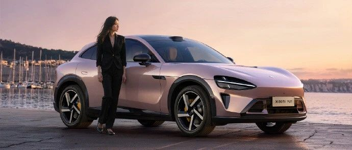
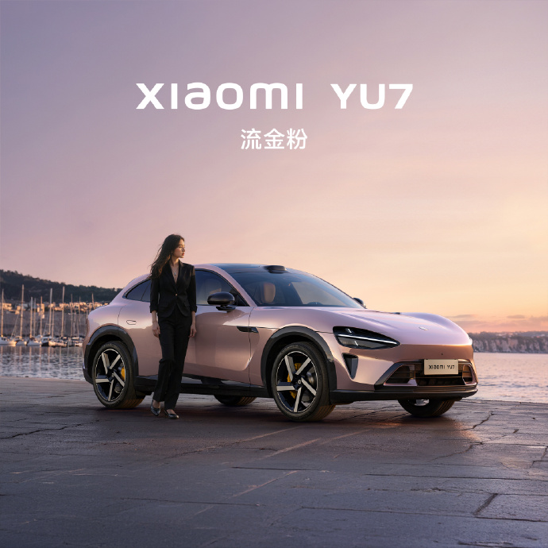
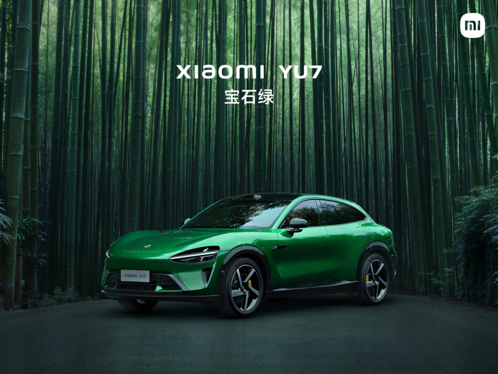
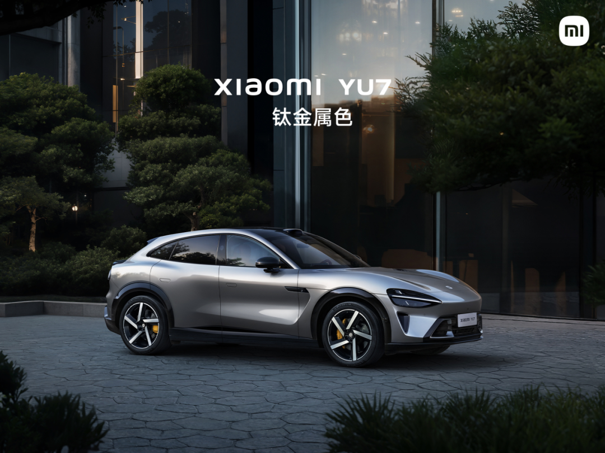
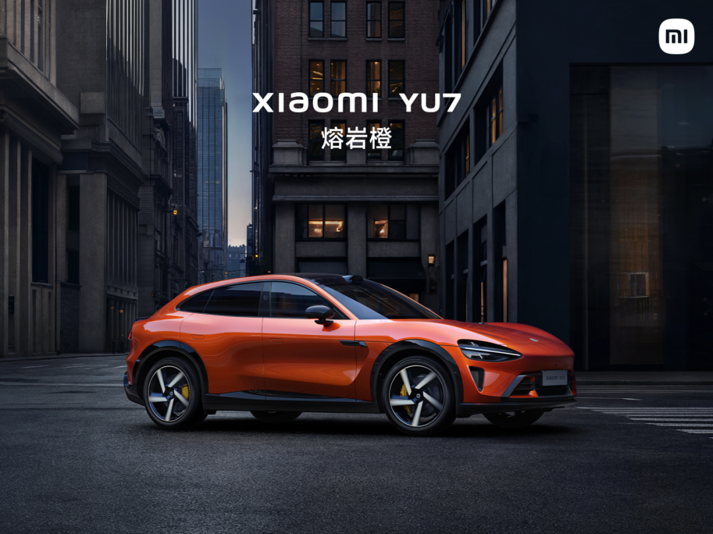
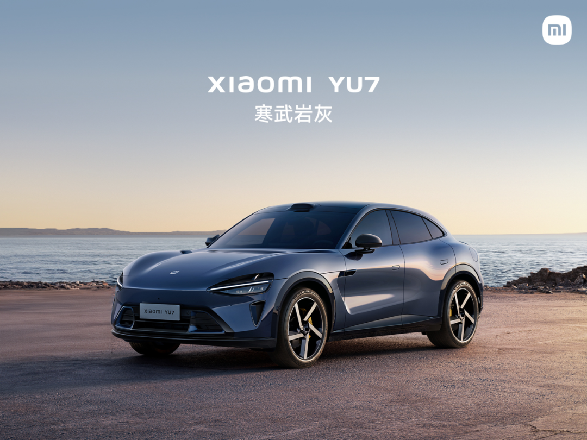

#  小米汽车答网友问（第160集）

[ 小米汽车 ](<javascript:void\(0\);>)

______

**01**

**小米汽车的首款****SUV****为什么不是目前市场上最热门的6座车型？**

「SUV」里的「S」代表Sport，SUV就是“运动型多功能车”。正如雷总所说，我们的首款SUV想要“不忘初心”，做好一辆运动型SUV。因此，小米YU7并不是一款普通的、平庸的“方盒子”SUV，而是一款豪华高性能SUV，兼顾日常使用的豪华、舒适需求，还有够用的大空间；同时，驾驶者的驾驶体验也能被充分关注到。小米YU7，就是这样一辆兼具豪华运动性能和豪华舒适性的SUV。

小米YU7还是一台为时代精英打造的「先进SUV」，全系标配8大先进功能，包括全系超长续航、全系标配2200MPa小米超强钢全车四门防撞梁及「内嵌式防滚架」、全系标配激光雷达、全系标配小米天际屏全景显示、全系标配后排135゜豪华电动座椅、全系标配800V碳化硅高压平台、全系标配700TOPS辅助驾驶算力芯片、全系标配连续阻尼可变减振器。

当然，小米YU7的先进实力远不止这些，更多产品亮点，6月26日晚7点发布会见！

**02**

**这次小米YU7上市，相比去年小米****SU7****，你们的把握是不是大了很多？**

这一次，我们的信心确实更足了。 自小米YU7上个月技术发布以来，用户朋友们的热情远超我们预期，小米YU7用户留资量达到了小米SU7同期的3倍。

在此，我们由衷地感谢各位朋友的支持。我们有信心，小米YU7将和小米SU7一样火爆。

**03**

**小米YU7 是否是一款拉高版的小米****SU7****？**

不是。在产品定义之初，我们就明确了小米YU7不是简单的SU7拉高版，而是一台由内而外大不同的小米首款SUV。虽然小米YU7和小米SU7都是基于小米摩德纳平台开发的，但小米YU7项目有90%零部件都重新设计了。

小米YU7定位「豪华高性能SUV」，不是一辆平庸普通的大空间SUV，而是一辆为驾驶者精心设计的SUV。它既拥有优雅造型和高性能，同时还提供了出色的豪华感和空间舒适性。

外饰造型采用和小米SU7一脉相承的家族化设计语言，并在镂空水滴大灯、光环尾灯等细节进化，更加凌厉、立体，也更符合「豪华高性能SUV」的产品定位。

还有更加科技、豪华、舒适的座舱设计，新增小米天际屏全景显示Xiaomi HyperVision，带来全新的视觉交互体验；内饰采用双区环绕设计，型面简洁、饱满，用料豪华，大量软包覆盖，还有前排双零重力座椅、后排135°豪华电动座椅，更有超预期的大空间，提供更豪华舒适的享受。

在性能方面，新升级的小米超级电机V6s Plus，转速、扭矩、功率在V6s基础上进一步提升，双电机全轮驱动版本最大马力达690PS，峰值功率达508kW，性能非常强大。豪华的底盘配置，专业底盘调校，兼顾运动与舒适。全系超长续航，入门版即有835km的超长CLTC续航，四驱版本也有最高770km的出色续航表现。

更重要的是，小米YU7的底层架构继承小米SU7优势并进行了全面的升级，比如铠甲笼式车身、四合一域控制模块、辅助驾驶等等，为用户提供了更全面领先的先进体验。

欢迎大家在试驾车到店后前往试驾体验，相信在大家试驾之后，就会感受到小米YU7和小米SU7的不同。

**04**

**流金粉太好看了，它的工艺有什么特别之处么？小米YU7还有其他哪些配色？**

小米YU7全新配色「流金粉」的灵感来源于破晓时刻的日照金山，它是一款金属漆，其独特之处在于我们在粉色漆面基底之上，叠加了浅金色金属颗粒，打造了晨雾初融般的通透质感。

小米YU7 一共有9种颜色，涵盖跑车色系、时尚色系、豪华色系及经典色系。之前，我们已经公布了其他四款颜色，每一款都独具特色：宝石绿：灵感来源于哥伦比亚绿宝石，浓郁纯粹；钛金属色：低调沉着，高级优雅，又难掩力量；熔岩橙：跃动着活力与激情，充满能量，瞩目吸睛；寒武岩灰：深沉内敛，优雅深邃。作为一款「豪华高性能SUV」，小米YU7还有4款颜色即将发布。款款经典，敬请期待！

*左右滑动 查看更多

05

「晕车舒缓模式」是个什么功能？有什么作用？

「晕车舒缓模式」是小米YU7搭载的一项全新驾驶场景模式。 我们通过对车辆的动力输出、能量回收和底盘悬架系统进行专属调校，实现更舒缓的加减速与更平稳的过弯，提升乘坐舒适度。更多详情请关注即将到来的发布会，同时也欢迎大家在试驾车到店后亲身体验。

06

小米YU7 Max的智能天幕，遮光和防晒效果怎么样？

小米YU7 Max采用的是最新一代EC智能调光天幕，不仅可以遮光，还有着非常优秀的防晒隔热表现。

小米YU7 Max的智能调光天幕配合双层镀银等技术，可达到紫外线隔绝率99.9%、红外线隔绝率99.9%；同时天幕透光度可调，遮光模式下，天幕最大遮光率可达99.85%。更多有关小米YU7 Max智能调光天幕的信息，我们发布会见！

07

小米YU7的前备箱可以通过车外**小爱****打开，怎么保障安全？****  
**

您完全不用担心安全问题，当您在车机的账号管理菜单中设置好声纹信息并开启相关功能后，小米YU7的车外语音功能需通过声纹和数字钥匙进行双重安全验证，只有当熟悉的声音和钥匙同时出现时，才会唤醒车外小爱打开前备箱。

同时，车外语音的交互功能也会进行相关的安全防范，例如前后备箱的开闭指令，只有当车处于P档且车上无乘员时才会执行，即便是家人的误操作也无需担心。更多有关车外小爱语音功能，我们发布会见！

**08**

**小米YU7全系标配的800V****碳化硅****高压平台，具体有什么好处？****  
**

800V碳化硅高压平台是新一代电动车核心技术架构，整车高压系统（电池、电机、电控、热管理系统等）的工作电压平台800V，并采用碳化硅（SiC）功率器件替代传统的硅（Si）功率器件。碳化硅（SiC）材料相较硅（Si）材料更耐高压、耐高温、导热性更高，所以相应的器件损耗更小，系统效率更高。

小米YU7全系标配800V碳化硅高压平台，能够带来充电更快，性能更强的体验。其中小米YU7 Max最大充电倍率可以达到5.2C，15分钟最长补能里程620km；搭载V6s Plus电机最大功率508kW，零百加速3.23秒。

  

< img alt="图片" class="rich_pages wxw-img" data-ratio="0.8824074074074074" src="https://mmbiz.qpic.cn/sz_mmbiz_png/UaK4PTh6Zpk2TaVLh0tUHxviapUIsTcXOFp1ATh7VRDuqnQr3V3oDvw9DodpJKDZDh0fV2YVzbrgHETVM5DzIqA/640?wx_fmt=png&from=appmsg&wxfrom=5&wx_lazy=1&wx_co=1" data-w="1080" style="visibility: visible !important;width: 350px !important;height: auto !important;" width="100%" data-imgqrcoded="1">

预览时标签不可点

微信扫一扫  
关注该公众号

继续滑动看下一个

轻触阅读原文

小米汽车 

向上滑动看下一个

[知道了](<javascript:;>)

微信扫一扫  
使用小程序

****

[取消](<javascript:void\(0\);>) [允许](<javascript:void\(0\);>)

****

[取消](<javascript:void\(0\);>) [允许](<javascript:void\(0\);>)

****

[取消](<javascript:void\(0\);>) [允许](<javascript:void\(0\);>)

× 分析

__

微信扫一扫可打开此内容，  
使用完整服务

： ， ， ， ， ， ， ， ， ， ， ， ， 。 视频 小程序 赞 ，轻点两下取消赞 在看 ，轻点两下取消在看 分享 留言 收藏 听过