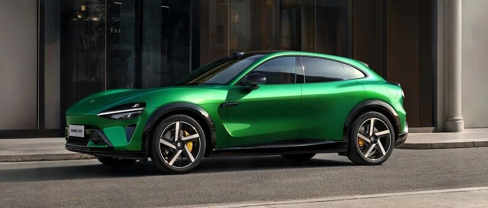

#  小米汽车答网友问（第161集）

[ 小米汽车 ](<javascript:void\(0\);>)

______

**01**

**网上传言，小米YU7标准版比小米****SU7****标准版只贵2万，这是真的吗？**

这不是真的，雷总之前已公开否认过。小米YU7标准版的配置就很高，比如最高CLTC 835km的续航、激光雷达、英伟达最新Thor芯片 、小米天际屏全景显示等。在行业内，这些豪华配置往往只有在友商的Max版甚至Ultra版上才会搭载。

最终定价敬请期待上市发布会，我们一定会给大家一个合理的价格。

**02**

**小米YU7发布后，是否会影响小米****SU7****的销量？**

我们并不担心小米YU7会影响小米SU7的销量。小米YU7和小米SU7两款产品都极具个性，喜欢SUV和轿车的用户都很多。我们相信，小米YU7发布后，小米SU7依然是市场上卖得最好的轿车之一。

**03**

**小米YU7就正式发布了，打算第一时间下定，有什么准备工作需要做的么？**

为了帮助您在小米YU7开售时能更快、更顺利地完成定购，我们为您准备了一份购前准备攻略，帮助您提前做好购买准备。

  * 首先，请前往各大应用商店**将您的小米汽车****APP****更新至最新版本：1.16.1** ；

  * 提前在小米汽车APP中**完成账号注册和登录** ，并在「我的」-「设置」-「账号与安全」里**完成实名认证** 。我们建议您同时**绑定银行卡** ，以便下单后可以第一时间支付定金；

  * 您可以在小米汽车APP-“YU7主页”**预填信息，提前填写并保存您购车时需填写的信息** 。具体包括：

      * 购车信息：即登录账号时绑定的实名信息（注意：与车牌所有人无关）；

      * 车牌所有人信息：即上牌指标人信息，可与账号姓名不一致，用于上牌、开票、金融及保险等业务；

      * 预填信息保存后，您在定购时系统将会将其自动填入，节省您临时填写的时间；（若您之前购买过小米汽车或创建过小米汽车定单，之前填写的信息会默认保存并自动填入下单页）

  

  * 请您提前绑定并验证好您计划用于支付定金的支付方式，如支付宝、微信、银行卡等；

  * 在定购开始前10-15分钟，找一个安静、不受打扰的环境，专注于定购页；同时我们建议您使用电量充足、性能较好的设备并确保其运行流畅，连接到稳定的5G网络或高速Wi-Fi网络，避免使用公共网络或在信号弱的区域进行操作；

再次感谢大家对小米YU7的支持与喜爱，希望大家都能早日提到自己心仪的爱车！

04

**我是小米汽车车主，在哪里能找到小米YU7的购车入口？**

**针对所有的小米汽车已提车车主，或已锁单待提车的准车主，您可通过以下两个路径找到小米YU7购车入口：**

    * 小米汽车APP - 「发现」-「购车」-「YU7主页」

    * 小米汽车APP- 「商城」-「购车」-「YU7购车卡片」

05

**一番紧张的操作后，我支付好了小米YU7的定金，是否就代表购买成功了？**

支付完定金后，您**仍需手动****锁单****。** 订单将按照锁单时间顺序排产，请您务必注意，犹豫期（7天）内可修改配置，犹豫期结束后，将自动锁单，定金不退。更多详情，请于发布会后在小米汽车APP中及时查看《小米YU7定购指南》。

06

**「24小时耐力挑战」是什么？主要是为了考验车辆哪些方面的性能？**

「24小时耐力挑战」借鉴了勒芒24小时耐力赛，是指车辆在24小时内连续超高速行驶和超快速充电，来挑战其能达到的最长行驶里程。这是对整车动力、续航、充电和散热的一次全方位极限测试。

这对于纯电车型来说非常困难，首先续航要够长，单次行驶距离越长，最终成绩越好； 其次充电还要足够快，24小时内完成，充电用时越短越好； 还要有足够强并且稳定的动力性能，需要持续保持210km/h+ 超高速行驶； 最重要的是需要具备强大的散热能力，需要满足连续快充快放三电系统不过热。

总的来说，「24小时耐力挑战」相当于用百米冲刺的时速跑完一整场马拉松，是车辆综合性能的一次大考。小米YU7最终表现如何？敬请期待上市发布会。

07

**在哪儿能收看小米「人车家全生态」发布会？**

本次小米人车家全生态发布会将于今晚（6月26日19:00）在小米公司、小米手机、小米汽车等官方账号多平台直播，同时将在多个数码媒体、汽车媒体、电商等平台同步播出，敬请关注小米官方账号直播动态。

小米首款SUV，小米YU7即将正式发布。还有小米MIX Flip 2小折叠旗舰手机、小米平板7S Pro 高效移动生产力平板、以及面向下一代的个人智能设备，都将联袂登场。小米「人车家全生态」的新起点，我们诚挚邀请您一起见证，不见不散！

  

  

< img alt="图片" class="rich_pages wxw-img" data-ratio="0.8824074074074074" src="https://mmbiz.qpic.cn/sz_mmbiz_png/UaK4PTh6Zpk2TaVLh0tUHxviapUIsTcXOFp1ATh7VRDuqnQr3V3oDvw9DodpJKDZDh0fV2YVzbrgHETVM5DzIqA/640?wx_fmt=png&from=appmsg&wxfrom=5&wx_lazy=1&wx_co=1" data-w="1080" style="visibility: visible !important;width: 350px !important;height: auto !important;" width="100%" data-imgqrcoded="1">

预览时标签不可点

微信扫一扫  
关注该公众号

继续滑动看下一个

轻触阅读原文

小米汽车 

向上滑动看下一个

[知道了](<javascript:;>)

微信扫一扫  
使用小程序

****

[取消](<javascript:void\(0\);>) [允许](<javascript:void\(0\);>)

****

[取消](<javascript:void\(0\);>) [允许](<javascript:void\(0\);>)

****

[取消](<javascript:void\(0\);>) [允许](<javascript:void\(0\);>)

× 分析

__

微信扫一扫可打开此内容，  
使用完整服务

： ， ， ， ， ， ， ， ， ， ， ， ， 。 视频 小程序 赞 ，轻点两下取消赞 在看 ，轻点两下取消在看 分享 留言 收藏 听过