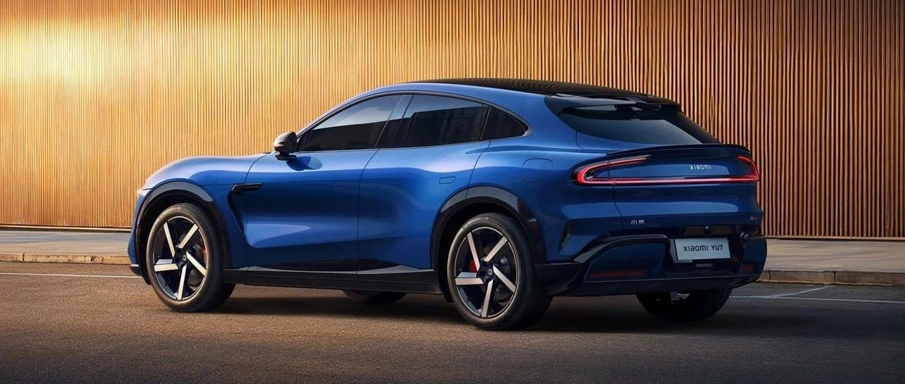

#  小米汽车答网友问（第162集）

[ 小米汽车 ](<javascript:void\(0\);>)

______

**01**

小米YU7的订单情况怎么样了？

截至今天下午16点，小米YU7开售仅18小时，锁单量已突破24万台。这个成绩已经远远超出了预期，我们再次真诚地感谢每一位朋友的支持！

**02**

**小米YU7是按什么顺序规则做 交付？**

所有的小米YU7订单将按照锁单先后顺序进行排产，同配置下先锁定的订单先排产。请您务必注意，您可以在犹豫期（7天）内可修改配置或取消订单，犹豫期结束后，您的订单将自动锁单，定金不退。

**03**

小米YU7什么时候可以试驾？

全国所有小米汽车门店现已开启试乘试驾服务，欢迎大家预约到店品鉴！

04

自从去年12月小米YU7首次亮相，到如今正式上市，一共做了多少的路试工作？

事实上从2024年初开始，我们就启动了小米YU7的整车测试工作。截至目前，小米YU7的路试工作历时541天，覆盖296个城市，道路实测里程超过649万公里。

在这段时间里，我们的工程师开着小米YU7测试车经历过53摄氏度的吐鲁番，经历过零下41度的黑河，也抵达过海拔5380米的西藏阿里地区。从闹市区到无人区、从高温区、高寒区、到高原区，小米YU7在不同的气温、不同海拔，雪山、戈壁等恶劣环境，都经受住了耐久考验。同时，作为一台SUV，小米YU7在路测中也充分验证了复杂路况、恶劣天气的情况下的通过性。

小米汽车团队一直都坚持做大量的真实道路测试。虽然通过实验室仿真也能帮助测试，但还是不能代替真实路面的全面校验。所以，我们在路测投入非常大，相比行业普遍水准，小米测试的车辆数量、里程数和强度都高很多。

05

小米SU7 Ultra赛道专业套装和纽北限量版什么时候开始交付？之前小订用户的优先交付权还有效么？

小米SU7 Ultra选配赛道专业套装和小米SU7 Ultra纽北限量版均预计将在7月启动首批交付。  

此前未行使小订优先交付权的原小米SU7 Ultra小订用户，在6月29日24点前下定小米SU7 Ultra 选配赛道专业套装，支付定金40000元，并在犹豫期3天内锁单，可享优先排产权。

我们会尽快根据产能和锁单情况，按照同配置订单的锁单顺序刷新每张订单的预计交付周期，请以刷新后小米汽车APP所示预计交付周期为准，感谢您的理解。

06

戴墨镜会影响小米天际屏全景显示的观感吗？

绝大多数墨镜不会影响小米天际屏的显示效果。但如果您佩戴的是某些特定类型的偏光墨镜，观看小米天际屏时的成像体验可能会受一定影响。这是因为小米天际屏的成像原理与普通HUD相同，都是将TFT液晶显示屏产生的偏振光经玻璃反射到人眼。大自然中对人眼造成反光和眩光的光与屏幕发出光源属于同类偏振光，而偏光墨镜的设计作用就是隔绝该类光线。同样的问题也常见于行业内广泛运用的HUD抬头显示产品中。  

此外，即使偏光眼镜可能会影响小米天际屏的显示观感，但车速、档位等关键行车信息仍会显示在中控屏幕的左上角，不影响您获取关键车辆信息。  

如您习惯于在驾驶时佩戴太阳镜，建议选择非偏光太阳镜，小米天际屏的可视性将得到提升。同时，我们将会在小米YU7交付时随车赠送您一副非偏振光墨镜，在有效遮阳的同时又能确保您观看小米天际屏时画面清晰无干扰。

  
  
  
  
< img alt="图片" class="rich_pages wxw-img" data-ratio="0.8824074074074074" src="https://mmbiz.qpic.cn/sz_mmbiz_png/UaK4PTh6Zpk2TaVLh0tUHxviapUIsTcXOFp1ATh7VRDuqnQr3V3oDvw9DodpJKDZDh0fV2YVzbrgHETVM5DzIqA/640?wx_fmt=png&from=appmsg&wxfrom=5&wx_lazy=1&wx_co=1" data-w="1080" style="visibility: visible !important;width: 350px !important;height: auto !important;" width="100%" data-imgqrcoded="1">

预览时标签不可点

修改于

微信扫一扫  
关注该公众号

继续滑动看下一个

轻触阅读原文

小米汽车 

向上滑动看下一个

[知道了](<javascript:;>)

微信扫一扫  
使用小程序

****

[取消](<javascript:void\(0\);>) [允许](<javascript:void\(0\);>)

****

[取消](<javascript:void\(0\);>) [允许](<javascript:void\(0\);>)

****

[取消](<javascript:void\(0\);>) [允许](<javascript:void\(0\);>)

× 分析

__

微信扫一扫可打开此内容，  
使用完整服务

： ， ， ， ， ， ， ， ， ， ， ， ， 。 视频 小程序 赞 ，轻点两下取消赞 在看 ，轻点两下取消在看 分享 留言 收藏 听过